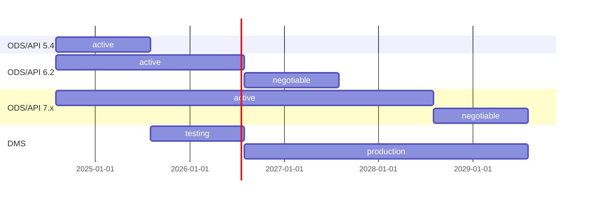
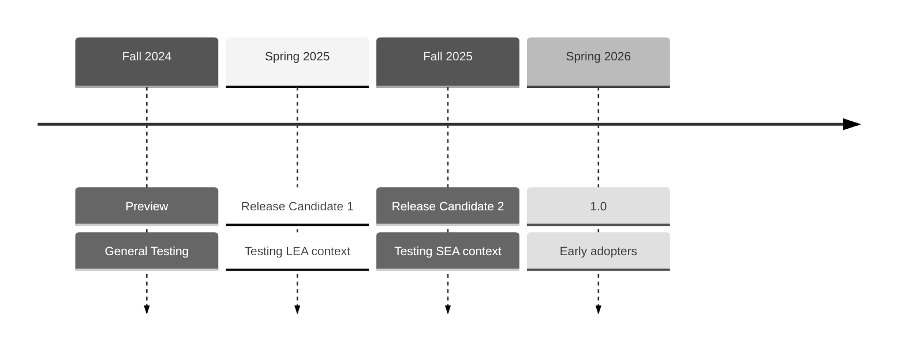

# Ed-Fi ODS/API and Data Management Service FAQ

The recent Ed-Fi blog post New Cloud-Native Functionality Coming to the Ed-Fi
Alliance Technology Suite introduced a piece of software under active
development, the Ed-Fi Data Management Service. Eventually, this software will
replace the Ed-Fi ODS/API Platform. Unsurprisingly, a few themes emerged in the
questions and conversations at Ed-Fi Tech Congress 2024. We will try to address
some of the most common below.

## Q: What does the future look like for the legacy ODS/API Platform?

The Ed-Fi Alliance plans to continue support for the ODS/API Platform through school year 2027-2028.

As show in the table above:

* Ed-Fi ODS/API Platform (“ODS/API”) version 5.4, coming out in summer 2024,
  will be supported for one more school year. The 5.x line of code was first
  released in 2020, for the 2021-2022 school year. It supported Data Standard 3
  (current: 3.3).
* ODS/API 6.2, this past February, supports Data Standard 4.0. No further
  feature enhancements are planned. It will be supported in production at least
  through the 2025-2026 school year; this may be extended depending on community
  adoption of the newer ODS/API 7.x releases.
* ODS/API 7.2 will be released in June, and we plan to continue with biannual
  feature enhancements (and bug fixes) for the next several years.

  This version supports Data Standard 4 and Data Standard 5. It will be fully
  supported at least through school year 2027-2028. Continued support for one
  more year beyond this will be negotiable based on actual circumstances, if the
  expense of maintaining it can be kept low.

"Support" means that the Ed-Fi Alliance will release updates as needed for
critical bugs and security issues, and the most recent major version (e.g.
ODS/API 7.x) may continue receiving new features and enhancements. Anyone
wanting the latest bug fixes will always need to install the most recent
minor/patch release for the same major version. For example, someone wanting bug
fixes for ODS/API 6.1 will need to install ODS/API 6.2, as there will not be
another stand-alone bug fix or patch release to 6.1.

## Q: When will the Data Management Service be available?

Goal timeline:

1. _Preview release_ in September, in time for the Ed-Fi Summit 2024. The goal is
   to have something people can use in basic scenarios, something functional and
   performant enough to give feedback on core Ed-Fi API functionality.
2. _Release candidate 1_ in spring 2025, with enough features to satisfy a typical
   deployment for a Local Education Agency. :exclamation:Only recommended for
   those who are engaged with the Project Tanager Technical Workgroup.
3. _Release candidate 2_ in fall 2025, with enough features to satisfy a typical
   deployment for a State Education Agency.
4. Potential _Release 1.0_ in spring 2026, available for production usage in
   school year 2026-2027.

The first release candidate will be fully-compatible with the _must have_
requirements described in the [Ed-Fi API Design and Implementation Guidelines,
4.0](https://edfi.atlassian.net/wiki/spaces/EFAPIGUIDE/pages/144867329/Ed-Fi+API+Design+and+Implementation+Guidelines).
The second release candidate will expand further into the _should have_ and
_optional_ requirements and features. State Education Agencies (SEA) frequently
have more detailed technical requirements for client authorization and for
access to raw data for warehousing and reporting. Tentatively, those features
will be given a longer timeline; this will provide more opportunity for
co-development with the SEA community.

The final release will not have complete parity with the optional features in
the ODS/API Platform (see note below). The Project Tanager Technical Workgroup
and/or Technical Advisory Group (TAG) will help guide prioritization of
features.

> [!NOTE]
> An example of an ODS/API feature that is _not_ planned for the Data Management
> Service: `link` elements in the `xyzReference` sections when retrieving a
> resource with a `GET` request. See [Deprecation of
> Links](https://edfi.atlassian.net/wiki/spaces/EFAPIGUIDE/pages/133791871/GET+Requests#Deprecation-of-Links)
> for more information.

## Q: Will integrations built for the ODS/API continue to work with the new system?

The Data Management Service will be a fully compatible Ed-Fi API implementation.
Client applications that interact with the REST API will continue to work.

The backend data store will be very different from the ODS/API. Existing
database integrations will not be able to work directly with the core set of
database tables. The application will introduce new integration capabilities,
such as the use of streaming events in Kafka. However, we recognize that many
existing Ed-Fi installations have critical reporting and analytics systems that
currently integrate directly with the ODS database. We are committed to working
with the community to create a pathway that allows agencies to leverage their
existing data integrations; for example, there is a proposal to build database
views that look like the tables from the ODS database.

## Q: Will integrations built for the Admin API continue to work with the new system?

Yes – if referring to the Admin API specification. No – if referring to the
specific software. The Data Management Service will have a vastly different
database system than the ODS/API, including restructuring of the data currently
housed in the EdFi_Admin and EdFi_Security databases. The project will introduce
a new application, tentatively called the Ed-Fi Configuration Service. The plan
is to implement the Admin API specification (version 2), so that applications
and scripts developed on this specification can interact seamlessly either with
the platform of today or of tomorrow.

## Q: How can I / my team get involved?

The Ed-Fi Alliance is launching a technical workgroup that will meet monthly for
the next year, helping with prioritization, review, and testing of the software.

Anyone wishing to contribute at the level of design or application code level is
invited to review the [Project Tanager design repository](./) and the [DMS
Project](https://tracker.ed-fi.org/secure/RapidBoard.jspa?rapidView=261&view=planning&issueLimit=100)
in Ed-Fi Tracker (Ed-Fi community account required) to understand current and
upcoming work. Please see [How to Contribute](./CONTRIBUTING.md) for more
information.
