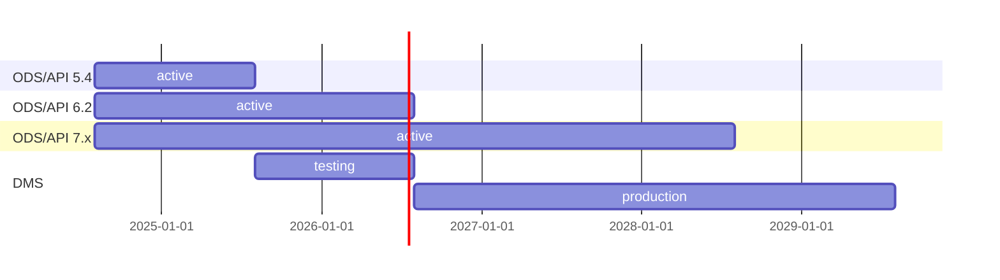
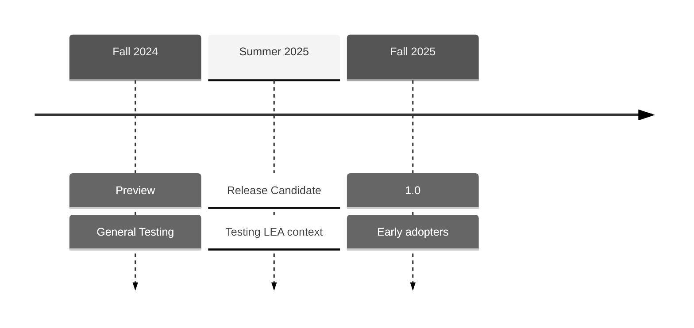

# Ed-Fi ODS/API and Data Management Service FAQ

The Ed-Fi Alliance is actively developing the Data Management Service (DMS) to
enhance data integration and management capabilities for educational agencies.
Designed to be robust and flexible, the DMS will address the evolving needs of
the Ed-Fi Community. The Ed-Fi Alliance plans to fully replace the current
ODS/API Platform with the DMS by the 2028–2029 school year. In the meantime, the
Alliance remains committed to supporting the ODS/API Platform through the
2027–2028 school year.

## Q: What does the future look like for the legacy ODS/API Platform?

The Ed-Fi Alliance plans to continue support for the ODS/API Platform through
school year 2027-2028.

As shown in the table above:

* ODS/API 5.4, released in summer 2024, will be supported for the school year
  2024-2025. The 5.x series was first released in 2020, for the 2021-2022 school
  year. It implements Data Standard 3 (current: 3.3).
* ODS/API 6.2, released in February 2024, implements Data Standard 4.0. No
  further feature enhancements are planned. It will be supported in production
  at least through the 2025-2026 school year;
* ODS/API 7.x will continue to receive annual feature enhancements (and bug
  fixes) for the next several years. This version supports Data Standard 4 and
  Data Standard 5. It will be fully supported at least through school year
  2027-2028.

"Support" means that the Ed-Fi Alliance will release updates as needed for
critical bugs and security issues, and the most recent major version (e.g.
ODS/API 7.x) may continue receiving new features and enhancements. Anyone
wanting the latest bug fixes will always need to install the most recent
minor/patch release for the same major version. For example, someone wanting bug
fixes for ODS/API 6.1 will need to install ODS/API 6.2, as there will not be
another stand-alone bug fix or patch release to 6.1.

## Q: When will the Data Management Service be available?

Goal timeline:

1. _Release candidate_ in summer 2025, with enough features to satisfy a typical
   deployment for a Local Education Agency. :exclamation:Only recommended for
   those who are engaged with the Project Tanager Technical Workgroup.
2. _Release 1.0_ in fall 2025, available for production usage in school year
   2026-2027.

The first release candidate will be fully-compatible with the _must have_
requirements described in the [Ed-Fi API Design and Implementation Guidelines,
4.0](https://docs.ed-fi.org/reference/data-exchange/api-guidelines/design-and-implementation-guidelines/).
The _release 1.0_ will expand further into the _should have_ and _optional_
requirements and features. State Education Agencies (SEA) frequently have more
detailed technical requirements for client authorization and for access to raw
data for warehousing and reporting. Tentatively, those features will be given a
longer timeline; this will provide more opportunity for co-development with the
SEA community.

The final release will not have complete parity with the optional features in
the ODS/API Platform (see note below). The Project Tanager Technical Workgroup
and/or Technical Advisory Group (TAG) will help guide prioritization of
features.

> [!NOTE] An example of an ODS/API feature that is _not_ planned for the Data
> Management Service: `link` elements in the `xyzReference` sections when
> retrieving a resource with a `GET` request. See [Deprecation of
> Links](https://edfi.atlassian.net/wiki/spaces/EFAPIGUIDE/pages/133791871/GET+Requests#Deprecation-of-Links)
> for more information.

## Q: Will integrations built for the ODS/API continue to work with the new system?

The Data Management Service will be a fully compliant Ed-Fi API specification.
Client applications that interact with the REST API will continue to work*.

The backend data store will be very different from the ODS/API. Existing
database integrations will not be able to work directly with the core set of
database tables. The application will introduce new integration capabilities,
such as the use of streaming events in Kafka. However, we recognize that many
existing Ed-Fi installations have critical reporting and analytics systems that
currently integrate directly with the ODS database. We are committed to working
with the community to create a pathway that allows agencies to leverage their
existing data integrations.

\* Caveats: the base URLs will be different in the Data Management Service
compared to the ODS/API. The differences between the two can easily be bridged
if needed by changing client code to query the root endpoint (Discovery API), or
with special redirection rules in an API Gateway application sitting in front of
the Data Management Service.

## Q: Will integrations built for the Admin API continue to work with the new system?

Yes – if referring to the Admin API specification. No – if referring to the
specific software called "Admin API". The Data Management Service will have a
vastly different database system than the ODS/API, including restructuring of
the data currently housed in the EdFi_Admin and EdFi_Security databases. The
project will introduce a new application, called the Ed-Fi Configuration
Service. The plan is to implement the Admin API specification (version 2), so
that applications and scripts developed on this specification can interact
seamlessly either with the platform of today or of tomorrow.

## Q: How can I / my team prepare for the upgrade

Start by identifying all direct ODS integrations in your environment (e.g. ETLs
that load data from the ODS to a data warehouse. Data Validation procedures that
run directly on ODS), Then, work with your Ed-Fi liaison to build a plan for
transitioning ahead of the 2028–2029 school year.

## Q: How can I / my team get involved?

The Ed-Fi Alliance is continuing to host a technical workgroup that will meet to
help with prioritization, review, and testing of the software.

Anyone wishing to contribute at the level of design or application code level is
invited to review the [Project Tanager design repository](./) and the [DMS
Project](https://tracker.ed-fi.org/secure/RapidBoard.jspa?rapidView=261&view=planning&issueLimit=100)
in Ed-Fi Tracker (Ed-Fi community account required) to understand current and
upcoming work. Please see [How to Contribute](./CONTRIBUTING.md) for more
information.
