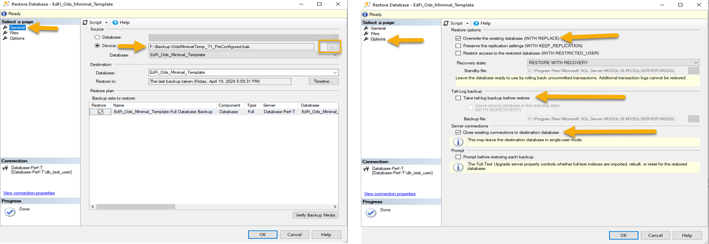
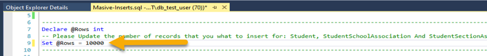
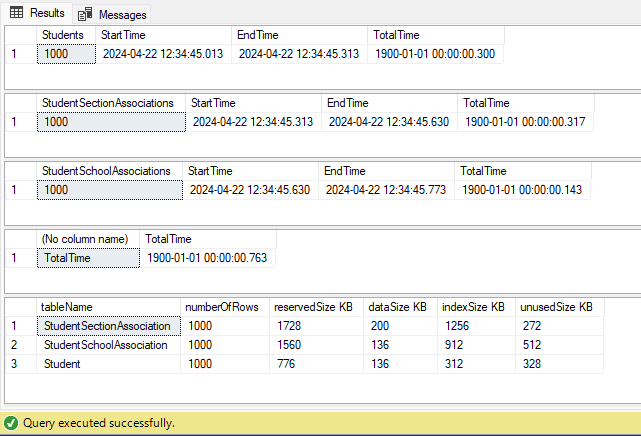

# Database matrices

This test aims to obtain some statistics that will allow us to compare the performance of the ODS databases with that of the proposed database for DMS.
In this section, we will analyze the performance of the ODS database. To do so, we have taken as an example three of the most commonly used tables: Student, StudentSchoolAssociation, and StudentSectionAssociation.

#### Conditions:
*-*	Because we selected the minimum template database (EdFi_Ods_Minimal_Template), we must perform an initial configuration data load. For this, we take as an example the execution (POST) of some endpoints necessary to work:

 *	EducationServiceCenters
 *	LocalEducationAgencies
 *	Schools
 *	GrandingPeriods
 *	Sessions
 *	Courses
 *	ClassPeriods
 *	CourseOfferings
 *	Locations
 *	Sections

 *-*	A new environment was created for the execution of the tests. Some values configured in the environment are:
 *	Windows Server 2020
 *	Microsoft SQL Server 2022
 *	32GB RAM
 *	4 CPU 2.56 GHz

#### Requirements:
*-*	Download the following artifacts from the Project-Tanager repository ([POC-Applications\POC.Databases\Artifacts\MsSql](https://github.com/Ed-Fi-Alliance-OSS/Project-Tanager/tree/a61373c5e9542b87b8d5fa4a9da84f6a79362ee3/POC-Applications/POC.Databases/Artifacts/MsSql)):
*	Pre-DB-Configuration-Inserts.sql
*	Masive-Inserts.sql

*-* Have a backup of the database EdFi_Ods_Minimal_Template (We will name it OdsMinimalTemp_71.bak).

*-*	Run the "Pre-DB-Configuration-Inserts.sql" script, which will insert all the required configurations (EducationOrganization, LocalEducationAgency, School, GradingPeriod, Session, among others).

#### Configuration:
*-*	First Time:

* Take the database backup (OdsMinimalTemp_71.bak) and pull it up via SQL Management Studio.
*	Open the Pre-DB-Configuration-Inserts.sql script and run it.
*	After the previous step and in order not to have to execute so many steps in each stage of the test, a backup of the database was made, and this will be the one that will be raised in each stage of testing; the backup is called OdsMinimalTemp_71_PreConfigured.bak.

*-*	The next time the procedure is executed, the backup OdsMinimalTemp_71_PreConfigured.bak must be restored.

#### Procedure:
*	In SQL Server Management Studio, Run the file Masive-Inserts.sql. Remember to change the variable Rows to determine how many records you want to insert.

* When the script execution is finished, we will take the values from the results section.:

## First round of execution

### 1,000 records:
| Table Name                 | OperationName | Execution Time In Seconds | Data Space Used (KB)| Index Space Used (KB)|
|----------------------------|---------------|------------------------|---------------------|----------------------|
| Student                    | INSERT        | 0:00:02                | 136                 | 312                  |
| StudentSchoolAssociation   | INSERT        | 0:00:02                | 136                 | 912                  |
| StudentSectionAssociation  | INSERT        | 0:00:02                | 200                 | 1,240                |

### 10,000 records:
| Table Name                 | OperationName | Execution Time In Seconds | Data Space Used (KB)| Index Space Used (KB)|
|----------------------------|---------------|------------------------|---------------------|----------------------|
| Student                    | INSERT        | 0:00:18                | 1,360               | 1,704                |
| StudentSchoolAssociation   | INSERT        | 0:00:20                | 1,360               | 5,448                |
| StudentSectionAssociation  | INSERT        | 0:00:19                | 2,000               | 11,544               |

### 100,000 records:
| Table Name                 | OperationName | Execution Time In Seconds | Data Space Used (KB)| Index Space Used (KB)|
|----------------------------|---------------|------------------------|---------------------|----------------------|
| Student                    | INSERT        | 0:03:00                | 13,650              | 15,536               |
| StudentSchoolAssociation   | INSERT        | 0:04:05                | 13,336              | 15,536               |
| StudentSectionAssociation  | INSERT        | 0:03:18                | 20,000              | 114,696              |

### 1,000,000 records:
| Table Name                 | OperationName | Execution Time In Seconds |Data Space Used (KB)| Index Space Used (KB)|
|----------------------------|---------------|------------------------|---------------------|----------------------|
| Student                    | INSERT        | 0:33:02                | 135,600             | 150,256              |
| StudentSchoolAssociation   | INSERT        | 0:37:24                | 133,336             | 519,976              |
| StudentSectionAssociation  | INSERT        | 0:33:20                | 200,00              | 1,147,584            |

### 10,000,000 records:
| Table Name                 | OperationName | Execution Time In Seconds | Data Space Used (KB)| Index Space Used (KB)|
|----------------------------|---------------|------------------------|---------------------|----------------------|
| Student                    | INSERT        | 0:00:00                | 0                 | 0                  |
| StudentSchoolAssociation   | INSERT        | 0:00:00                | 0                 | 0                  |
| StudentSectionAssociation  | INSERT        | 0:00:00                | 0                 | 0                |

