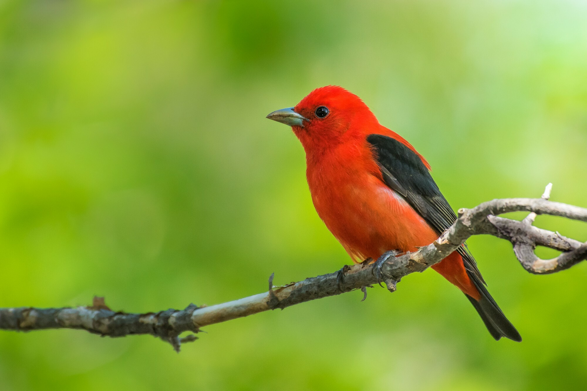

# Project Tanager

Design documents and discussions around the Ed-Fi Alliance's "Project Tanager",
which is building the next generation of the Ed-Fi Alliance Technology Suite.

* Project Documents
  * [Introducing Project Tanager](./docs/README.md): motivation and
    architectural vision
  * [Ed-Fi ODS/API and Data Management Service FAQ](https://docs.ed-fi.org/reference/roadmap/api-faq)
* Products (Tanager is "project", these are the products):
  * [Data Management Service](https://github.com/Ed-Fi-Alliance-OSS/Data-Management-Service)
  * Configuration Service - pending
* Boilerplate
  * [How to Contribute](./CONTRIBUTING.md)
  * [Contributor Code of Conduct](./CODE_OF_CONDUCT.md)
  * [List of Contributors](./CONTRIBUTORS.md)
  * [Copyright and License Notices](./NOTICES.md)
  * [License](./LICENSE)

## What is a tanager?

"Tanagers" are a class of new world birds, including the [Scarlet
Tanager](https://www.allaboutbirds.org/guide/Scarlet_Tanager/) pictured above.
The Scarlet Tanager breeds across much of eastern North America and winters in
northwestern South America.

The photo above was taken by [Adam Jackson, with no rights
reserved](https://www.inaturalist.org/observations/193251982).

## Legal Information

Copyright (c) 2024 Ed-Fi Alliance, LLC and contributors.

Licensed under the [Apache License, Version 2.0](./LICENSE) (the
"License").

Unless required by applicable law or agreed to in writing, software distributed
under the License is distributed on an "AS IS" BASIS, WITHOUT WARRANTIES OR
CONDITIONS OF ANY KIND, either express or implied. See the License for the
specific language governing permissions and limitations under the License.
