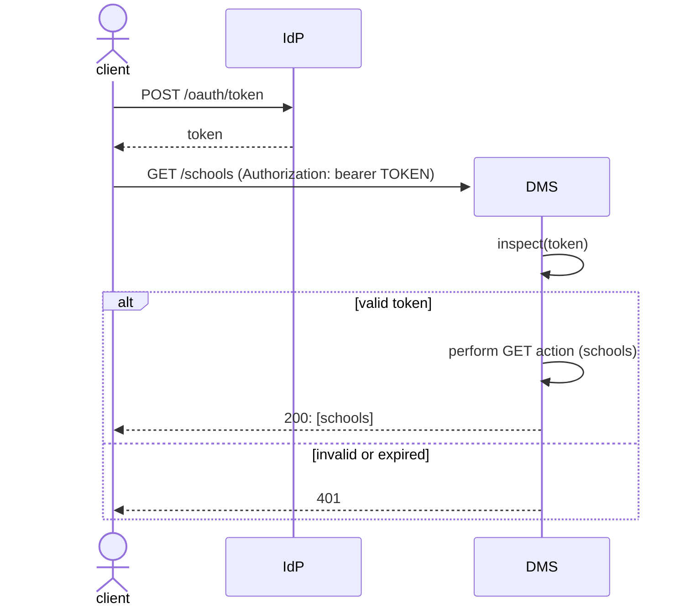

# Authentication and Authorization Requirements

All HTTP requests to Ed-Fi services, except for endpoints from the Ed-Fi
Discovery API, must be authenticated using an OAuth 2.0 (bearer) access token
via the client credentials flow. That token should be a JSON Web Token (JWT), so
that it can encode basic claim information.

## Multiplicity of Providers

This project aims to support a multiplicity of Identity Providers (IdP's), so
that platform hosts may choose from among available managed services. Through
use of various OAuth 2 specifications, the application code for accepting and
inspecting bearer tokens should be interoperable with any platform. However,
each platform has its own unique client management system and its own style of
supporting custom claims. Until further experiments are performed, it is not clear
if custom claims can be expressed in the same way in all platforms, or if they
may have some naming convention applied. So far, Google searches have not
surfaced details on how custom claims are emitted in JSON Web Tokens created by
the major platforms.

To that end, the Data Management Service and the Configuration Service will need
to have customized translation layers:

* A Gateway class for interacting with the remote IdP when managing client
  credentials. (Also see: [Plugin Architecture](./PLUGIN.md)).
* Potentially, a Mapper class that can translate between an IdP's idiom and an
  internal token representation,

Initially, the project will develop support for using
[Keycloak](https://www.keycloak.org/) as the OAuth Identity Provider.

## Client Authorization

Various authorization schemes will be applicable depending on the API being
accessed, and will be described in more detail in that application's
documentation.

* [Authorization in the Data Management Service](./DMS/AUTHORIZATION/README.md)
* [Authorization in the Configuration Service](./CS/CS-AUTH.md)

The steps for token inspection are described below; these steps apply to both
applications. Respond with status code 401 if any of these three checks fail:

### 1. Signature

There are two ways to validate that a JWT was created by the expected identity
provider (IdP): the receiving application can verify the signature, or it can
send the token to the IdP's introspection endpoint. To avoid this extra
round-trip, the DMS will verify the signature.

The most widely used signature algorithms are HS256 and RS256. In the former, a
single key is shared between both IdP and the receiving server. If that key
should be stolen, then anyone could create their own valid tokens. RS256, on the
other hand, is a private / public key pair. The IdP holds the private key and
the receiving server holds the public key or a certificate. The DMS will use
RS256.

### 2. Standard Parameters

This includes the audience, issuer, and expiration date.

### 3. Role

Ensure that there is an appropriate _role_ claim. Look for a claim labeled
`http://schemas.microsoft.com/ws/2008/06/identity/claims/role`, which should
contain an array of values. The expected value will be configurable (examples:
`dms-client`, `dms-config-client`).

## Implementation Notes

### Public Key Validation

Rather than store the public key, the DMS will store openid configuration URL
and use it to look up the [JSON Web Key
(JWK)](https://datatracker.ietf.org/doc/html/rfc7517) URL, which will contain the
public key:

At application startup:

1. Fetch contents at the OPen ID Configuration URL.
2. Extract the `jwks_uri` value and fetch those contents.
3. The next result will be an array of keys; look for the key with algorithm `RS256`.

Potentially useful resources for using this key to validate the received JWT:

* [How to validate the JWT token of keycloak in C# .Net?](https://stackoverflow.com/questions/68001461/how-to-validate-the-jwt-token-of-keycloak-in-c-sharp-net)
* [Verifying JWT signed with the RS256 algorithm using public key in C#](https://stackoverflow.com/questions/34403823/verifying-jwt-signed-with-the-rs256-algorithm-using-public-key-in-c-sharp)

> [!NOTE]
> The configuration URL also contains the `token_endpoint`; the application
> should read the endpoint from here, rather than hard-coding it in the
> app settings.

### Parameters and Role for Validation

These values should all be stored in app settings.
