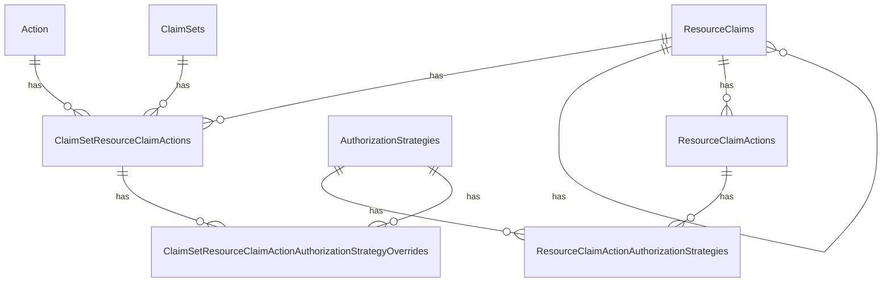
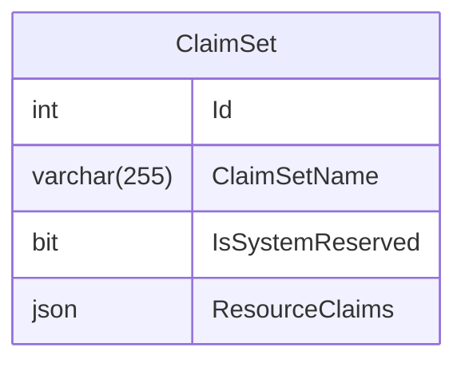

# Claimset Management

Ed-Fi API security relies on the concept of a claimset, which groups together
the operations allowed by an API client in the following dimensions:

* Authorization Strategy (namespace, ownership, various relationships, or no
  restriction).
* Resource - all of the entities in both the Resource API and the Descriptors
  API
  * There is also a hierarchy: for example, grouping some Descriptors together
    as "system descriptors" or "managed descriptors", or grouping together all
    education organizations.
* Actions (create, read, update, delete, and read changes (change queries)).

## Legacy Approach

### Database Model

In the ODS/API and the Admin API applications, these data are stored in the
`EdFi_Security` database with the following model:

### Admin API REST Interface

The Admin API interface supports the following operations related to these tables:

* /action
  * GET all
* /authorizationStrategies
  * GET all
* /claimsets
  * Regular CRUD operations:
    * GET all
    * GET by id
    * POST
    * PUT
    * DELETE
  * CLOB ("Character Large OBject") operations, which unifies all of the dimensions of a Claimset into one payload:
    * GET /export
    * POST /copy
    * POST /import
  * /claimsets/{id}/resourceClaimActions
    * POST
    * PUT
    * DELETE
    * /claimsets/{id}/resourceClaimActions/{id}
      * POST overrideAuthorizationStrategy
      * POST resetAuthorizationStrategies
* /resourceClaims
  * GET all
  * GET by id

The read-only endpoint return essentially hard-coded lists, so that a user will
know what ID values to use in constructing the payload for the CLOB operations
or resourceClaimActions operations.

## Proposed Approach

## Data Model

The DMS Configuration Service needs to support client tools built to interact
with Admin API 2. The service could duplicate the normalized database structure
from the ODS/API - or, it could take a more "NoSQL" like approach, as done in
the DMS. This inverts the legacy order, where the CLOB operations are wrappers
around the fine-grained tables. Instead, the CLOB resources could become the
real resources, so long as a PUT operation can be added to the interface
(`PUT /v2/claimSets/{id}/import`), with the same payload as `POST /v2/claimSets/import`.

Proposed database model:

> [!NOTE]
> The Admin API specification already describes the identifiers as integers. We
> will stick with that convention, rather than trying to switch to a UUID.

## REST API Implications

The DMS Configuration Service will not, initially, support all of the Admin API
endpoints. Further discussion with the affected community members is needed to
determine if this is a viable long-term direction. Initially, the key goal is to
enable the DMS to retrieve claimset information from the Configuration Service.
This is essentially the same as the export operation. We will modify the GET all
and GET by id endpoints to accept a query parameter that returns the "fully
hydrated" claimsets (with query string parameter `verbose`).

> [!TIP]
> [admin-api-2.2.0.yaml](https://github.com/Ed-Fi-Alliance-OSS/Ed-Fi-API-Standards/blob/main/api-specifications/admin-api/admin-api-2.2.0.yaml)
> is Admin API's specification in OpenAPI format. Use this definition to
> determine the request and response payloads.

### Supported Endpoints

#### ClaimSets

In the claimset GET requests, the readonly `_applications` array implies that
the query needs to join to the `Application` table. Thus the `Application` table
needs an index on `ClaimSetName`.

* `GET /v2/claimSets/{id}/export`
* `GET /v2/claimSets`
  * Return the simple response body defined in the Admin API specification.
  * Includes paging operations.
* `GET /v2/claimSets?verbose=true`
  * Returns the entire CLOB, with the same response as the `/export` endpoint.
  * Needs to support the normal paging operations, though `offset` and `limit`
    should _not_ be required fields.
* `GET /v2/claimSets/{id}`
  * Return the simple response body defined in the Admin API specification.
* `GET /v2/claimSets/{id}?verbose=true`
  * Returns the entire CLOB, with the same response as the `/export` endpoint.
* `POST /v2/claimSets`
  * In the Admin API interface, only the `name` is used. Continue supporting
    that. Basically, this is creating a placeholder with no useful information.
  * Also support accepting the entire `resourceClaims` CLOB payload, just like
    the `/import` endpoint.
  * If the `name` already exists, perform an `UPDATE` instead of re-inserting.

  > [!NOTE]
  > ClaimSet `name` must be unique.

* `PUT /v2/claimSets/{id}`
  * There is a small mistake in the Admin API specification, and we should fix
    that right now. Thus we have a breaking change compared to the Admin API 2.2
    specification. A `PUT` request _by definition_ must include the entire
    resource. In the DMS, we have interpreted that to mean that the `id` value
    is required in the payload. It also means that a request with only `{ "id":
    1, "name": "claimset name" }` would completely remove the `resourceClaims`
    node. Except for any metadata, we store _exactly_ what was received in the
    `PUT` request.
* `DELETE /v2/claimSets/{id}`
* `POST /v2/claimSets/copy`
* `POST /v2/claimSets/import`
  * Becomes a synonym to `/v2/claimSets`, except that now the `resourceClaims`
    array will be a required attribute.

#### AuthorizationStrategies

Support full CRUD operations on `/v2/authorizationStrategies`, even though the Admin API
specification only includes the read operations.

#### Actions

Continue supporting the read-only hard-coded list for `/v2/actions`.

### Unsupported Endpoints

At this time, the following endpoints will not be supported in the Configuration
Service, because the `/v2/claimSets` will provide the same support. This is
subject to change based on community feedback.

* `/v2/resourceClaims`
* `/v2/resourceClaims/{id}`
* `/v2/claimSets/{claimSetId}/resourceClaimActions/{resourceClaimId}/overrideAuthorizationStrategy`
* `/v2/claimSets/{claimSetId}/resourceClaimActions/{resourceClaimId}/resetAuthorizationStrategies`
* `/v2/claimSets/{claimSetId}/resourceClaimActions`
* `/v2/claimSets/{claimSetId}/resourceClaimActions/{resourceClaimId}`
* `/v2/claimSets/{claimSetId}/resourceClaimActions/{resourceClaimId}`

## Summary of Changes Compared to Admin API 2.2 Specification

* `offset` and `limit` should not be required parameters
* `PUT` requests will require the presence of the matching `id` attribute in the
  request body.
* Both `POST` and `PUT` on `/v2/claimSets` will support use of the
  `resourceClaims` attribute.
* A `GET` request to `/v2/claimSets` or `/v2/claimSets/{id}` will return the
  `resourceClaims` array _if_ query string parameter `verbose` is received with
  value `true`.

Thus, we have begun defining elements of an Admin API **3.0** specification.
