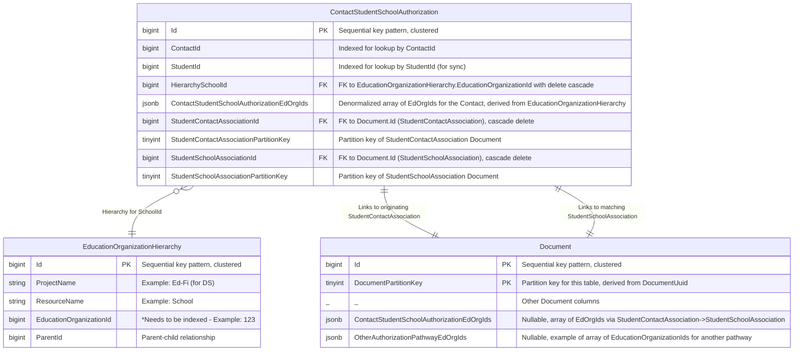
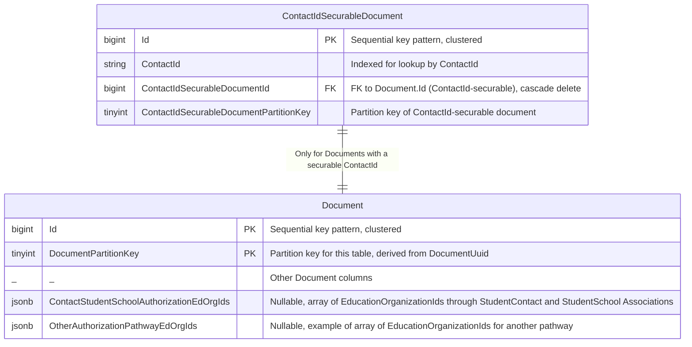

# Overview

This design builds on the existing [Student-EducationOrganization relationship-based authorization design](./STUDENT-EDORG-AUTHORIZATION.md)

The goal of this design is to enable Contact-EducationOrganization relationship-based authorization through a new authorization pathway called ContactStudentSchoolAuthorization that is similar to the StudentSchoolAssociationAuthorization pathway. This pathway builds on the existing StudentSchoolAssociationAuthorization and EducationOrganizationHierarchy tables.

# Primary Datastore Support

## ContactStudentSchoolAuthorization Pathway Table

This pathway links a Contact to a School's EducationOrganizationHierarchy via a combination of StudentContactAssociation and StudentSchoolAssociation.



The ContactStudentSchoolAuthorization table links a ContactId from StudentContactAssociation to a SchoolId from StudentSchoolAssociation. Note that their can be multiple Contacts for a Student and so multiple entries for a Student in this table. It uses EducationOrganizationHierarchy via SchoolId for the EdOrg hierarchy. The ContactStudentSchoolAuthorizationEdOrgIds column will be a JSONB column with a simple denormalized array taken from EducationOrganizationHierarchy for the School.

Records are created/updated/deleted primarily based on StudentContactAssociation document activity but also affected by changes to StudentSchoolAssociation documents.

# Denormalization for Search Engine Support

Search engine support requires a new denormalized EdOrgId array on the Document table called ContactStudentSchoolAuthorizationEdOrgIds which will be copied from the denormalized column provided by ContactStudentSchoolAuthorization.

Like with StudentId-securable documents, there will be a new ContactIdSecurableDocument table used to index those Documents by ContactId.



## Authorization Algorithm for Create/Update/Delete/Get-by-ID of a ContactId-Securable Document

As with StudentId-Securable Documents, the backend interfaces need to know which authorization pathways apply to a document. DMS Core compares the relevant denormalized EdOrgId array(s) on the document with client authorizations. ContactId-Securable Documents will use ContactStudentSchoolAuthorizationEdOrgIds on Document in the same manner for Create/Update/Delete/Get-by-ID as StudentId-Securable Documents use StudentSchoolAuthorizationEdOrgIds.

## Synchronization between ContactSchoolAssociation document (Document table), StudentSchoolAssociation document (Document table), ContactSchoolAssociationAuthorization, ContactIdSecurableDocument, and ContactId-Securable document (Document table)

This is the denormalization synchronization phase. The synchronization logic becomes more complex due to the need to union EdOrg IDs from potentially multiple associations.

* StudentSchoolAssociation - Additional Behavior for Contact Support
    * Create
        1. Find the Contacts for this Student via the ContactStudentSchoolAuthorization table.
        2. Insert a new ContactStudentSchoolAuthorization row linking the Contacts to this new StudentSchoolAssociation. StudentSchoolAssociation-related columns will be the same as those created for the StudentSchoolAssociationAuthorization table.
        3. For each of the Contacts, find the relevant ContactId-securable Documents via ContactIdSecurableDocument. Update their Document.ContactStudentSchoolAuthorizationEdOrgIds with the union of all ContactStudentSchoolAuthorization.ContactStudentSchoolAuthorizationEdOrgIds for the Contact.

    * Update
        1.  Nothing new

    * Delete (#2 and #3 are the same as #1 and #3 in Create)
        1. Delete the StudentSchoolAssociation document, which cascades to ContactStudentSchoolAuthorization
        2. Find the Contacts for this Student via the ContactStudentSchoolAuthorization table.
        3. For each of the Contacts, find the relevant ContactId-securable Documents via ContactIdSecurableDocument. Update their Document.ContactStudentSchoolAuthorizationEdOrgIds with the union of all ContactStudentSchoolAuthorization.ContactStudentSchoolAuthorizationEdOrgIds for the Contact.

* StudentContactAssociation
    * Create
        1. Insert StudentParentAssociation document into Document
        2. Find the rows for this Student in the StudentSchoolAssociationAuthorization table.
        3. For each row, insert a corresponding ContactStudentSchoolAuthorization row, bringing over the StudentSchoolAssociation-related columns from StudentSchoolAssociationAuthorization.
        4. For the Contact, find the relevant ContactId-securable Documents via ContactIdSecurableDocument. Update their Document.ContactStudentSchoolAuthorizationEdOrgIds with the union of all ContactStudentSchoolAuthorization.ContactStudentSchoolAuthorizationEdOrgIds for the Contact.

    * Update
        1. No action - identity is immutable

    * Delete (#3 same as #3 in Create, #2 same as #1 in Create of StudentSchoolAssociation)
        1. Delete the StudentContactAssociation document, which cascades to ContactStudentSchoolAuthorization.
        2. Find the Contacts for this Student via the ContactStudentSchoolAuthorization table.
        3. For the Contact, find the relevant ContactId-securable Documents via ContactIdSecurableDocument. Update their Document.ContactStudentSchoolAuthorizationEdOrgIds with the union of all ContactStudentSchoolAuthorization.ContactStudentSchoolAuthorizationEdOrgIds for the Contact.


* ContactId-securable Document (Document table)
    * Create
        1. Find the Contacts for this ContactId in the ContactStudentSchoolAuthorization table.
        2. Get the union of all ContactStudentSchoolAuthorization.ContactStudentSchoolAuthorizationEdOrgIds for those
        rows.
        2. Insert ContactId-securable document into Document, including the unioned ContactStudentSchoolAuthorizationEdOrgIds array
        3. Create ContactIdSecurableDocument entry for this Document

  * Update (including cascade)
      1. Detect changes to ContactId
         1. If none, skip.
         2. If change, treat as Delete and Create
      2. Update ContactId-securable document in Document

  * Delete
    1. Nothing synchronization-related


# Search Engine Query with Authorization Filters

## Search Engine Indexing

The denormalized EdOrgId array column ContactStudentSchoolAuthorizationEdOrgIds is included in the search engine index and keyword indexed.

```json
    {
      "DocumentUuid": "...",
      "ProjectName": "...",
      "ResourceName": "...",
      "EdfiDoc": "...",

      // Authorization pathway fields
      "ContactStudentSchoolAuthorizationEdOrgIds":["...", "...", "..."],
      "OtherAuthorizationPathwayEdOrgIds":["...", "...", "..."]
    }
```

## Search Engine Query Formulation

This is identical to the StudentSchoolAuthorization pathway, instead using ContactStudentSchoolAuthorizationEdOrgIds for filtering.
Authorization filtering applies client-authorized EdOrgIds against the relevant pathway fields using `terms` filters, ANDed with other query terms.

## Possible Future Improvements

* Partitioning of ContactIdSecurableDocument and ContactStudentSchoolAuthorization with partition key derived from ContactId.
* Support for multiple `StudentSchoolAssociations` per Student.
* Handling `EducationOrganizationHierarchy` changes.
* Analysis of tolerance for synchronization delays.

# Possible Future Issues

Future partitioning of ContactStudentSchoolAuthorization may be a problem because of the need to index on both StudentId and ContactId. Most index access is via ContactId, but a delete of StudentContactAssociation requires access via StudentId. It would make the most sense for a partition key to be derivable from ContactId. Therefore, an index of StudentId would have to be cross-partition.
