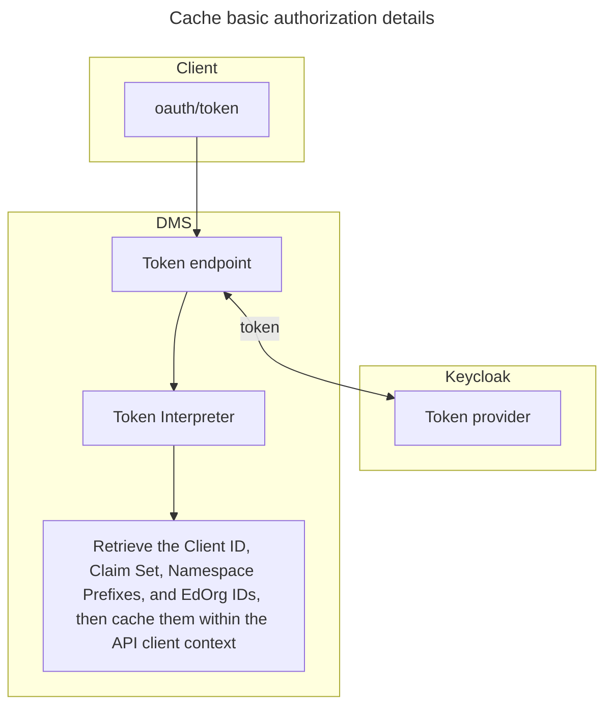
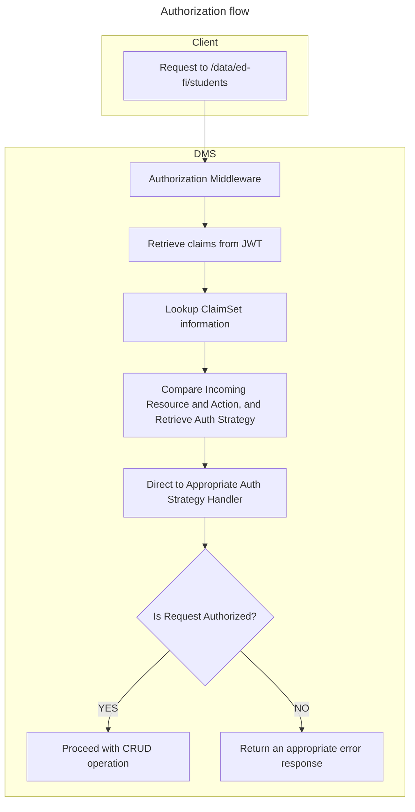

# Namespace Based Authorization Implementation

These design notes complement the documentation in [Document Authorization](./DOCUMENT-AUTHORIZATION.md).

## 1. Authenticating and Authorizing the Client on DMS

The client provides its client ID and secret to the oauth/token endpoint on DMS.
The system then authenticates these credentials using a third-party
authentication provider(`Keycloak`), which returns a token upon successful
authentication.
> [!NOTE]
> For more details on configuring the DMS client and token information, please refer to [Configure client on Keycloak](https://github.com/Ed-Fi-Alliance-OSS/Data-Management-Service/blob/main/eng/docker-compose/KEYCLOAK-SETUP.md)

## 2. Token Validator and Interpreter

The provided token will be validated to ensure it includes the expected role,
such as 'dms-client.' Then, the token interpreter will decode the token to
extract essential authorization metadata, including the Client ID, ClaimSet
name, Education Organization IDs, Namespace prefixes, and other relevant
details.

## 3. Authorization Context

An authorization context is established, including the client's basic
authorization details (Client id, Claim set name, Education Organization ids,
Namespace prefixes etc..). This context data is then cached to streamline
further requests.

## 4. Security Metadata Cache

> [!NOTE]
> The initial implementation may not need to validate or account for hierarchy
> or grouping based authorization.

Caching only the claim set data may be insufficient, as parent entity details
could also be required for authorization. On DMS, the claim set
details—including resource claims, resource claim actions, and resource claim
action authorization strategies—are retrieved and cached from the DMS
Configuration Service, which stores this data in its own database.

## 5. Authorizing /data Endpoint Requests

Authorization checks for the /data endpoint requests are performed immediately
before database operations (CRUD operations).

## 6. Authorization Middleware

Within the authorization middleware, the system decides whether the request is
authorized or not.

## 7. Security Backend

A dedicated project is in place to handle all authorization processes.

## 8. Initial Implementation

The initial plugin structure (Interfaces and classes) will be established to
support the process of verifying the request against the claim set.

Handlers will be created for two authorization strategies:

* Namespace-based Authorization

* No Further Authorization

### Resources and Descriptors authorization

**Resources:** Initially, resource operations will use the "No Further
Authorization" strategy.

**Descriptors:** Create, update, and delete operations for descriptors will
require "Namespace Based" authorization, while read operations require "No
Further Authorization".

## Proposed Application Design

