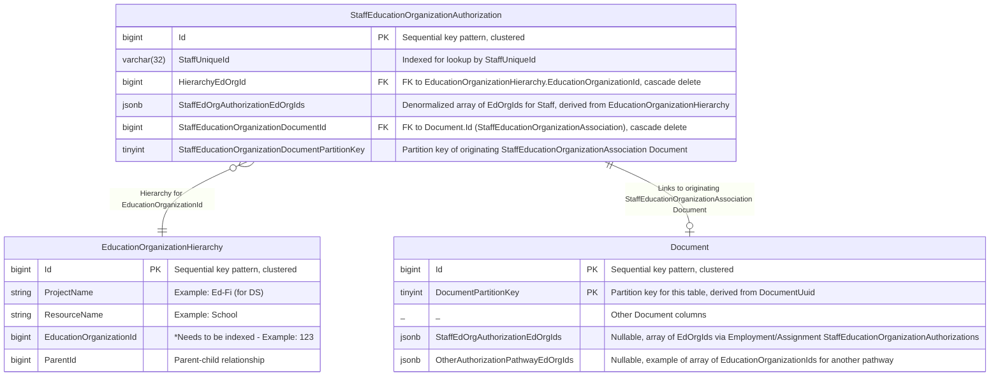
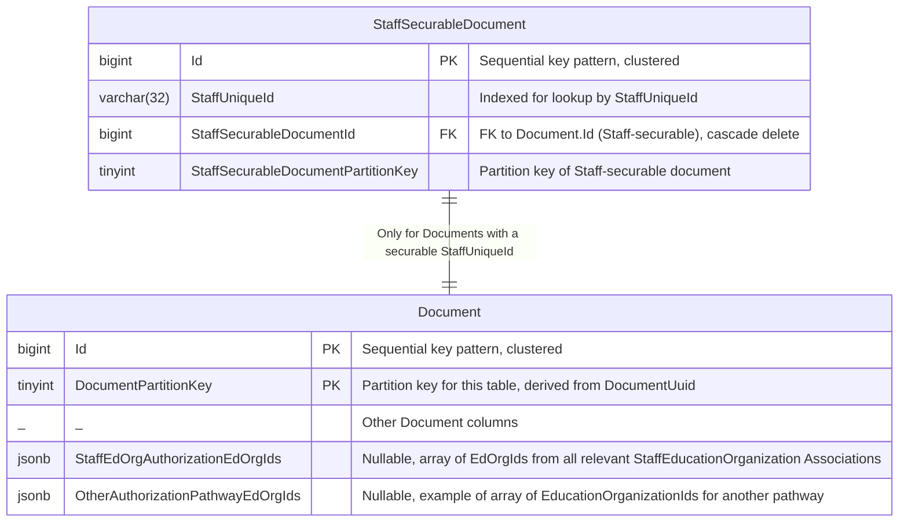

# Overview

This design has many similarities to the existing [Student-EducationOrganization relationship-based authorization design](./STUDENT-EDORG-AUTHORIZATION.md)

The goal of this design is to enable Staff-EducationOrganization relationship-based authorization though a new pathway. This pathway links a Staff member to their associated EducationOrganizations through their Employment and/or Assignment Associations. Note that a Staff member can have multiple associations, both of different types (Employment/Assignment) and to multiple EducationOrganizations within each type.

# Primary Datastore Support

## StaffEducationOrganizationAuthorization Pathway Table

This pathway links a Staff to a EducationOrganization's EducationOrganizationHierarchy via either a StaffEducationOrganizationEmploymentAssociation document or a StaffEducationOrganizationAssignmentAssociation document.



The StaffEducationOrganizationAuthorization table links a StaffUniqueId from StaffEducationOrganizationEmploymentAssociation or StaffEducationOrganizationAssignmentAssociation to an EducationOrganizationId in the EducationOrganizationHierarchy. Note that there can be multiple EducationOrganizations for a Staff and so multiple entries for a Staff in this table. It uses EducationOrganizationHierarchy via HierarchyEdOrgId for the EdOrg hierarchy. The StaffEdOrgAuthorizationEdOrgIds column will be a JSONB column with a simple denormalized array taken from EducationOrganizationHierarchy for the Staff for this specific association.

# Denormalization for Search Engine Support

Search engine support requires a new denormalized EdOrgId array on the Document table called StaffEdOrgAuthorizationEdOrgIds which will be copied from the denormalized column provided by StaffEducationOrganizationAuthorization.

Like with Student-securable documents, there will be a new StaffSecurableDocument table used to index those Documents by StaffUniqueId.



Note that for Staff-securable documents, the StaffEdOrgAuthorizationEdOrgIds column will store the union of all StaffEdOrgAuthorizationEdOrgIds arrays from all StaffEducationOrganizationAuthorization rows associated with this StaffSecurableDocument.

## Authorization Algorithm for Create/Update/Delete/Get-by-ID of a Staff-securable Document

As with Student-securable Documents, the backend interfaces need to know which authorization pathways apply to a document. DMS Core compares the relevant denormalized EdOrgId array(s) on the document with client authorizations. Staff-securable Documents will use StaffEdOrgAuthorizationEdOrgIds on Document in the same manner for Create/Update/Delete/Get-by-ID as Student-securable Documents use StudentSchoolAuthorizationEdOrgIds.


## Synchronization between StaffEducationOrganizationEmploymentAssociation document (Document table), StaffEducationOrganizationAssignmentAssociation document (Document table), StaffEducationOrganizationAuthorization, StaffSecurableDocument, and Staff-securable document (Document table)

Synchronization ensures the denormalized `StaffEdOrgAuthorizationEdOrgIds` on `Document` tables are kept consistent with the source association data.

* StaffEducationOrganizationAssociation (Employment or Assignment)
  * Create
    1. Insert StaffEducationOrganizationAssociation document into Document
    2. Compute EdOrgId array for Staff from EdOrgId and EducationOrganizationHierarchy
    3. Insert derived row into StaffEducationOrganizationAuthorization, including EdOrgId array in StaffEdOrgAuthorizationEdOrgIds column
    4. Update EdOrgId array on each Staff-securable Document for this Staff, using indexed StaffUniqueId on StaffSecurableDocument. Note this needs to be a union of all Staff entries in StaffEducationOrganizationAuthorization

  * Update
    1. No action - identity is immutable

  * Delete (#2 same as #4 in Create of StaffEducationOrganizationAssociation)
    1. Delete the StaffEducationOrganizationAssociation document, which cascades to StaffEducationOrganizationAuthorization.
    2. Update EdOrgId array on each Staff-securable Document for this Staff, using indexed StaffUniqueId on StaffSecurableDocument. Note this needs to be a union of all Staff entries in StaffEducationOrganizationAuthorization


* Staff-securable Document (Document table)
  * Create
    1. Find the Staff for this StaffUniqueId in the StaffEducationOrganizationAuthorization table.
    2. Get the union of all StaffEducationOrganizationAuthorization.StaffEdOrgAuthorizationEdOrgIds for those
    rows.
    2. Insert Staff-securable document into Document, including the unioned StaffEdOrgAuthorizationEdOrgIds array
    3. Create StaffSecurableDocument entry for this Document

  * Update (including cascade)
    1. Detect changes to StaffUniqueId
      1. If none, skip.
      2. If change, treat as Delete and Create
    2. Update Staff-securable document in Document

  * Delete
    1. Nothing synchronization-related

# Search Engine Query with Authorization Filters

### Indexing

The denormalized EdOrgId array column StaffEdOrgAuthorizationEdOrgIds is included in the search engine index and keyword indexed.

```json
    {
      "DocumentUuid": "...",
      "ProjectName": "...",
      "ResourceName": "...",
      "EdfiDoc": "...",

      // Authorization pathway fields
      "StaffEdOrgAuthorizationEdOrgIds":["...", "...", "..."],
      "OtherAuthorizationPathwayEdOrgIds":["...", "...", "..."]
    }
```

## Search Engine Query Formulation

This is identical to the StudentSchoolAuthorization pathway, instead using StaffEdOrgAuthorizationEdOrgIds for filtering.
Authorization filtering applies client-authorized EdOrgIds against the relevant pathway fields using `terms` filters, ANDed with other query terms.

## Possible Future Improvements

* Partitioning of StaffSecurableDocument and StaffEducationOrganizationAuthorization with partition key derived from StaffUniqueId.
* Handling `EducationOrganizationHierarchy` changes.
* Analysis of tolerance for synchronization delays.
