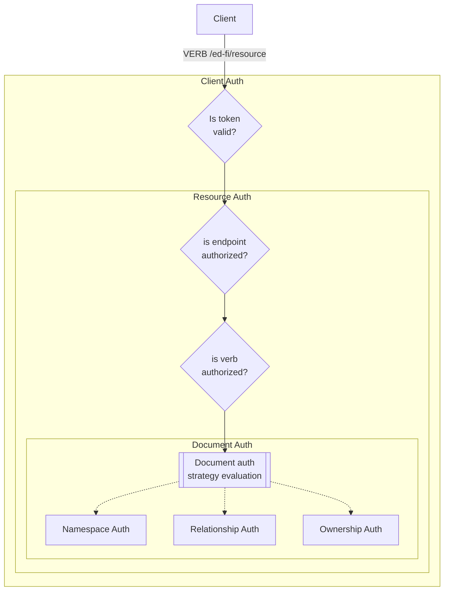

# Authorization in the Data Management Service

> [!TIP]
> Also see the global [Authentication and Authorization Requirements](../../AUTH.md)

Client authentication will be performed using an OAuth 2.0 compatible identity
provider (IdP). The initial release of the Data Management Service (DMS) will
support [Keycloak](https://www.keycloak.org/) out of the box, and it will be
built for extensibility to [support other
providers](../../AUTH.md#multiplicity-of-providers).

The DMS intended primarily for system interaction, not user interaction.
Therefore it will initially support only two-legged OAuth using the
`client_credentials` grant type.

The IdP will be expected to create a signed [JSON Web Token](https://jwt.io)
containing information about the client, which can be used for authorization to:

* The API itself
* Specific Ed-Fi Descriptors and Resources ("endpoint authorization")
* Specific documents ("row level authorization")

The Data Management Service will reproduce the authorization _strategies_
[employed by the Ed-Fi ODS / API](./ODS-API-AUTHORIZATION.md). The _mechanisms_,
however, will necessarily differ due to the new database design and the decision
to use JWTs instead of a random string bearer token.

The following detailed design documents build on each other successively.

* [Client Authorization](../../AUTH.md#client-authorization)
* [Resource Authorization](./RESOURCE-AUTHORIZATION.md)
* [Document Authorization](./DOCUMENT-AUTHORIZATION.md)

## Authorization and Dependency Ordering

The dependencies endpoint in the Discovery API will likely be influenced by
authorization requirements. For example, in the ODS/API's _education
organization_ based authorization, the Student _create_ permission has a higher
order number for the Student _update_ permission, with the Student School
Association coming in between the two. This is because the Student cannot be
updated until there is a Student School Association with which to decide if the
update is authorized.
