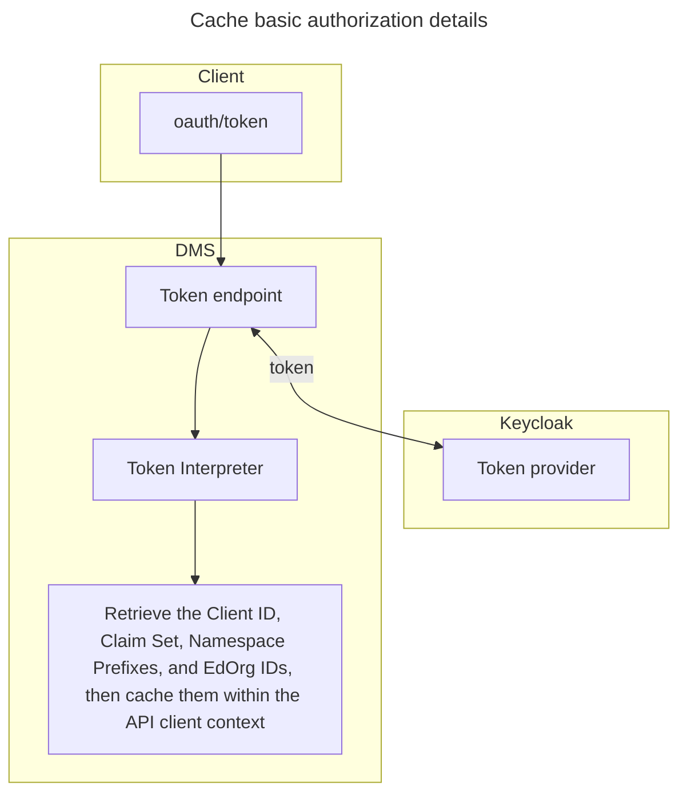
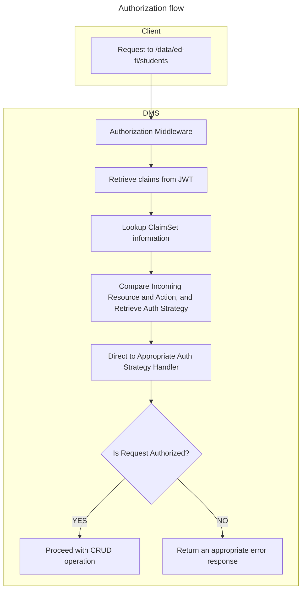

# Authorization in the Data Management Service

> [!TIP]
> Also see the global [Authentication and Authorization Requirements](../AUTH.md)

Client authentication will be performed using an OAuth 2.0 compatible identity provider (IdP). The initial release of the Data Management Service (DMS) will support [Keycloak](https://www.keycloak.org/) out of the box, and it will be built for extensibility to [support other providers](../../AUTH.md#multiplicity-of-providers).

The DMS intended primarily for system interaction, not user interaction. Therefore it will initially support only two-legged OAuth using the `client_credentials` grant type.

The IdP will be expected to create a signed [JSON Web Token](https://jwt.io) containing information about the client, which can be used for authorization to:

* The API itself
* Specific Ed-Fi Descriptors and Resources ("endpoint authorization")
* Specific documents ("row level authorization")

The Data Management Service will reproduce the authorization _strategies_ [employed by the Ed-Fi ODS / API](./ODS-API-AUTHORIZATION.md). The _mechanisms_, however, will necessarily differ due to the new database design and the decision to use JWTs instead of a random string bearer token.

The following detailed design documents build on each other successively.

* [Client Authorization](../../AUTH.md#client-authorization)
* [Resource Authorization](./RESOURCE-AUTHORIZATION.md)
* [Document Authorization](./DOCUMENT-AUTHORIZATION.md)

### Namespaces

Technically a given client can have an unlimited number of namespaces. In practice, we anticipate that there will usually be one to three namespaces. Thus the namespaces can be stored directly on the JWT generated by the IdP.

### Education Organization Identifiers

In some rare cases a client may have access to a large number of education organizations. For example, a Student Information System (SIS) that provides service to half of the school districts in Texas might have a single client that has access to 600 local education organizations. Storing all of those in the JWT is probably excessive.

Design for handling this is _to be determined_.

## Authorization and Dependency Ordering

The dependencies endpoint in the Discovery API will likely be influenced by
authorization requirements. For example, in the ODS/API's _education
organization_ based authorization, the Student _create_ permission has a higher
order number for the Student _update_ permission, with the Student School
Association coming in between the two. This is because the Student cannot be
updated until there is a Student School Association with which to decide if the
update is authorized.

## Namespace based authorization on DMS

### 1. Authenticating and Authorizing the Client on DMS

The client provides its client ID and secret to the oauth/token endpoint on DMS.
The system then authenticates these credentials using a third-party
authentication provider(`Keycloak`), which returns a token upon successful
authentication.
> [!NOTE]
> For more details on configuring the DMS client and token information, please refer to [Configure client on Keycloak](https://github.com/Ed-Fi-Alliance-OSS/Data-Management-Service/blob/DMS-81/eng/docker-compose/KEYCLOAK-SETUP.md)

### 2. Token Validator and Interpreter

The provided token will be validated to ensure it includes the expected role,
such as 'dms-client.' Then, the token interpreter will decode the token to
extract essential authorization metadata, including the Client ID, ClaimSet
name, Education Organization IDs, Namespace prefixes, and other relevant
details.

### 3. Authorization Context

An authorization context is established, including the client's basic
authorization details (Client id, Claim set name, Education Organization ids,
Namespace prefixes etc..). This context data is then cached to streamline
further requests.

### 4. Security Metadata Cache

> [!NOTE]
> The initial implementation may not need to validate or account for hierarchy
> or grouping based authorization.

Caching only the claim set data may be insufficient, as parent entity details
could also be required for authorization. On DMS, the claim set
details—including resource claims, resource claim actions, and resource claim
action authorization strategies—are retrieved and cached from the DMS
Configuration Service, which stores this data in its own database.

### 5. Authorizing /data Endpoint Requests

Authorization checks for the /data endpoint requests are performed immediately
before database operations (CRUD operations).

### 6. Authorization Middleware

Within the authorization middleware, the system decides whether the request is
authorized or not.

### 7. Security Backend

A dedicated project is in place to handle all authorization processes.

### 8. Initial Implementation

The initial plugin structure (Interfaces and classes) will be established to
support the process of verifying the request against the claim set.

Handlers will be created for two authorization strategies:

* Namespace-based Authorization

* No Further Authorization

#### Resources and Descriptors authorization

**Resources:** Initially, resource operations will use the "No Further
Authorization" strategy.

**Descriptors:** Create, update, and delete operations for descriptors will
require "Namespace Based" authorization, while read operations require "No
Further Authorization".

## Proposed Application Design

