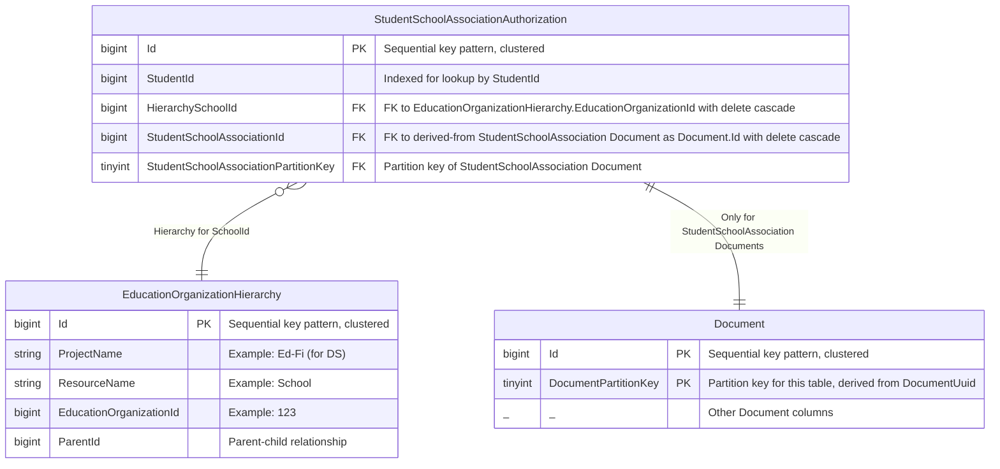
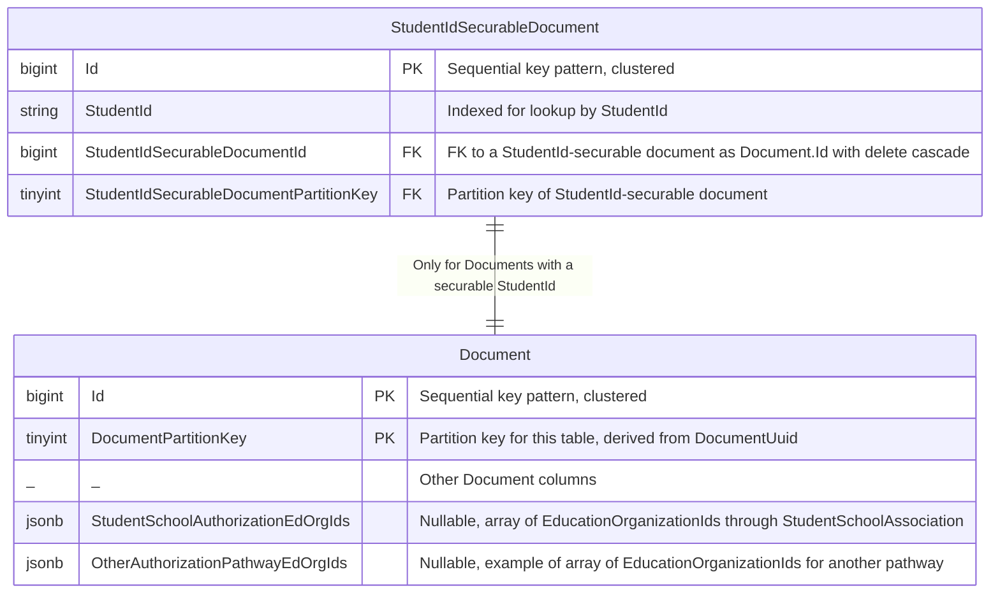

# Overview

The goal of this design is to enable Student-EducationOrganization relationship-based authorization through multiple authorization strategies. Examples include StudentSchoolAssociationAuthorization and StudentProgramAssociationAuthorization. In this document we will use StudentSchoolAssociationAuthorization strategy as our example.

The challenge is to denormalize just enough information to allow for efficient authorization checks, both against the primary datastore and a search engine, while at the same time not be overly burdensome for security-related Document insert/update/delete.

We will build on the existing EducationOrganizationHierarchy table to implement Student relationship-based authorization by using a concrete table for each relationship strategy.

# Primary Datastore Support

## Authorization Strategy Table - StudentSchoolAssociationAuthorization example

There will be a denormalized, non-partitioned table per authorization strategy. An example with StudentSchoolAssociationAuthorization as the strategy:

StudentSchoolAssociationAuthorization records are created/updated along with StudentSchoolAssociation documents. The HierarchySchoolId FK will be used to access the full hierarchy of EducationOrganizations the School is a part of. The StudentSchoolAssociationId FK is for syncing updates and deletes of StudentSchoolAssociation documents, via the Document.Id from the initial insert of the StudentSchoolAssociation Document.

Updates to a StudentSchoolAssociation Document will require corresponding updates to the StudentSchoolAssociationAuthorization table. This includes updates due to a cascade.

* Not designed here: We will need a way for core to communicate to the backend on insert/update/delete of a StudentSchoolAssociation that this is the StudentSchoolAssociationAuthorization pathway, along with the extracted StudentId and SchoolId for insert/update. We will also need to communicate when a document is StudentId securable.

* Also, need to make sure EducationOrganizationHierarchy is indexed appropriately.

# Denormalization for Search Engine Support

Our search engine support will require the introduction of denormalized EducationOrganizationId arrays on the Document table (omitted above, shown below). This information will be similar to that provided by StudentSchoolAssociationAuthorization, with one column per authorization pathway. In this case, the column would be StudentSchoolAuthorizationEdOrgIds, a JSONB column containing a simple array of EducationOrganizationIds for a Student, derived from StudentSchoolAssociation and constructed from StudentSchoolAssociationAuthorization. This denormalized array is what will be used for authorization filtering on search engine queries.

Additionally, we will need a non-partitioned table StudentIdSecurableDocument that will act as an index into the Document table for all StudentId-securable documents. This will provide efficient access to StudentId-securable Documents for synchronization of StudentSchoolAuthorizationEdOrgIds.

When a new document with StudentId is inserted, need to lookup StudentSchoolAssociationAuthorization table and link it if it exists. Note you can hit an FK constraint violation here by trying to delete a StudentSchoolAssociation while it's being used for security. Need to null out StudentSchoolAssociationAuthorizationId and StudentSchoolAuthorizationEdOrgIds instead.

What about when a StudentSchoolAssociation record gets created after a document with StudentId is already there? Need a lookup table with all documents with a securable StudentId? Then a trigger on change to StudentSchoolAssociationAuthorization could update all Document.StudentSchoolAssociationAuthorizationId and Document.StudentSchoolAuthorizationEdOrgIds columns.

## Authorization Algorithm for Create/Update/Delete/Get-by-ID of a document with StudentIds

**** Needs a second pass

Assuming this is a document with StudentId, using the StudentSchoolAssociationAuthorization strategy:

1. Get the EducationOrganizationHierarchy for this student as a list of EducationOrganizationIds, via the backend.
   * This means we need a way to query the backend for EducationOrganizationHierarchy for one or more StudentIds, via the StudentSchoolAssociationAuthorization and EducationOrganizationHierarchy tables. At some point this will need to be cacheable-friendly.
2. Compare the EducationOrganizationIds with client authorizations.

## Synchronization between StudentSchoolAssociation document (Document table), StudentSchoolAssociationAuthorization, StudentIdSecurableDocument, and StudentId-Securable document (Document table)

**** Continue StudentIdSecurableDocument refinement here, look at putting EdOrgId array directly onto StudentSchoolAssociationAuthorization

Note: This version assumes frequent recalc of EdOrgId array for a Student, derived from StudentSchoolAssociationAuthorization and EducationOrganizationHierarchy. May want to change to denormalize EdOrgId array directly onto StudentSchoolAssociationAuthorization. This will require additional synchronization for changes to EducationOrganizationHierarchy.

* StudentSchoolAssociation (Document table)
  * Create
    1. Insert StudentSchoolAssociation document into Document
    2. Insert derived row into StudentSchoolAssociationAuthorization
    3. Compute EdOrgId array for Student from SchoolId and EducationOrganizationHierarchy
    4. Insert EdOrgId array into each StudentId-Securable Document

  * Update (including cascade)
    1. Update StudentSchoolAssociation document in Document
    2. Detect changes to either StudentId or SchoolId - StudentSchoolAssociation allows identity updates
       1. If none, done.
       2. If change to StudentId, treat as Delete and Create
       3. If change to SchoolId, compute and insert EdOrgId array into each StudentId-Securable Document

  * Delete
    1. Null out EdOrgId array in each StudentId-Securable Document
    2. Delete StudentSchoolAssociation document
    3. Delete cascade will remove StudentSchoolAssociationAuthorization row

* StudentId-securable Document (Document table)
  * Create
    1. Insert StudentId-securable document into Document
    2. Lookup StudentSchoolAssociationAuthorization for Student
    3. Compute EdOrgId array for Student from SchoolId and EducationOrganizationHierarchy
    4. Insert EdOrgId array into each StudentId-Securable Document

  * Update (including cascade)
      1. Update StudentId-securable document in Document
      2. Detect changes to StudentId
         1. If none, done.
         2. If change to SchoolId, lookup StudentSchoolAssociationAuthorization for Student, compute and insert EdOrgId array into Document

  * Delete
    1. Do nothing security-related

* EducationOrganizationHierarchy - Currently changes in response to EducationOrganization Document activity. We expect such changes after initial load to be quite rare, so we will defer this for RC.

* StudentSchoolAssociationAuthorization - Only changes as a side effect of other Document changes.

# Search Engine Query with Authorization Filters

**** Describe algorithm, include AND/OR examples for joining multiple pathway filters to express an Auth Strategy
