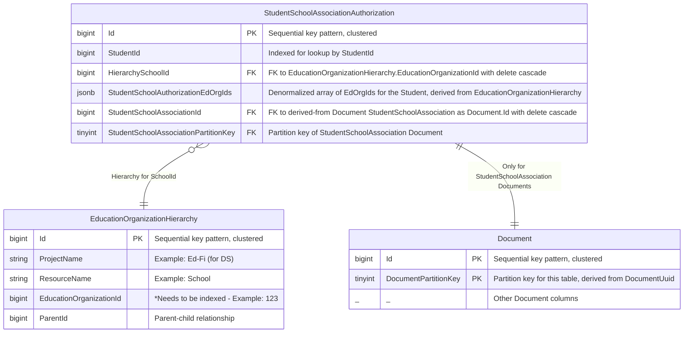

# Overview

The goal of this design is to enable Student-EducationOrganization relationship-based authorization through multiple authorization strategies. Examples include StudentSchoolAssociationAuthorization and StudentProgramAssociationAuthorization. This document begins with StudentSchoolAssociationAuthorization by itself as an authorization pathway. We will build on the existing EducationOrganizationHierarchy table to implement Student relationship-based authorization by using a concrete table for each relationship pathway.

The challenge is to denormalize just enough information to allow for efficient authorization checks, both against the primary datastore and search engine, while at the same time not be overly burdensome for synchronization on Document inserts and updates.

A vocabulary note: The term "authorization pathway" refers to a component of an authorization strategy. Authorization strategies may be composed of one or more authorization pathways with AND/OR logic.

# Primary Datastore Support

## Authorization Pathway Table - StudentSchoolAssociationAuthorization example

There will be a denormalized, non-partitioned table per authorization pathway. With StudentSchoolAssociationAuthorization as the pathway:


The EducationOrganizationHierarchy table already exists but needs the addition of an index on EducationOrganizationId.

StudentSchoolAssociationAuthorization records are created/updated/deleted along with StudentSchoolAssociation documents. The HierarchySchoolId FK will be used to access the full hierarchy of EducationOrganizations the School is a part of, via EducationOrganizationHierarchy. The StudentSchoolAuthorizationEdOrgIds column will be a JSONB column with a simple denormalized array taken from EducationOrganizationHierarchy for the School.

Updates to a StudentSchoolAssociation Document will require corresponding updates to the StudentSchoolAssociationAuthorization table. This includes updates due to a cascade. We will need a way for core to communicate to the backend on insert/update/delete of a StudentSchoolAssociation that this is the StudentSchoolAssociationAuthorization pathway, along with the extracted StudentId and SchoolId for insert/update.

StudentSchoolAssociationAuthorization does not need to be replicated to the search engine.

# Denormalization for Search Engine Support

Our search engine support will require the introduction of denormalized EducationOrganizationId arrays on the Document table (omitted from diagram above, but shown below). This information will be copied from the denormalized row provided by StudentSchoolAssociationAuthorization, with one column per authorization pathway. In this case, the Document column would be StudentSchoolAuthorizationEdOrgIds, a JSONB column containing a simple array of EducationOrganizationIds for a Student, derived from StudentSchoolAssociation. This denormalized array is what will be used for authorization filtering on search engine queries.

When a new StudentId-securable document is inserted, the backend will need to lookup the StudentId on the StudentSchoolAssociationAuthorization table and apply the StudentSchoolAuthorizationEdOrgIds to the document via StudentSchoolAssociationAuthorization.

Additionally, we will need a non-partitioned table StudentIdSecurableDocument that will act as an index into the Document table for all StudentId-securable documents. This will provide efficient access to StudentId-securable Documents for synchronization when StudentSchoolAuthorizationEdOrgIds change. When a new StudentId-securable Document is inserted, the backend will add this record. The FK will be cascade deleted when a StudentId-securable document is deleted.

StudentIdSecurableDocument does not need to be replicated to the search engine.


## Authorization Algorithm for Create/Update/Delete/Get-by-ID of a StudentId-Securable Document

There are two phases to security actions for the backend. This is the authorization itself for
a StudentId-securable Document, using the StudentSchoolAssociationAuthorization pathway:

* Create/Update
  1. In DMS Core, get the StudentSchoolAuthorizationEdOrgIds array for this student, via the backend. This means we need a new interface to query the backend for EducationOrganizationIds for StudentId-securable documents for specific authorization pathway(s), and also pass along client authorizations.
  2. DMS Core compares the StudentSchoolAuthorizationEdOrgIds with client authorizations and allow or deny.

* Get-by-ID
  1. DMS core calls the backend with the request. We need the Get-By-Id interface to be told when the Document is StudentId-securable using specific authorization pathway(s). Backend returns the document along with its StudentSchoolAuthorizationEdOrgIds.
  2. DMS Core compares the StudentSchoolAuthorizationEdOrgIds with client authorizations and allow or deny.

* Delete
  1. DMS core calls the backend with the request. We need the Delete interface to be told when the Document is StudentId-securable using specific authorization pathway(s), and also pass along client authorizations.
  2. Backend compares the StudentSchoolAuthorizationEdOrgIds with client authorizations and allow or deny.

## Synchronization between StudentSchoolAssociation document (Document table), StudentSchoolAssociationAuthorization, StudentIdSecurableDocument, and StudentId-Securable document (Document table)

There are two phases to security actions for the backend. This is the denormalization synchronization phase.

* StudentSchoolAssociation (Document table)
  * Create
    1. Insert StudentSchoolAssociation document into Document
    2. Compute EdOrgId array for Student from SchoolId and EducationOrganizationHierarchy
    3. Insert derived row into StudentSchoolAssociationAuthorization, including EdOrgId array in StudentSchoolAuthorizationEdOrgIds column
    4. Update EdOrgId array on each StudentId-Securable Document for this Student, using indexed StudentId on StudentIdSecurableDocument

  * Update (including cascade)
    1. Detect changes to either StudentId or SchoolId - StudentSchoolAssociation allows identity updates
       1. If none, skip.
       2. If change to StudentId or SchoolId, treat as Delete and Create
    2. Update StudentSchoolAssociation document in Document

  * Delete
    1. Null out EdOrgId array in each StudentId-Securable Document, using indexed StudentId on StudentIdSecurableDocument
    2. Delete StudentSchoolAssociation document
    3. Delete cascade will remove StudentSchoolAssociationAuthorization row

* StudentId-securable Document (Document table)
  * Create
    1. Lookup EdOrgId array on StudentSchoolAssociationAuthorization by indexed StudentId
    2. Insert StudentId-securable document into Document, including EdOrgId array
    3. Create StudentIdSecurableDocument entry for this Document

  * Update (including cascade)
      1. Detect changes to StudentId
         1. If none, skip.
         2. If change, treat as Delete and Create
      2. Update StudentId-securable document in Document

  * Delete
    1. Nothing synchronization-related

* EducationOrganizationHierarchy - Currently changes in response to EducationOrganization Document activity. We expect such changes after initial load to be quite rare, so we will defer this for RC.

* StudentSchoolAssociationAuthorization - Only changes as a side effect of other Document changes.

# Search Engine Query with Authorization Filters

## Search Engine Indexing

When the Document table is replicated into the search engine, the EducationOrganizationIds columns for each authorization pathway will be included and keyword indexed.

```json
    {
      "DocumentUuid": "...",
      "ProjectName": "...",
      "ResourceName": "...",
      "EdfiDoc": "...",

      // Authorization pathway fields
      "StudentSchoolAuthorizationEdOrgIds":["...", "...", "..."],
      "OtherAuthorizationPathwayEdOrgIds":["...", "...", "..."]
    }
```

## Search Engine Query Formulation

With the EducationOrganizationIds for each authorization pathway indexed, search engine authorization filtering can be done by applying filters with the client authorized EducationOrganizationIds for the authorization pathways relevant to the authorization strategy being used. This would be ANDed to the client query terms, if any.

 A snippet of an authorization filter for the StudentSchoolAuthorization pathway by itself would look like:

```json
"must":
{
  "terms":
  {
    "StudentSchoolAuthorizationEdOrgIds": "["...", "...","..."] // Client Authorizations
  }
}
```

Authorization strategies that require more than one authorization pathway can be mixed and matched with AND and OR clauses in the filter as necessary.

## Possible Future Improvements

* Partitioning of StudentIdSecurable table with partition key derived from StudentId.
* Partitioning of StudentSchoolAssociationAuthorization table with partition key derived from StudentId.
* May need to support multiple StudentSchoolAssociations, where a Student is enrolled in multiple schools. Needs analysis.
* Update StudentSchoolAuthorizationEdOrgIds when EducationOrganizationHierarchy changes (e.g. new Network/Department added during school year)
* Some authorization strategy logic will be in the backend. What can we pull up into DMS core to simplify backends? This would mean multiple smaller actions in the backend interface, in separate transactions. This could result in stale authorization checks over a short period of time (expected upper bound of a few seconds). What is the tolerance for the time for an authorization change to take effect?
