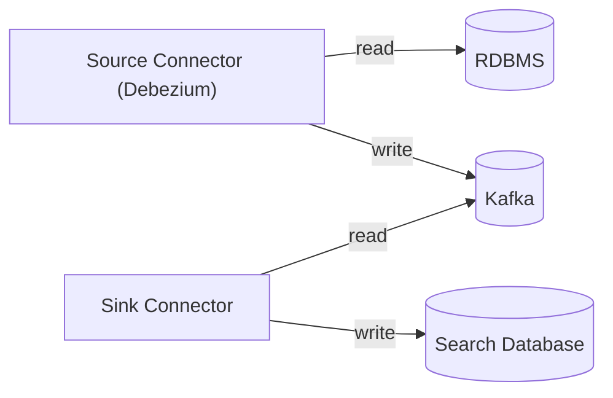

# DMS Feature: Change Data Capture to Stream

As described in the [Architectural Vision](../README.md#architectural-vision),
the Data Management Service (DMS) will utilize Change Data Capture (CDC) technology to
load incoming data into other platforms. For example, the CDC application could
push data into a streaming platform (e.g. Kafka), which will enable subscribers
to perform operations such as level 2 validation checks or populating a [Search
Database](./SEARCH-DATABASE.md).

> [!NOTE]
> This document describes a reference architecture that should assist in
> building production deployments. This reference architecture will not be tuned
> for production usage. For example, it will not include service clustering, may
> not be well secured, and it will not utilize cloud providers' managed
> services.

## Tech Stack

### Debezium

CDC technology uses a database's [write-ahead
log](https://en.wikipedia.org/wiki/Write-ahead_logging) to read the database's
transaction logs, allowing the application to access new data essentially in
real-time without needing to query or poll the storage tables. The alternative
to CDC is to have dual-writes: the DMS would need to write to both the primary
data storage and any secondary storage in the same transaction, which degrades
responsiveness (waiting for a second transaction to complete) and introduces
resiliency challenges around distributed transactions.

The open source
[Debezium](https://debezium.io/) platform is the ideal tool for CDC:

* Has
  [Connectors](https://debezium.io/documentation/reference/2.7/connectors/index.html)
  for PostgreSQL and SQL Server, among other database platforms.
* Mature and active.
* Supported by a large corporate backer (Red Hat/IBM).
* Available under the Apache License, version 2.0.

### Apache Kafka

[Apache Kafka](https://kafka.apache.org/) is a widely-used open source platform
for durable storage of streaming data. In essence, it is a highly-scalable
transactional database log. Kafka storage is built on _topics_, which are
[analogous to database
_tables_](https://developer.confluent.io/courses/apache-kafka/topics/).

The system will detect changes in the `dms.documents` table and publish them to
the `edfi.dms.documents` topic. These messages must have a structure that is
easily consumable by the sink connector for loading, updating, and deleting from
the search database.

The reference implementation Kubernetes deployment for the Data Management
Service will include Kafka 3.7, packaged by Debezium under its version number
2.7. This sample setup will also include the [Kafdrop user
interface](https://github.com/obsidiandynamics/kafdrop) for browsing topics and
messages.

### Search Databases

The reference deployment will include [OpenSearch](https://opensearch.org/) and
may include an alternative demonstration using
[Elasticsearch](https://www.elastic.co/elasticsearch). The DMS source code will
include a backend module for query either service, using the API from
Elasticsearch 7.10 (the last ancestor common to both applications). The
deployment will include [OpenSearch
Dashboard](https://www.opensearch.org/docs/latest/dashboards/) for browsing and
managing indexes. If Elasticsearch support is included, then
[Kibana](https://www.elastic.co/kibana) will also be included.

## Implementation

### Debezium Deployment Patterns

Debezium 2.7 has two common [deployment
options](https://debezium.io/documentation/reference/2.7/architecture.html):

1. Using **Apache Kafka Connect** with integrated Debezium to populate an Apache
   Kafka instance. Downstream Kafka Connect instances, or custom applications,
   can read from the Kafka streams to perform operations and/or load the data
   into downstream data stores.
2. Alternately, **Debezium Server** can load data directly into a number of
   different data stores, many of which have their own streaming support.

(A third mode is to incorporate Debezium into a custom Java application; that
will not be explored for the Ed-Fi platform).

If well architected, the Data Management Server's [Primary Data
Storage](./PRIMARY-DATA-STORAGE/) can easily support both options. The first use
case to be supported will be the [Search Database](./SEARCH-DATABASE.md), using
either OpenSearch or Elasticsearch. Debezium Server does not have native [sink
configurations](https://debezium.io/documentation/reference/2.7/operations/debezium-server.html#_sink_configuration)
supporting direct loading of data into either of these platforms. Therefore, the
out-of-the-box Ed-Fi solution will demonstrate using the Kafka Connect approach
to populating a downstream data store.



### Connectors

The source connector will use the native Debezium connector for PostgresQL and
Microsoft SQL Server. Transforms will be used to reshape the data into something
more easily consumed by OpenSearch.

There is no native connector for OpenSearch or Elasticsearch. For that, the
system should be able to use
`io.aiven.kafka.connect.opensearch.OpensearchSinkConnector`, which is available
under the Apache License, version 2.0. In Project Meadowlark, the Ed-Fi Alliance
development team created a custom [Single Message Transform
(SMT)](https://www.confluent.io/blog/kafka-connect-single-message-transformation-tutorial-with-examples)
to facilitate transforming the message as recorded in Kafka into something
useful in OpenSearch. This connector and the custom transform will be
distributed together in an Ed-Fi built Docker image, based on the generic
Debezium connector image.

Connector configurations are saved as JSON files, which are POST'ed into a REST
API running in the Connector service. Example command, in PowerShell:

```pwsh
Invoke-RestMethod -Method Post -InFile .\postgresql_connector.json `
    -uri http://localhost:$sourcePort/connectors/ -ContentType "application/json"
```

#### PostgreSQL Connector

These connector settings appear to be useful in prototype testing:

| Key                                    | Value                                                | Explanation                                                                                        |
| -------------------------------------- | ---------------------------------------------------- | -------------------------------------------------------------------------------------------------- |
| plugin.name                            | pgoutput                                             | Supported by PostgreSQL by default; the other options require modification of PostgreSQL.          |
| topic.prefix                           | edfi                                                 |                                                                                                    |
| table.include.list                     | dms.documents                                        |                                                                                                    |
| value.convert                          | org.apache.kafka.connect.json.JsonConverter          | Writes the message body as JSON                                                                    |
| value.converter.schemas.enable         | false                                                | Removes the schema from the message; Opensearch does not need it, and this trims the message size  |
| transforms                             | unwrap, extractId                                    | List of transforms to be applied, described below                                                  |
| transforms.unwrap.type                 | io.debezium.transforms.ExtractNewRecordState         |                                                                                                    |
| transforms.unwrap.drop.tombstones      | false                                                | We need tombstones for deleting records in OpenSearch                                              |
| transforms.unwrap.delete.handling.mode | none                                                 | Also required for properly writing a tombstone                                                     |
| transforms.extractId.type              | org.apache.kafka.connect.transforms.ExtractField$Key |                                                                                                    |
| transforms.extractId.field             | id                                                   | Simplifies the message key to only the `id`, otherwise will include the unnecessary `partitionkey` |

The tombstone settings above are also important for Kafka topic compaction.

An example message key:

```json
{
  "schema": { "type": "int64", "optional": false },
  "payload": 29
}

```

And accompanying message body:

```json
{
  "id": 29,
  "documentpartitionkey": 5,
  "documentuuid": "284d5752-b27f-4ba2-9e30-d7fb13fdc9e7",
  "resourcename": "academicWeek",
  "resourceversion": "5.1.0",
  "projectname": "ed-fi",
  "edfidoc": "{\"id\": \"284d5752-b27f-4ba2-9e30-d7fb13fdc9e7\", \"endDate\": \"2024-07-11\", \"beginDate\": \"2024-07-11\", \"weekIdentifier\": \"2024-07-08\", \"schoolReference\": {\"schoolId\": 99}, \"totalInstructionalDays\": 0}",
  "createdat": 1721056664617640,
  "lastmodifiedat": 1721056664617640
}
```

> [!NOTE]
> It is possible to replace the integer `id` value with the `documentuuid` from
> the payload. In our experiments, this did not work correctly with tombstone
> events: they ended up having a blank key.

#### OpenSearch Connector

These [connector
settings](https://github.com/Aiven-Open/opensearch-connector-for-apache-kafka/blob/main/docs/opensearch-sink-connector-config-options.rst)
appear to be useful in prototype testing:

| Key                                             | Value                                                  | Explanation                                                                                            |
| ----------------------------------------------- | ------------------------------------------------------ | ------------------------------------------------------------------------------------------------------ |
| max.in.flight.requests                          | 1                                                      | Prevents out-of-order messages                                                                         |
| tasks.max                                       | 1                                                      | Not sure if this can be tuned further given the setting above                                          |
| key.converter                                   | org.apache.kafka.connect.storage.StringConverter       | Simplifies the key for use in OpenSearch                                                               |
| value.converter                                 | org.apache.kafka.connect.json.JsonConverter            | Read the message body as JSON                                                                          |
| value.converter.schemas.enable                  | false                                                  | Prevents looking for a schema                                                                          |
| schema.ignore                                   | true                                                   | Tells OpenSearch to infer the schema                                                                   |
| compact.map.entries                             | true                                                   | Writes JSON in the native format instead of converting to `{"key": "entryKey", "value": "entryValue"}` |
| transforms                                      | removeId, generateIndexFromResource                    | List of transforms to be applied, described below                                                      |
| transforms.removeId.type                        | org.apache.kafka.connect.transforms.ReplaceField$Value | :question: maybe unnecessary?                                                                          |
| transforms.removeId.exclude                     | id                                                     | :question: maybe unnecessary?                                                                          |
| transforms.generateIndexFromResource.type       | _long name below_                                      | Custom transform                                                                                       |
| transforms.generateIndexFromResource.field.name | projectname, resourceversion, resourcename             | Settings for the custom transform                                                                      |
| behavior.on.version.conflict                    | ignore                                                 | ignore and keep the existing record when there are version conflicts                                   |
| behavior.on.null.values                         | delete                                                 | deletes by key when the message body is null                                                           |
| index.write.method                              | upsert                                                 | updates records in place                                                                               |

The custom transformation developed for Project Meadowlark has the unwieldy name
`com.github.edfiexchangeoss.meadowlark.kafka.connect.transforms.GenerateIndexFromResource`.
This will be replaced for Project Tanager with
`org.ed-fi.kafka.connect.transforms.GenerateIndexFromResource`.

### Data Replication Strategy

Each message in Kafka has a unique key and it has a message body. The OpenSearch
connector works by inserting a record into OpenSearch. In the Upsert mode it
will, when it sees a message with the same key:

* If the message has a body, then it will replace the existing record with the new body.
* If the body is `null`, then it will delete the existing record.

For this purpose, it is best to monitor the `documents` table directly. Only
this table needs to be replicated to OpenSearch or other downstream consumers.

#### Outbox Topic

An alternative is to populate an Outbox topic that _describes events_. This
would likely look a little bit different. More information will be needed from
the Ed-Fi community before we can contemplate the message structure details. It
might be necessary to write message to a separate `outbox` table in the
relational database, or possibly the source messages can be transformed into the
desired structure. If a separate database table is needed, then it might be
implemented through database triggers in order to keep the C# code from having
to write multiple records.

### PostgreSQL Configuration

The PostgreSQL instance needs to be configured for logical replication, allowing
access from the Kafka Connect instance. The following commands will enable this:

```bash
echo "host    replication    postgres         kafka-connect-source    trust" >> /var/lib/postgresql/data/pg_hba.conf
echo "wal_level = logical" >> /var/lib/postgresql/data/postgresql.conf
```

Restart the PostgreSQL server after applying these settings.

> [!WARNING]
> This is not a good security configuration, as it uses the built-in `postgres`
> super user. See [these
> notes](https://debezium.io/documentation/reference/2.7/connectors/postgresql.html#postgresql-permissions)
> from Debezium for an improved security posture.
