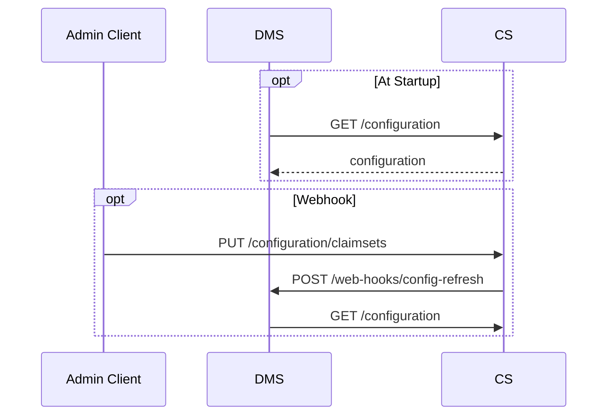

# Configuration

Runtime application configuration information for the Data Management Service
(DMS) will likely come through two approaches:

1. Settings required for application startup will use ASP.NET application
   settings (see [Configuration](../CONFIGURATION.md)).
2. More complex, such as client authorization rules, will be provisioned via the
   [Configuration Service](../CS/) (CS).

The URL for the Configuration Service will need to be provided via app settings.
On startup, the Data Management Service must call the Configuration Service to
retrieve settings. The DMS will then cache those settings.

A webhook mechanism _might_ be provided whereby the Configuration Service can
instruct the DMS to refresh itself, rather than forcing restart of the DMS.

