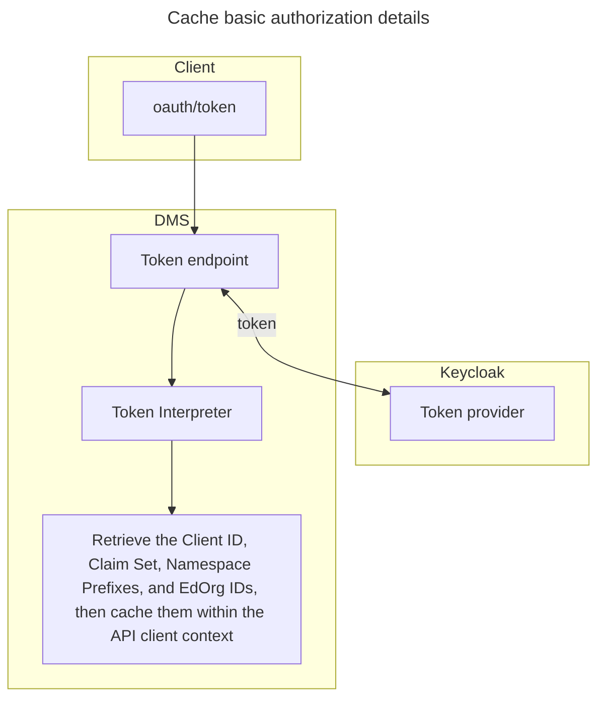
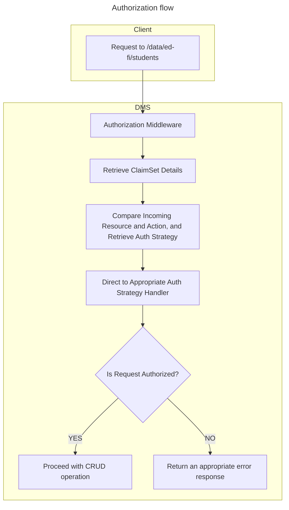

# Authorization in the Data Management Service

Also see [Authentication and Authorization Requirements](../AUTH.md)

> [!NOTE]
> These initial notes are not fully developed yet.

## Claimsets

In order to keep the JWT from becoming unreasonably large, and to prevent
managing detailed permissions within the OAuth 2.0 provider, these schemes may
use a role and/or "claimset" name that can then be mapped to detailed
information.

For example, a client of the Resources API might be granted the "SIS Vendor"
claimset. This would be a claim registered in the JWT. The Data Management
Service would need to load the actual object-level permissions for that
claimset, retrieving those details from the Configuration Service.

## Custom Claims

Other claims may be necessary, for example `EducationOrganizationId` or
`GradeLevel`. That determination will be made at a later date, with strong
community input to ensure that we create a meaningful new authorization scheme.

## Authorization and Dependency Ordering

The dependencies endpoint in the Discovery API will likely be influenced by
authorization requirements. For example, in the ODS/API's _education
organization_ based authorization, the Student _create_ permission has a higher
order number for the Student _update_ permission, with the Student School
Association coming in between the two. This is because the Student cannot be
updated until there is a Student School Association with which to decide if the
update is authorized.

## Existing ODS API Authorization

### 1. Retrieve Api Client Identity from Token

When an API request comes in, the system extracts the identity of the API client
by decoding the token included in the request.

### 2. Retrieve associated Claimset

The associated claimset for the Api client will be retrieved. This claimset
defines Resource claims, Resource claims actions, Resource claims action
authorization strategies.

### 3. Retrieve and cache Basic Claims details

The system retrieves additional basic claims details, such as the education
organization id, key, profiles, and namespace prefixes for the ApiClient. These
details are stored in a cached context.

### 4. Retrieve Claimset details from Security Database (Cached)

The claimset details, including Resource claims, Resource claims actions,
Resource claims action authorization strategies, are retrieved from a security
database.

### 5. Check incoming request against Api Details Context

The system checks whether the incoming request complies with the permissions and
access rights defined in the API details context. Specifically, the system
verifies if the client has access to the requested educational organization or
namespace prefix.

### 6. Check incoming request against Claim Set details

The incoming resource and action will be compared to the resource claims in the
claim set. If the resource name is present in the resource claims list, the
action will be validated according to the specified authorization strategies.
Finally, the resource data will be checked to ensure compliance with the
authorization strategy rule sets. If all verification steps pass, the requested
action will proceed.

## Namespace based authorization on DMS

### 1. Authenticating and Authorizing the Client on DMS

The client provides its client ID and secret to the oauth/token endpoint on DMS.
The system then authenticates these credentials using a third-party
authentication provider(`Keycloak`), which returns a token upon successful
authentication.

### 2. Token Interpreter

The token interpreter decodes the received token to extract basic authorization
metadata, including the Client id, Claim set name, Education Organization ids,
Namespace prefixes etc...

### 3. Authorization Context

An authorization context is established, including the client's basic
authorization details (Client id, Claim set name, Education Organization ids,
Namespace prefixes etc..). This context data is then cached to streamline
further requests.

### 4. Security Metadata Cache

In the ODS API, the entire security metadata is cached. Caching only the claim
set data may be insufficient, as parent entity details could also be required
for authorization.

### 5. Authorizing /data Endpoint Requests

Authorization checks for the /data endpoint requests are performed immediately
before database operations (CRUD operations).

### 6. Authorization Middleware

Within the authorization middleware, the system decides whether the request is
authorized or not.

### 7. Security Backend

A dedicated project is in place to handle all authorization processes.

### 8. Initial Implementation

The initial plugin structure (Interfaces and classes) will be established to
support the process of verifying the request against the claim set.

Handlers will be created for two authorization strategies:

* Namespace-based Authorization

* No Further Authorization

#### Resources and Descriptors authorization

**Resources:** Initially, resource operations will use the "No Further
Authorization" strategy.

**Descriptors:** Create, update, and delete operations for descriptors will
require "Namespace Based" authorization, while read operations require "No
Further Authorization".

