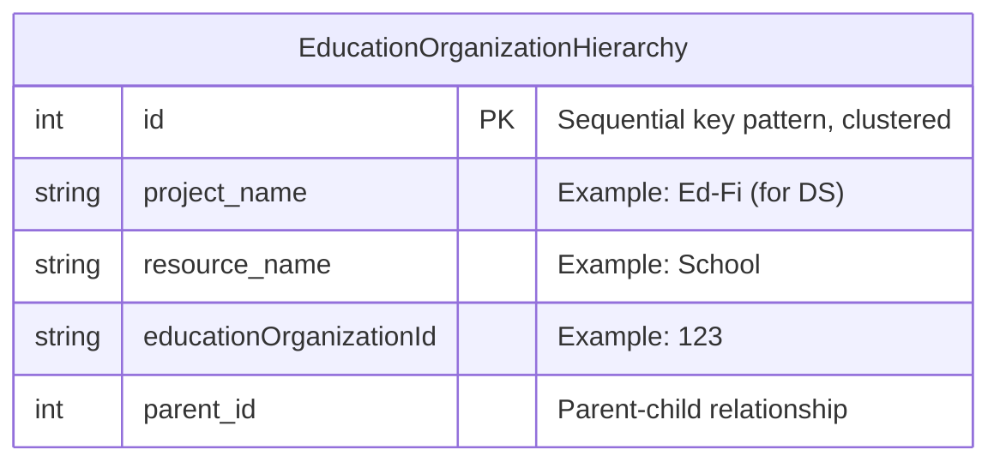
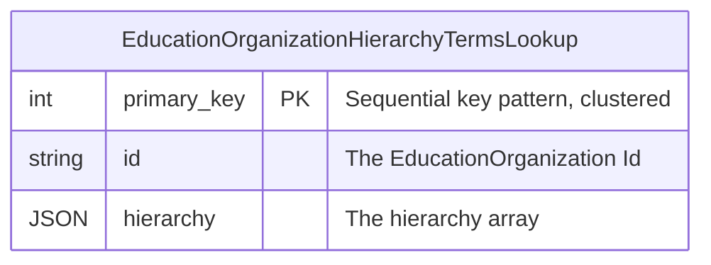
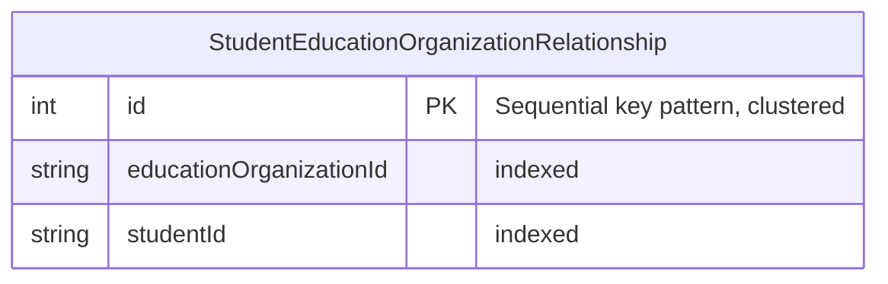
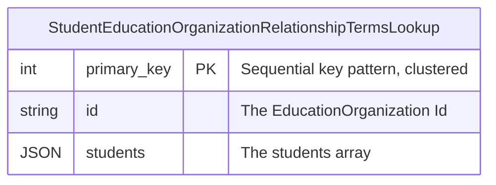

# Document Authorization

## Problem

The ODS/API provides several document security configurations. Among those are EducationOrganization-based
security and Namespace-based security. These security configurations rely on comparing attributes of a
document (e.g. SchoolId, EducationServiceCenterId, Namespace) with a list of authorizations configured for
each client. Additionally, EducationOrganizations form a hierarchy (e.g. Schools are a part of a
LocalEducationAgency) where a higher-level client authorization applies to lower level security attributes.

EducationOrganization-based security also extends the authorization hierarchy down to the Student level. This
flows through Associations such as StudentSchoolAssociation to define the student data that is authorized for
a client, based on their EducationOrganization permissions.

The design of Client Authorizations is covered in [DMS-AUTH](DMS-AUTH.md).

The scope of the problem is to determine how the DMS will:

- Efficiently extract the security attributes of a document.
- Understand the hierarchy of EducationOrganizations.
- Understand the extension of the EducationOrganization hierarchy down to the Student level.
- Efficiently apply a client's authorizations to POST, PUT, GET and DELETE actions, including to a search
  engine datastore.

## Solution

### Security Attribute Location

DMS needs to know which resources have security attributes and where those attributes are located on the
document. These attributes then need to be extracted into a `securityAttributes` object.

MetaEd will provide this information in the ResourceSchema in ApiSchema.json for any EducationOrganization,
Student, and Namespace field on a resource. There will be an entry for each type of security attribute for the
resource along with the attribute JsonPath. This is independent of run-time security configuration to allow
for support of all configurations. For example, Course has an EducationOrganization superclass reference and
so the SecurityAttribute would look like this:

```json
"courses": {
  "securityAttributes": {
    "EducationOrganization": [
      "$.educationOrganizationReference.educationOrganizationId"
    ]
  }
}
```

DisciplineAction provides an example of a School (an EducationOrganization subclass) reference with a role
name:

```json
"disciplineActions": {
  "securityAttributes": {
    "School": [
      "$.responsibilitySchoolReference.schoolId"
    ]
  }
}
```

Similarly, Credentials has a Namespace and would look like:

```json
"credentials": {
  "securityAttributes": {
    "Namespace": [
      "$.namespace"
    ]
  }
}
```

And finally, StudentGradebookEntry has a Student and would look like:

```json
"credentials": {
  "securityAttributes": {
    "StudentUniqueId": [
      "$.studentReference.studentUniqueId"
    ]
  }
}
```

The `securityAttributes` object can have multiple attributes (for example EducationOrganization, School, and
StudentUniqueId) - and each entry is an array to allow for multiple JsonPaths.

Note that this scheme requires MetaEd to have hardcoded knowledge of Namespace, StudentUniqueId and the
various EducationOrganizations in the Data Standard. Hardcoding of EducationOrganizations can be minimized by
detection via the EducationOrganization Abstract Entity rather than hardcoding each individual
EducationOrganization subclass, the number of which changes as the Data Standard evolves.

### EducationOrganization Types

DMS will need to build an internal hierarchy of EducationOrganization identifiers to understand relationships
like which Schools belong to which LocalEducationAgencies. An enabling step is for MetaEd to provide the
EducationOrganization resource hierarchy in ApiSchema. This will be a project-level object called
`educationOrganizationHierarchy` and be composed of parent-child relationships. For example:

```json
"educationOrganizationHierarchy": {
  "EducationOrganization": [
    "School",
    "LocalEducationAgency",
    "EducationServiceCenter",
    "CommunityOrganization",
    "CommunityProvider"
  ],
  "CommunityOrganization": [
    "CommunityProvider"
  ]
}
```

Which shows that `CommunityProvider` and `CommunityOrganization` are both categories of
`EducationOrganization` and that `CommunityProvider` is also a sub-category of `CommunityOrganization`.

### Security Attribute Extraction

At runtime, DMS will extract security attributes on POST and PUT for the document into a JSON object for
authorization and storage. This `SecurityAttributes` object will be structured similarly to the object on
ApiSchema.json. An example:

```json
{
  "EducationOrganization": ["12"],
  "School": ["34", "56"],
  "EducationOrganizationNetwork": ["78"],
  "CommunityOrganization": ["90"],
  "Namespace": ["uri://ed-fi.org"]
}
```

The extracted object will be used for the authorization of the POST/PUT action, and passed to the backend
along with the document.

Relational backends will add a `SecurityAttributes` JSON column to the Documents table for storage of the
extracted security attributes. This column will not be indexed, nor will it be searched on in the relational
store. It will be propagated to Kafka via Debezium like all Document columns, and so will be indexed with the
document in OpenSearch/Elasticsearch.

### EducationOrganization Attributes
#### EducationOrganization Parent-Child Relationships

As EducationOrganizations are POSTed, DMS will use the `educationOrganizationHierarchy` from ApiSchema.json to
build and maintain a lookup table for parent-child EducationOrganization identifiers. For example, when a
School with SchoolId 123 and LocalEducationAgencyId 456 is POSTed, after all validations are completed DMS
will add School 123 as a child of LocalEducationAgency 456 to its internal hierarchy. These relationships will
be stored in the backend datastore as well as the search engine.

#### EducationOrganizationHierarchy Backend Storage

Relational backends will add an `EducationOrganizationHierarchy` table that will persist EducationOrganization
parent-child relationship information. This will be a simple, non-partitioned table looking something like
this:



#### EducationOrganizationHierarchy Search Engine Storage

Opensearch and Elasticsearch both have a feature called "Terms Lookup" that makes it advantageous to store a
denormalized version of the EducationOrganizationHierarchy table in the search engine:

* [Opensearch Terms Lookup](https://opensearch.org/docs/latest/query-dsl/term/terms/#terms-lookup)
* [Elasticsearch Terms
  Lookup](https://www.elastic.co/guide/en/elasticsearch/reference/current/query-dsl-terms-query.html#query-dsl-terms-lookup)

The idea is to store the EducationOrganization hierarchy information from the backend into an
EducationOrganizationHierarchyTermsLookup index in the search engine, with one document per
EducationOrganization. The id of the document will be an EducationOrganizationId, and the document will
consist of a list of that EducationOrganizationId and all of its descendants. For example, if we had an
EducationOrganization hierarchy where #1 was a SEA, #10 and #11 were LEAs, and #100 and #110 were Schools, the
documents in the EducationOrganizationHierarchyTermsLookup index might look like this:

```json
{
  id: 1,
  hierarchy: [1, 10, 100, 11, 110]
},
{
  id: 10,
  hierarchy: [10, 100]
},
{
  id: 11,
  hierarchy: [11, 110]
},
{
  id: 100,
  hierarchy: [100]
},
{
  id: 110,
  hierarchy: [110]
}
```

With the EducationOrganizationHierarchyTermsLookup data shaped this way, the level of indirection provided by
the "Terms Lookup" search engine feature makes a filter query from DMS simple. For example, a filter of
CourseOfferings by School for SEA #1 would look like:

```json
GET courseOfferings/_search
{
  "query": {
    "terms": {
      "schoolId": {
        "index": "EducationOrganizationHierarchyTermsLookup",
        "id": "1",
        "path": "hierarchy"
      }
    }
  }
}
```

The DMS backend will need to populate a table that is the source of the documents that go into the
EducationOrganizationHierarchy index. This simple, non-partitioned EducationOrganizationHierarchyTermsLookup
table should look something like this:


This table will be managed in parallel with the EducationOrganizationHierarchy table. Addition and removal of
hierarchy array elements will be done through datastore JSON functions. The documents will be pushed to the
search engine via the normal Debezium process.


### Student Attributes
#### Student-EducationOrganization Relationships

EducationOrganization-based security must also be able to secure on documents that have a Student attribute.
This is typically done through the StudentSchoolAssociation resource.

Much like the EducationOrganizationHierarchy, as StudentSchoolAssociations are POSTed, DMS will track these
Student-EducationOrganization relationships in the backend datastore as well as the search engine.

#### Student Backend Storage

Relational backends will add a `StudentEducationOrganizationRelationship` table that will persist
Student-EducationOrganization relationship information. This will be a simple, non-partitioned table looking
something like this:



Note that EducationOrganizationHierarchy will need to be used to insert a row into the
StudentEducationOrganizationRelationship table for every level of EducationOrganization the Student is
associated with.

#### Student Search Engine Storage

Much like the EducationOrganizationHierarchyTermsLookup search engine index, there will a
StudentEducationOrganizationRelationshipTermsLookup index based on the same Student-EducationOrganization
relationship information. The DMS backend will populate a simple, non-partitioned source table named
StudentEducationOrganizationRelationshipTermsLookup, which should look something like this:


This table will be managed in parallel with the StudentEducationOrganizationRelationship table, with addition
and removal of array elements done through datastore JSON functions. The documents will be pushed to the
search engine via the normal Debezium process.

### Client Authorization

Clients are configured to have authorizations for certain EducationOrganizations. These are included in the
client claimset. For non-search engine queries, DMS will take the EducationOrganization authorizations and
expand them using the EducationOrganizationHierarchy table in the backend datastore to include all child
EducationOrganizations. For performance, these EducationOrganizationHierarchy lookups should probably be
cold-cached by DMS.

Below are the steps taken for client authorization for each type of action. Note these are general steps, and
there will be variations based on configuration.

#### POST/PUT Actions

DMS compares the expanded EducationOrganization authorizations to the security attributes extracted from the
provided document. If they do not match, the action is not authorized.

#### GET by Query Action

For search engine query handlers, DMS adds a "Terms Lookup" filter to the query with the authorized
EducationOrganizationIds that are relevant for the current resource. These filters would use the appropriate
search engine index for the resource to match on EducationOrganization, StudentUniqueId, etc. For relational
queries, see [RELATIONAL-QUERIES](PRIMARY-DATA-STORAGE/RELATIONAL-QUERIES.md) for what the filtering would
look like.

#### DELETE/GET by Id Actions

DMS retrieves the document from the backend, along with its security attributes. If they do not match the
expanded EducationOrganization authorizations, the action is not authorized.
