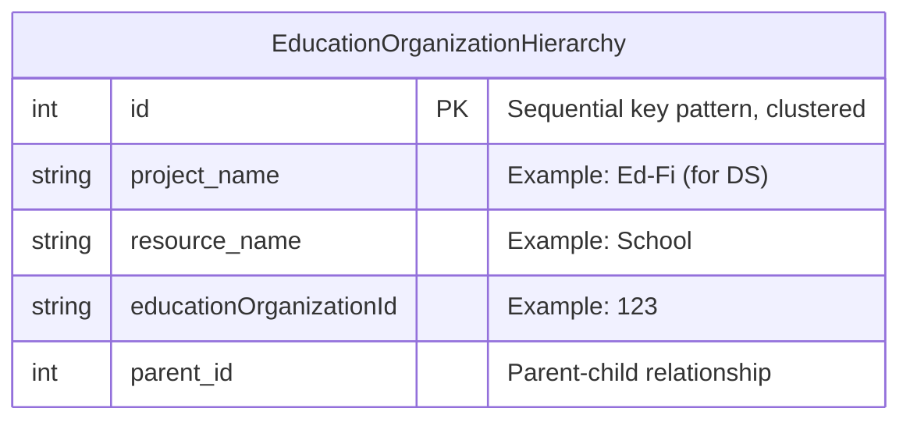

# Document Authorization

## Problem

The ODS/API provides several document security configurations. Among those are EducationOrganization-based
security and Namespace-based security. These security configurations rely on comparing attributes of a
document (e.g. SchoolId, EducationServiceCenterId, Namespace) with a list of authorizations configured for
each client. Additionally, EducationOrganizations form a hierarchy (e.g. Schools are a part of a
LocalEducationAgency) where a higher-level client authorization applies to lower level security attributes.

The design of Client Authorizations is covered in [DMS-AUTH](DMS-AUTH.md).

The scope of the problem is to determine how the DMS will:

- Efficiently extract the security attributes of a document.
- Understand the hierarchy of EducationOrganizations.
- Efficiently apply a client's authorizations to POST, PUT, GET and DELETE actions, including to a search
  engine datastore.

## Solution

### Security Attribute Location

DMS needs to know which resources have security attributes and where those attributes are located on the
document. These attributes then need to be extracted into a `securityAttributes` object.

MetaEd will provide this information in the ResourceSchema in ApiSchema.json for any EducationOrganizations
and Namespace fields on a resource. There will be an entry for each type of security attribute for the
resource along with the attribute JsonPath. For example, Course has an EducationOrganization superclass
reference and so the SecurityAttribute would look like this:

```json
"courses": {
  "securityAttributes": {
    "educationOrganizationId": [
      "$.educationOrganizationReference.educationOrganizationId"
    ]
  }
}
```

DisciplineAction provides an example of a School (an EducationOrganization subclass) reference with a role
name:

```json
"disciplineActions": {
  "securityAttributes": {
    "schoolId": [
      "$.responsibilitySchoolReference.schoolId"
    ]
  }
}
```

Similarly, Credentials has a Namespace and would look like:

```json
"credentials": {
  "securityAttributes": {
    "namespace": [
      "$.namespace"
    ]
  }
}
```

The `securityAttributes` object can have multiple attributes (e.g. schoolId, localEducationAgencyId,
educationOrganizationNetworkId) and each entry is an array to allow for multiple JsonPaths.

Note that this scheme requires MetaEd to have hardcoded knowledge of Namespace and the various
EducationOrganizations in the Data Standard. Hardcoding of EducationOrganizations can be minimized by
detection via the EducationOrganization Abstract Entity rather than hardcoding each individual
EducationOrganization subclass, the number of which changes as the Data Standard evolves.

### EducationOrganization Types

DMS will need to build an internal hierarchy of EducationOrganization identifiers to understand relationships
like which Schools belong to which LocalEducationAgencies. An enabling step is for MetaEd to provide the
EducationOrganization resource hierarchy in ApiSchema. This will be a project-level object called
`educationOrganizationHierarchy` and be composed of parent-child relationships. For example:

```json
"educationOrganizationHierarchy": {
  "EducationOrganization": [
    "School",
    "LocalEducationAgency",
    "EducationServiceCenter",
    "CommunityOrganization",
    "CommunityProvider"
  ],
  "CommunityOrganization": [
    "CommunityProvider"
  ]
}
```

Which shows that `CommunityProvider` and `CommunityOrganization` are both categories of
`EducationOrganization` and that `CommunityProvider` is also a sub-category of `CommunityOrganization`.

### Security Attribute Extraction

At runtime, DMS will extract security attributes on POST and PUT for the document into a JSON object for
authorization and storage. This `SecurityAttributes` object will be structured similarly to the object on
ApiSchema.json. An example:

```json
{
  "educationOrganizationId": ["12"],
  "schoolId": ["34", "56"],
  "educationOrganizationNetworkId": ["78"],
  "communityOrganizationId": ["90"],
  "namespace": ["uri://ed-fi.org"]
}
```

The extracted object will be used for the authorization of the POST/PUT action, and passed to the backend
along with the document.

### EducationOrganization Parent-Child Relationships

As EducationOrganizations are POSTed, DMS will use the `educationOrganizationHierarchy` from ApiSchema.json to
maintain a lookup table for parent-child EducationOrganization identifiers. For example, when a School with
SchoolId 123 and LocalEducationAgencyId 456 is POSTed, after all validations are completed DMS will add School
123 as a child of LocalEducationAgency 456 to its internal hierarchy. These relationships will be stored in
the backend as well as cached.

### Backend Storage

Relational backends will add a `SecurityAttributes` JSON column to the Documents table for storage of the
extracted security attributes. This column will not be indexed, nor will it be searched on in the relational
store. It will be propagated to Kafka via Debezium like all Document columns, and so will be indexed with the
document in OpenSearch/Elasticsearch.

Relational backends will also add an `EducationOrganizationHierarchy` table that will persist
EducationOrganization parent-child relationship information. This will be a simple, non-partitioned table
looking something like this:



### Client Authorization

Clients are configured to have authorizations for certain EducationOrganizations and Namespaces. DMS will take
the EducationOrganization authorizations and expand them in a cache to include any sub-categories. What
follows depends on the type of action:

#### POST/PUT

DMS compares the expanded authorizations to the security attributes extracted from the provided document. If
they do not match, the action is not authorized.

#### GET by Query

For search engine query handlers, DMS adds a filter to the query of the expanded authorizations that are
relevant for the current resource. For relational queries, see
[RELATIONAL-QUERIES](PRIMARY-DATA-STORAGE/RELATIONAL-QUERIES.md) for what the filtering would look like.

#### DELETE/GET by Id

DMS retrieves the document from the backend, along with its security attributes. If they do not match the
expanded authorizations, the action is not authorized.
