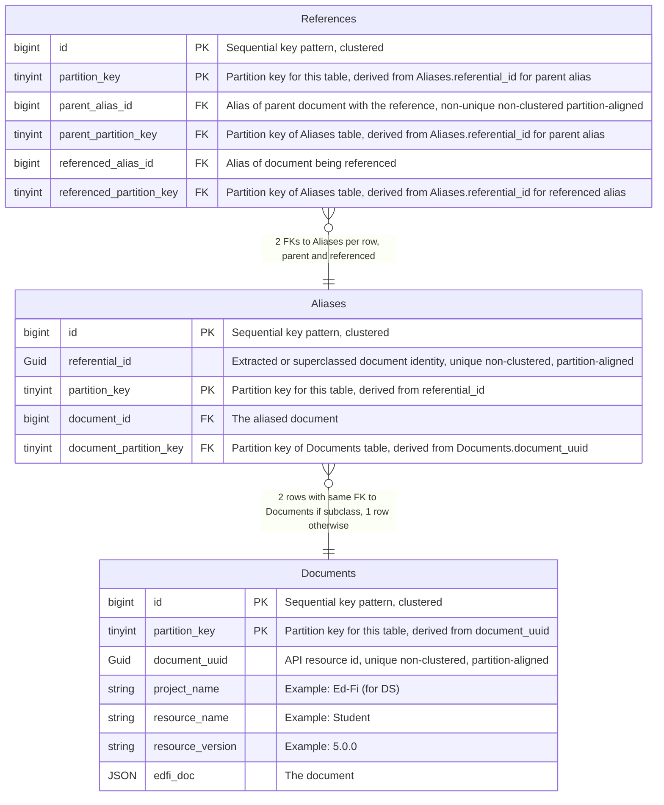
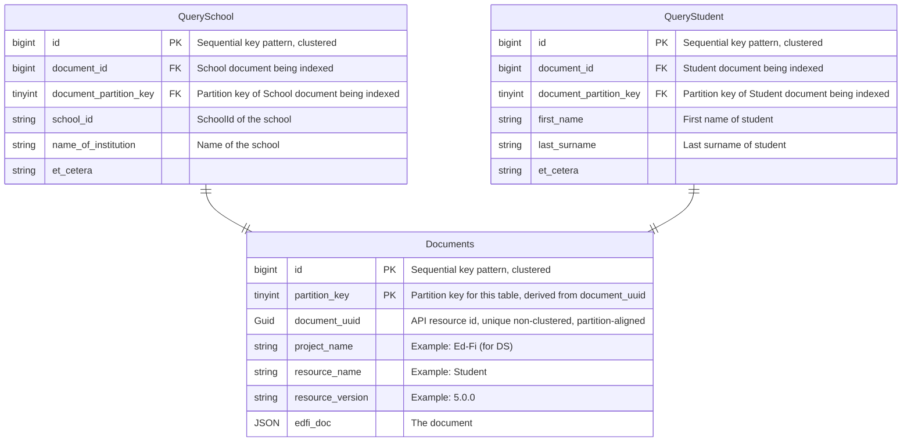
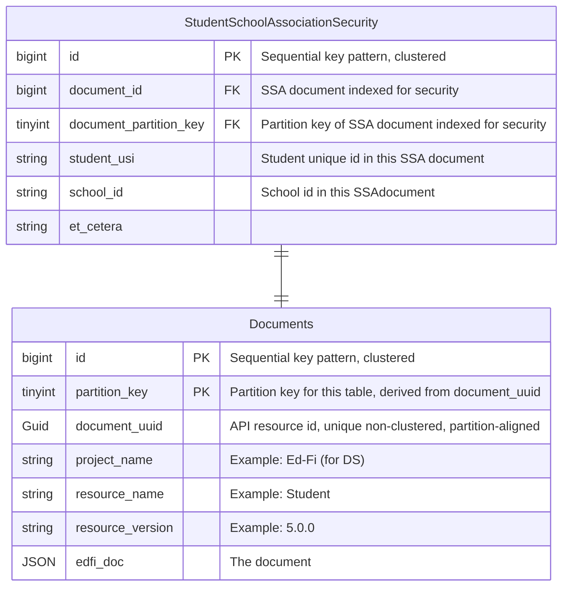

# DMS Feature: Primary Data Storage

## Problems to solve via DB design

### Existence and reference validation

The first problem is existence and reference validation. Unlike Meadowlark, we want to leverage foreign key
referential integrity to do this. Note we need to be able to take into account superclass identities, for
example the existence of an EducationOrganization can satisfy reference validation for a School reference, so
there has to be some mapping here. We would also like reference validation to be tunable in some fashion,
meaning you can turn it on or off.

### Query support in relational DB

The next problem is query support. We'll need to know what the different fields are that you're allowed to
query on, and then have some way to index them into the json.

One question is how performant does this need to be? If/when it becomes too slow, moving to a search engine
would be the recommendation because if you want true performance you would use a separate read only store.

### Security

The next thing that you need to be able to support is security. Following the ODS/API, we'll want
Namespace-based for sure, Education Organization-based probably, and possibly Grade Level-based as well. In
some ways this may be similar to query support, as we'll need to know the relevant fields to secure on for
each resource.

### Streaming changes

We'll need the ability to stream out changes. This needs to be something that can be easily integrated with
Kafka and potentially other streaming platforms, with a well-defined message format. Change query support is
related to this, but we won't prejudge whether it will be based off of streaming.

### Simplicity

As maintainability is a primary goal, we want to keep Tanager as simple as possible. Meadowlark demonstrated
that we can simplify over the ODS/API by avoiding code-per-resource and instead use a generalized design
applicable to any resource. While it may not be possible with Tanager to do this completely, we would like to
do it whenever possible.

### Performance

We need to make sure that we design to meet performance goals, and test early and often to ensure that we are
able to hit those goals.

## Implementation

### ER Diagram



### SQL DDL

```
----------------- Documents Table ------------------

-- 16 partitions, 0 through 15
IF NOT EXISTS (SELECT * FROM sys.partition_functions
    WHERE name = 'partition_function_Documents')
BEGIN
    CREATE PARTITION FUNCTION partition_function_Documents(TINYINT)
           AS RANGE RIGHT FOR VALUES (1, 2, 3, 4, 5, 6, 7, 8, 9, 10, 11, 12, 13, 14, 15);
END

IF NOT EXISTS (SELECT * FROM sys.partition_schemes
    WHERE name = 'partition_scheme_Documents')
BEGIN
-- All on the primary filegroup
CREATE PARTITION SCHEME partition_scheme_Documents
  AS PARTITION partition_function_Documents
  ALL TO ('PRIMARY');
END

IF NOT EXISTS (select object_id from sys.objects where object_id = OBJECT_ID(N'[dbo].[Documents]') and type = 'U')
BEGIN
CREATE TABLE [dbo].[Documents] (
  id BIGINT IDENTITY(1,1),
  partition_key TINYINT NOT NULL,
  document_uuid UNIQUEIDENTIFIER NOT NULL,
  resource_name VARCHAR(256) NOT NULL,
  edfi_doc VARBINARY(MAX) NOT NULL,
  PRIMARY KEY CLUSTERED (partition_key ASC, id ASC)
  ON partition_scheme_Documents (partition_key)
);
END

-- edfi_doc stored as a pointer
EXEC sp_tableoption 'dbo.Documents', 'large value types out of row', 1;


-- GET/UPDATE/DELETE by id lookup support, document_uuid uniqueness validation
IF NOT EXISTS (SELECT name FROM sys.indexes WHERE name = N'UX_Documents_DocumentUuid')
    CREATE UNIQUE NONCLUSTERED INDEX UX_Documents_DocumentUuid
    ON [dbo].[Documents] (partition_key, document_uuid);

------------------ Aliases Table ------------------

-- 16 partitions, 0 through 15
IF NOT EXISTS (SELECT * FROM sys.partition_functions
    WHERE name = 'partition_function_Aliases')
BEGIN
CREATE PARTITION FUNCTION partition_function_Aliases(TINYINT)
  AS RANGE RIGHT FOR VALUES (1, 2, 3, 4, 5, 6, 7, 8, 9, 10, 11, 12, 13, 14, 15);
END

IF NOT EXISTS (SELECT * FROM sys.partition_schemes
    WHERE name = 'partition_scheme_Aliases')
BEGIN
-- All on the primary filegroup
CREATE PARTITION SCHEME partition_scheme_Aliases
  AS PARTITION partition_function_Aliases
  ALL TO ('PRIMARY');
END

IF NOT EXISTS (select object_id from sys.objects where object_id = OBJECT_ID(N'[dbo].[Aliases]') and type = 'U')
BEGIN
CREATE TABLE [dbo].[Aliases] (
  id BIGINT IDENTITY(1,1),
  partition_key TINYINT NOT NULL,
  referential_id UNIQUEIDENTIFIER NOT NULL,
  document_id BIGINT NOT NULL,
  document_partition_key TINYINT NOT NULL,
  CONSTRAINT FK_Aliases_Documents FOREIGN KEY (document_partition_key, document_id)
    REFERENCES [dbo].[Documents](partition_key, id),
  PRIMARY KEY CLUSTERED (partition_key ASC, id ASC)
  ON partition_scheme_Aliases (partition_key)
);
END

-- Referential ID uniqueness validation and reference insert into References support
IF NOT EXISTS (SELECT name FROM sys.indexes WHERE name = N'UX_Aliases_ReferentialId')
    CREATE UNIQUE NONCLUSTERED INDEX UX_Aliases_ReferentialId
    ON [dbo].[Aliases] (partition_key, referential_id);

------------------ References Table ------------------

-- 16 partitions, 0 through 15
IF NOT EXISTS (SELECT * FROM sys.partition_functions
    WHERE name = 'partition_function_References')
BEGIN
CREATE PARTITION FUNCTION partition_function_References(TINYINT)
  AS RANGE RIGHT FOR VALUES (1, 2, 3, 4, 5, 6, 7, 8, 9, 10, 11, 12, 13, 15);
END

IF NOT EXISTS (SELECT * FROM sys.partition_schemes
    WHERE name = 'partition_scheme_References')
BEGIN
-- All on the primary filegroup
CREATE PARTITION SCHEME partition_scheme_References
  AS PARTITION partition_function_References
  ALL TO ('PRIMARY');
END

IF NOT EXISTS (select object_id from sys.objects where object_id = OBJECT_ID(N'[dbo].[References]') and type = 'U')
BEGIN
CREATE TABLE [dbo].[References] (
  id BIGINT IDENTITY(1,1),
  partition_key TINYINT NOT NULL,
  parent_alias_id BIGINT NOT NULL,
  parent_partition_key TINYINT NOT NULL,
  referenced_alias_id BIGINT NOT NULL,
  referenced_partition_key TINYINT NOT NULL,
  CONSTRAINT FK_References_ParentAlias FOREIGN KEY (parent_partition_key, parent_alias_id)
  REFERENCES [dbo].[Aliases](partition_key, id),
  CONSTRAINT FK_References_ReferencedAlias FOREIGN KEY (referenced_partition_key, referenced_alias_id)
  REFERENCES [dbo].[Aliases](partition_key, id),
  PRIMARY KEY CLUSTERED (partition_key ASC, id ASC)
  ON partition_scheme_References (partition_key)
);
END

-- DELETE/UPDATE by id lookup support
IF NOT EXISTS (SELECT name FROM sys.indexes WHERE name = N'UX_References_ParentAliasId')
    CREATE NONCLUSTERED INDEX UX_References_ParentAliasId
    ON [dbo].[References] (partition_key, parent_alias_id);


```

### General Structure

This is very much like the Meadowlark implementation of the PostgreSQL backend, except we want to take
advantage of foreign key constraints for reference validation. We also want to introduce partitioning. All
three tables use the sequential surrogate key pattern with size `BIGINT`.

#### Documents Table

The `Documents` table holds all of the documents for all of the entities. `id` is the sequential surrogate
primary key. `document_uuid` is the external GUID expressed in the API as the resource id. It will be indexed
as unique and non-clustered to support both document_uuid uniqueness validation as well as direct access for
GET/UPDATE/DELETE by id operations. `partition_key` is included as part of the primary key. It is derived from
the `document_uuid`, either as a modulo or by taking low-order bits, and maps to a partition number. This will
allow the index on `document_uuid` to be partition-aligned.

`Documents` also includes metadata about the document, such as project name, resource name and resource
version. The table will also include the document itself as `edfi_doc`, which will be stored compressed and
off-row.

#### Aliases Table

The `Aliases` table is a partitioned table that maps documents to their referential id(s). It also has `id` as
a sequential surrogate primary key.

`referential_id` is a UUIDv5 (see [RFC 4122](https://datatracker.ietf.org/doc/html/rfc4122#section-4.3)) with
an Ed-Fi namespace ID as the "namespace" and the resource name + the extracted document identity as the
"name". This concept of a deterministic hash UUID allows Tanager to determine both document identities and
document references independent of data in the DB. Each document has at least one referential id. Only
subclass documents have a second referential id, which is the document identity in the form of its superclass.
`referential_id` will be indexed as unique and non-clustered to support referential_id uniqueness validation.

`partition_key` is included as part of the primary key. It is derived from the `referential_id`, either as a
modulo or by taking low-order bits, and maps to a partition number. This will allow the index on
`referential_id` to be partition-aligned.

`Aliases` has a foreign key reference back to the document with this `referential_id`.

#### References Table

The `References` table stores every document reference. It also has `id` as a sequential surrogate primary key
as well as a `partition_key` as part of the primary key.

The table is composed of two `referential_ids` foreign key references back to the `Aliases` table, one for the
parent of the reference and one for the document being referenced. The purpose of these foreign key
constraints is to perform reference validation. Insert attempts into this table validate reference existence.
Delete attempts from the `Aliases` table validate that a document is not referenced by another document.

`parent_alias_id` will be indexed as non-clustered to support removal on document deletes and updates.
`partition_key` is derived from the `parent_alias_id` referential id in the same manner and for the same
reason as the other tables.

#### Why not a table per resource?

The benefit of this design is that by putting all documents in a single table regardless of resource, we can
use three simple tables to provide reference validation via referential integrity between any two documents
using their extracted referential_id(s). If we split the tables up by resource, we will also require a
specific join table for every resource-pair participating in a reference, which 1) greatly increases
complexity and 2) is redundant because referential_id already encodes the resource type.

#### Why partitioning?

This design is for three very large tables. It's important to note that the largest US school district with
positive attendance tracking could have on the order of 450 million attendance records in a school year. Since
a Tanager instance will store a lot more that just attendance, we are targeting support on the order of 1
billion rows in the `Documents` table. If we estimate that each document has on the order of 10 references to
other documents (they can have arrays of references), then we need to be able to support on the order of 10
billion rows in the `References` table.

Determining a good default number of partitions for each table will require experimentation, but 16 partitions
for `Documents` and `Aliases` and 64 partitions for `References` is probably a good starting point. See
[here](https://www.brentozar.com/archive/2013/01/sql-server-table-partitioning-tutorial-videos-and-scripts/)
for a demo on experimenting with partitioning to find a good size. This will be a hash method of partitioning,
where we compute the `partition_key` from an appropriate GUID in the table to allow for partition elimination
on queries and partition-aligned indexing.

### Insert Operation

From Tanager Core:

- JSON Document
- Document Metadata
- Document UUID - generated
- Document Referential Id - extracted
- If a subclass, the Document Referential Id in superclass form
- Referential Ids of Document references - extracted

1. Insert the JSON Document, Document Metadata and Document UUID in the `Documents` table.
   - Derive `partition_key` from `document_uuid`.
   - Get the sequential id from the insert for the next operation.
   - A uniqueness constraint violation on `document_uuid` means this should be retried as an update.
1. Insert an entry in the `Aliases` table for the document.
   - Derive `partition_key` from `referential_id`.
   - FK back to the initial insert into `Documents`.
   - Get the sequential id from the insert for the next operation.
   - If the document is a subclass, insert a second entry Document Referential Id in superclass form.
   - A uniqueness constraint violation on `referential_id` on the first insert means this should be handled as
     an update.
   - A uniqueness constraint violation on `referential_id` on the superclass insert means failure because
     there already exists a subclass with the same superclass identity.
1. Insert each document reference on the document in the `References` table.
   - `parent_alias_id` is this document's sequential id from the initial `Aliases` insert.
   - `parent_partition_key` is the partition key from the initial `Aliases` insert.
   - Determine `referenced_alias_id` and `referenced_partition_key` from a lookup on the `Aliases` table index
     for `referential_id`.
   - A missing `referential_id` lookup on `Aliases` indicates a reference validation failure.

### Update Operation (ignoring identity updates)

From Tanager Core:

- JSON Document
- Document Metadata
- Document UUID
- Document Referential Id - extracted
- If a subclass, the Document Referential Id in superclass form
- Referential Ids of Document references - extracted

1. Find the document in the `Documents` table
   - Derive `partition_key` from `document_uuid`.
   - Find the document in `Documents` using the index on `document_uuid`.
   - Get `id` as the document id.
1. Get the Aliases table entry for the document (don't worry about superclass entry)
   - Derive `partition_key` from `referential_id`.
   - Find the alias in `Aliases` using the index on `referential_id`.
   - Sanity check alias `document_id` and `document_partition_key` are a match, fatal error otherwise.
   - This is the `parent_alias_id` and `parent_partition_key` for the `References` table.
1. Delete the old document references
   - Delete document references on the `References` table using the index on `parent_alias_id` and
     `parent_partition_key`.
1. Insert the new document references
   - Insert each document reference on the updated document as in the insert operation.
   - A missing `referential_id` lookup on `Aliases` indicates a reference validation failure.
1. Update the JSON document itself on the `Documents` table.

### Delete Operation

1. Follow update operation steps through deleting old document references.
1. Delete the document's aliases in the `Aliases` table.
   - A foreign key constraint violation indicates a reference validation failure due to the document having
     references to it.
1. Delete the document in the `Documents` table.

### Query handling

While the preferred method of query handling is via search engine, some deployments will not be able to handle
the additional operational complexity. In these cases Tanager can be configured to handle queries in the main
datastore at a cost of performance.

Queries are handled by resource-specific "query" tables that include each searchable field. These tables are
not well suited to partitioning, but are no worse than the ODS/API in table size per resource.



For example, `QuerySchool` has a foreign key to the `Documents` table with a row per School document. Because
the query tables include the `Documents` partition key, query tables act as a cross-partition index on the
Documents table while avoiding the downsides of an actual cross-partition index. For this reason, "Get All"
queries will use these tables as well.

The other columns on a query table are a list of queryable columns that are available to an API user for
GET-by-query. Pagination will operate on query tables only. Like the ODS/API there will be no indexes on
individual query fields, preferring insert performance over ad hoc query performance. Deployments needing fast
ad hoc query performance should consider using Tanager's search engine option.

The next question is how this tables get populated. The best way would be via a separate process so as not to
slow down insert performance inserts. However, in a deployment where a search engine is not an option, a
separate process may not be viable either. In this case, we'll need to extract the queryable fields from the
document before insert.

The query table schema will be pre-generated, as will the JSON Paths to the queryable elements.

#### Query SQL

```
-- Query table with search fields for School documents
IF NOT EXISTS (select object_id from sys.objects where object_id = OBJECT_ID(N'[dbo].[QuerySchool]') and type = 'U')
BEGIN
CREATE TABLE [dbo].[QuerySchool] (
  id BIGINT IDENTITY(1,1),
  document_partition_key TINYINT NOT NULL,
  document_id BIGINT NOT NULL,
  studentUniqueId VARCHAR(256) NULL,
  personId VARCHAR(256) NULL,
  birthCity VARCHAR(256) NULL,
  birthDate DATETIME2 NULL,
  birthInternationalProvince VARCHAR(256) NULL,
  dateEnteredUS DATETIME2 NULL,
  firstName VARCHAR(256) NULL,
  generationCodeSuffix VARCHAR(256) NULL,
  lastSurname VARCHAR(256) NULL,
  maidenName VARCHAR(256) NULL,
  middleName VARCHAR(256) NULL,
  personalTitlePrefix VARCHAR(256) NULL,
  preferredFirstName VARCHAR(256) NULL,
  preferredLastSurname VARCHAR(256) NULL,
  CONSTRAINT FK_QuerySchool_Documents FOREIGN KEY (document_partition_key, document_id)
    REFERENCES [dbo].[Documents](partition_key, id),
  PRIMARY KEY CLUSTERED (id)
);
END

-- Example SQL query for a lastSurname. Join includes partition elimination on Documents table
SELECT d.edfi_doc
FROM Documents d INNER JOIN QuerySchool q
  ON (d.partition_key = q.document_partition_key AND d.id = q.document_id)
WHERE q.lastSurname = 'Williams';

-- Example SQL query for a "GET ALL". Acts as a cross-partition index for all School documents
SELECT d.edfi_doc
FROM Documents d INNER JOIN QuerySchool q
  ON (d.partition_key = q.document_partition_key AND d.id = q.document_id);
```

### Security



We expect that security will be handled structurally the same way as queries, with sidecar tables generated
per resource with the fields relevant to security extracted into columns. In these cases however, indexes on
the security fields may be required.
