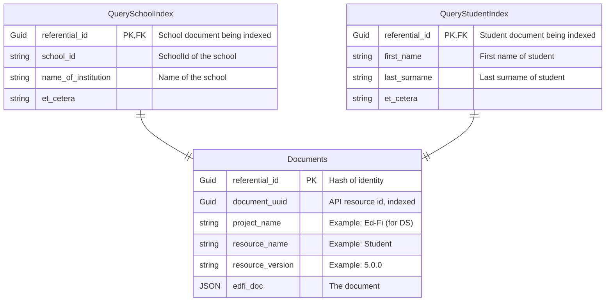

# DMS Feature: Primary Data Storage

## Problems to solve via DB design

### Existence and reference validation

The first problem is existence and reference validation. Unlike Meadowlark, we want to leverage foreign key
referential integrity to do this. Note we need to be able to take into account superclass identities, for
example the existence of an EducationOrganization can satisfy reference validation for a School reference, so
there has to be some mapping here. We would also like reference validation to be tunable in some fashion,
meaning you can turn it on or off.

### Query support in relational DB

The next problem is query support. We'll need to know what the different fields are that you're allowed to
query on, and then have some way to index them into the json.

One question is how performant does this need to be? If/when it becomes too slow, moving to a search engine
would be the recommendation because if you want true performance you would use a separate read only store.

### Security

The next thing that you need to be able to support is security. Following the ODS/API, we'll want
Namespace-based for sure, Education Organization-based probably, and possibly Grade Level-based as well. In
some ways this may be similar to query support, as we'll need to know the relevant fields to secure on for
each resource.

### Streaming changes

We'll need the ability to stream out changes. This needs to be something that can be easily integrated with
Kafka and potentially other streaming platforms, with a well-defined message format. Change query support is
related to this, but we won't prejudge whether it will be based off of streaming.

### Simplicity

As maintainability is a primary goal, we want to keep Tanager as simple as possible. Meadowlark demonstrated
that we can simplify over the ODS/API by avoiding code-per-resource and instead use a generalized design
applicable to any resource. While it may not be possible with Tanager to do this completely, we would like to
do it whenever possible.

### Performance

We need to make sure that we design to meet performance goals, and test early and often to ensure that we are
able to hit those goals.

## Potential Solutions

### Option A - Similar to Meadowlark

#### General Structure

This is very much like the Meadowlark implementation of the PostgreSQL backend, except we want to take
advantage of foreign key constraints for reference validation.

We would have a `Documents` table that will hold all of the documents for all of the entities. This will be a
partitioned table so that we don't have to be concerned about how big this table grows. The documents table
will have a `referential_id` as both the primary key and a hash partition key. It will be a UUIDv5 (see [RFC
4122](https://datatracker.ietf.org/doc/html/rfc4122#section-4.3)) with an Ed-Fi namespace ID and the resource
name + the extracted document identity as the "name". This concept of a deterministic hash UUID allows Tanager
to determine both document identities and document references independent of data in the DB. This ID will not
be provided to API clients.

The `Documents` table will also include the document itself as well as a `document_uuid`, which is the
externally exposed resource ID. It will also include metadata like resource name and version.

#### Reference validation

There will also be a separate `References` table which will be composed of two `reference_ids`, one for the
parent of the reference and one for the document being referenced. This table with also be partitioned and
will have a standard generated PK, but the important thing to note is that there will be foreign key
references to the `Documents` table, one for every reference between documents.

**(Think more about superclass aliases, whether they can actually be incorporated into the references table or
need to be their own separate aliases table that just has basically a myref ID and a my super class ref ID.)**

The benefit of this design is that by putting all resources in a single table we can also use a single table
to provide referential integrity between any two documents. If we split the documents by resource, we now also
require join tables between specific resources which greatly increases Tanager complexity.

#### Why random GUIDs as primary and partition keys on Documents?

We should expand on the reasoning behind the choice of random GUIDs as primary and partition keys on
`Documents`. While they bring many advantages to the project, they have higher storage requirements than other
index data types. They also require a different (but not necessarily more complex) index maintenance style
from sequential keys to minimize page splitting issues.

As mentioned above, the `referential_id` of a document provides a hash of the identity of the document. This
identity is composed of the document's resource type (e.g. School) along with the extracted values of the
document that make up its identity (e.g. schoolId). Therefore, a `referential_id` is computable solely from
the contents of a document. In the same way, the `referential_id` for any references one document may have to
another document are also computable from the contents.

Since `referential_id` can be derived from a document without a DB lookup and since they uniquely identify a
document, they make an excellent candidate for a primary key on `Documents`. Additionally, we will rely on
foreign key constraints between the `referential_id`s in the `Documents` and `References` tables to enforce
reference validation, which again makes `referential_id` a good PK choice.

Now, storing all of our documents in a single `Documents` brings challenges that random GUID keys are well
suited to address. If sequential PKs were used, rapid inserts would quickly cause last-page insert contention
on the table, also known as PAGELATCH_EX waits. With properly managed random GUIDs, inserts are evenly
distributed across pages, avoiding insert contention.

This same benefit of randomness also applies when designing the partition scheme for the `Documents` table.
Using the PK as the partition key means fast partition elimination, and the randomness of the GUIDs provides
for even distribution of inserts across partitions.

#### How insert/update/delete will work

All three will be implemented via transactions that operate on the `Documents` and `References` tables.

##### Insert

A transaction which inserts the document in the `Documents` table and each document reference on the document
in the `References` table. A PK constraint violation on `Documents` indicates this should be handled as an
update, not an insert. A FK constraint violation on `References` indicates a reference validation failure.

##### Update

A transaction which deletes the document's current document references in the `References` table, inserts each
document reference on the updated document in the `References` table, and updates the JSON document itself on
the `Documents` table. A FK constraint violation on `References` indicates a reference validation failure on
an updated reference.

##### Delete

A transaction which deletes the document from the `Documents` table and deletes its document references in the
`References` table. A FK constraint violation on `References` indicates a failure because the document is
referenced by another document.

#### Query handling

Looking at queries, these will be handled by some sidecar tables that will be need to be generated as a table
per resource.

For example, `QuerySchoolIndex` would have a `referential_id` foreign keyed to the `Documents` table with a
row per School document. The other columns will be the list of queryable columns that are available to an API
user for GET-by-query. Those columns will be indexed so they can be searched. These tables will likely need to
be partitioned as well.

The next question is how this tables get populated. Probably the best way would be for it to be via a separate
process so as not to slow down the performance of inserts. However, if you're in a deployment situation where
a search engine is not an option, a separate process may not be viable either.

(**Maybe provide both options?**)

The query table schema can be pre-generated of course, but also the JSON Paths to the queryable elements, and
even the SQL insert statements -- though they'd have to target all supported databases.

Since these query tables will likely be joined to the `Documents` table, they should have the same PK and
partitioning scheme as the `Documents`, including collocation. See
[here](https://learn.microsoft.com/en-us/sql/relational-databases/partitions/partitioned-tables-and-indexes?redirectedfrom=MSDN&view=sql-server-ver15#queries).

#### Security

We expect that security can be handled the same way as queries, with sidecar tables generated per resource
with the fields relevant to security extracted into columns.

#### Issues

Let's consider some downsides to this approach and how we can mitigate them. The most obvious is that all
resources are stored in a single table which presents a inconvenience when you only want to see specific
resources. A solution to that would be to create a view per entity, where the views just select out the JSON
for entities of a particular resource type. For example, there would be a view `edfi.schools` which just does
a `SELECT edfi_doc from Documents where resource_name = "School"`.

Another potential downside is partitioning itself. However, designing for partitioning up front is better than
adding on later, and there are resources for attendance and assessments with potential to need partitioning on
their own. Hash partitioning is conceptually straightforward and operationally you just decide on the number
of partitions to hash into.

(**Hash-based partitioning is easy to declare in PostgreSQL, need to research more on SQL Server side**)

Probably the biggest potential downside is a common SQL server community concern around using GUIDs as a
primary key.

(**There is a strong community bias towards sequential numbers as primary keys. It will be important to
demonstrate that using a randomized uuid as a primary key can work just fine, but definitely requires
different index maintenance from a sequential primary key. We will need to provide technical guidance on how
index maintenance differs between tables with sequential IDs and tables with randomized IDs. We will need to
provide real world testing showing that randomized IDs work very well so long as index maintenance is done
properly.** [This presentation](https://www.youtube.com/watch?v=nc4CMo7VSPo) **is an excellent starting
point.**)

### Option B - One table per resource

Option B moves closer to the ODS/API design by having a table per resource. So for example we would have a
`GraduationPlan` table and separate from that a `StudentSchoolAssociation` table and so on. This adds a large
amount of complexity.

In this example, we have a `StudentSchoolAssociation` table with the `referential_id` as the primary key. It
also includes the external `document_uuid`, the JSON document itself, and all of the queryable columns on it.
We also include the reference_ids specific to the entities referenced by this resource. So in this case there
would be a `student_referential_id` referencing a School and a `school_referential_id`

A problem that you run into with this approach is that you sometimes have many-to-many relationships between
entities. So you need a join table of reference IDs, which are tables that are not data standard concepts. An
example of this would be that `StudentSchoolAssociation` has a collection of `GraduationPlans` so we would
need a `StudentSchoolAssociationGraduationPlan` table. Aside from these tables not being Data Standard
concepts, this brings in a whole issue of potentially needing to model things with an object relational mapper
for these relationships, which means we are now having to generate C# classes which is exactly what we want to
avoid. Unfortunately the option of a single references table here is not available to us once we split out
tables by resource because you cannot foreign key to multiple tables. At least, it's not available if you want
to defer the heavy lifting on referential integrity/reference validation to the database.

### Option C: One table per resource, single reference table

Option C is like Option B except it has the single reference table like Option A to avoid the problem of join
tables.

The problem is that with a single `References` table, we cannot rely on referential integrity to do reference
validation. This means that we have to manage referential integrity entirely with Tanager. Our experience with
this in Meadowlark showed a couple issues. The most important is that it is error-prone and easy to get wrong.
The second is that while Meadowlark was able to get this down to simple index lookups, it still required
several round trips to accomplish reference validation.

We could mitigate the round trips by pushing reference validation into stored procedures. However, addressing
the potential for errors requires a very heavy investment in testing. This would be even more complex if we
had to do testing on stored procedures.

## Proposed Proof of Concept for Option A

Option A is our preferred alternative. A plan to test it:

- Create `Documents` and `References` with reference IDs as uuids for the primary key
- Insert a million records to start. (We'd really like to get more like 100 million in order to get the right
  order of magnitude for large districts, but a test like that takes a long time.)
  - Monitor index fragmentation with the tools from [this
    presentation](https://www.youtube.com/watch?v=nc4CMo7VSPo), and do index maintenance as necessary
- Compare insert performance.
- Compare query performance with a couple of likely scenarios.
- Compare storage requirements.
- Repeat with bigints as primary keys with sequential ordering

## Early notes to remove once saved elsewhere:

- Deployment decision: install tables on the fly, use separate utility, or hybrid approach. Example: a
  separate connection string is provided, deployment occurs on post to an endpoint, and only sys admins can
  access that endpoint.
- Generate schemas in MetaEd or C#? Relates closely to the item above.
- Store JSON for fast retrieval and for change data capture
  - As column or in a separate outbox table?
  - If outbox, then not valuable for fast retrieval.
  - If column, then do we need immediate updates on cascading key changes?
