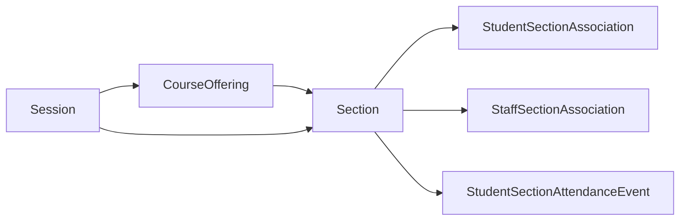

# DMS Feature: Cascading Updates into JSON Documents

## Problem

In a cascading update we must update not only the references between tables, but
also the JSON documents. For example, we may have the following `CourseOffering`
that depends on `Session`, which is one of the Ed-Fi Resources that allows
natural key (identity) updates:

```json
{
    "localCourseCode": "abc",
    "schoolReference": {
        "schoolId": 123
    },
    "sessionReference": {
        "schoolYear": 2025,
        "sessionName": "Session1",
        "schoolId": 123
    },
    "courseReference": {
        "courseCode": "ANEG1",
        "educationOrganizationId": 123
    }
}
```

The natural key for `Session` has three parts, as seen above. In the original
`Session` document, the `schoolYear` and `schoolId` are themselves nested under
references:

```json
{
    "sessionName": "Third Quarter",
    "schoolYearTypeReference": {
        "schoolYear": 2025
    },
    "beginDate": "2025-01-01",
    "endDate": "2025-03-31",
    "termDescriptor": "uri://ed-fi.org/TermDescriptor#Quarter",
    "totalInstructionalDays": 45,
    "schoolReference": {
        "schoolId": 123
    }
}
```

When any of those three natural key values - `sessionName`, `schoolYear`, or
`schoolId` - changes, then we need to cascade that change into the
`CourseOffering` document. To be clear: when the `Session.schoolId` values
changes, then both `CourseOffering.schoolReference.schoolId` and
`CourseOffering.sessionReference.schoolId` must also change (but not
`CourseOffering.courseReference.educationOrganizationId`, which is not part of
the key unification scheme for this Resource).

And that cascade extends further. Consider the following `Section`:

```json
{
    "sectionIdentifier": "identifier",
    "sessionReference": {
        "schoolYear": 2025,
        "sessionName": "Session1",
        "schoolId": 123
    },
    "courseOfferingReference": {
        "localCourseCode": "abc",
        "schoolId": 123,
        "schoolYear": 2025,
        "sessionName": "Session1"
    }
}
```

Note that it has both a direct `sessionReference` and a
`courseOfferingReference`, so two different updates will occur on this object:

1. On `Session` update, and
2. On `CourseOffering` update.

Furthermore, `Section` also has child entities. The following diagram shows some
of the relationship that cascade out from `Session`:



Thus, the cascading problem also becomes a recursion problem: update all
dependent JSON documents when an identity value changes. By definition, this
update is itself an allowed identity update which may cascade into yet more
documents.

## Algorithm

On `PUT` request, in the existing transaction scope:

1. If identity has been updated and identity updates are allowed for the resource.
   1. Update `dms.document` for the given item, completely replacing the document.
   2. Update the `referentialId` values in `dms.alias` and `dms.reference` using
      the newly calculated value.
   3. Enter recursion:
      1. Update the JSON document for all items that reference the modified item.
      2. For each affected item, re-enter the loop.

> [!TIP]
> Steps 1.1 and 1.2 are described in [DMS Feature: Referential
> Integrity](./REFERENTIAL-INTEGRITY.md)

## SQL Statements

Step 1.3.1 must generate a SQL statement like the following, which handles
changes to any part of the `Session` natural key:

```sql
update dms.document
set edfidoc = jsonb_set(
    jsonb_set(
      jsonb_set(
        jsonb_set(
          jsonb_set(
            edfidoc, '{sessionReference, sessionName}', '"@NewSessionName"'
          ), '{schoolYearTypeReference, schoolYear}', '"@NewSchoolYear"'
      ), '{sessionReference, schoolYear}', '"@NewSchoolYear"'
    ), '{sessionReference, schoolId}', '"@NewSchoolId"'
  ), '{schoolReference, schoolId}', '"@NewSchoolId"'
)
from (
  select parentdocumentid, parentdocumentpartitionkey
  from dms.reference
  where referenceddocumentid = @DocumentId
  and referenceddocumentpartitionkey = @DocumentPartitionKey
) as sub
where document.id = sub.parentdocumentid
and document.documentpartitionkey = sub.parentdocumentpartitionkey;
```

Note that this has five variables in it, all related to the document used on
entry into recursion: `@NewSessionName`, `@NewSchoolYear`, `@NewSchoolID`,
`@DocumentId`, and `@DocumentPartitionKey`. The sub-select uses `dms.reference`
to determine which records need to be modified. The nested `jsonb_set` calls
handle updates to `sessionReference` sub-documents and to any
`schoolReference` or `schoolYearTypeReference` sub-documents. This SQL statement
will need to be generated dynamically based on the Resource being modified.

> [!TIP]
> While it may be feasible to generate this dynamic SQL statement in SQL itself,
> doing so in C# will have the benefit of easier unit testing.

This is a solvable problem when using the custom API Schema document model.

But what about step 1.3.2?

By adding `returning` clause to the end of the statement, we can determine
which records were modified, and crucially, what resource type:

```sql
returning document.id as ModifiedDocumentId,
    document.documentpartitionkey as ModifiedDocumentPartitionKey,
    document.resourcename as ModifiedResourceName
```

This should provide sufficient information to take the recursive step. The
resource name is needed in order to build the `update` statement, but only the
attributes from the source document need be covered in that statement. For
example, `localCourseCode` is part of the natural key for `CourseOffering`. When
the original change came from a `Session` object, there is no need to modify the
`localCourseCode`. Thus the changed keys and values from the source document
will need to be retained throughout the recursion.

### Microsoft SQL Server

The example above was written for PostgreSQL. It should be possible to replicate
this in Microsoft SQL Server.

* Use
  [`JSON_MODIFY`](https://learn.microsoft.com/en-us/sql/t-sql/functions/json-modify-transact-sql?view=sql-server-ver16)
  in place of PostgreSQL's `jsonb_set`.
* The `OUTPUT` clause  [MSSQL's
  Update](https://learn.microsoft.com/en-us/sql/t-sql/queries/update-transact-sql?view=sql-server-ver16)
  appears to fill the same role as the `returning` clause in PostgreSQL.

## Worst Case Scenario

If the school is storing positive attendance for a section, and the
`sessionName` changes deep into the school year, then this could be a large
number of records to modify. In the Glendale sample database, with about 40,000
students:

* The `Session` with the most `Sections` is "Traditional-Spring Semester" with
  16,340 `Sections`.
* There are 174,205 `StudentSectionAssociation` records for that `Session`.
* There are 93 instructional days in that `Session`
* With positive attendance, there would be 93 x 174,205 = 16,201,065
  `StudentSectionAttendanceEvent` records.
* For a total of 16,391,610 JSON documents to update (plus any other table that
  refers to `Session`).

How long will it take to update those 16 million records? Even in the ODS/API
this would take a long time. As an initial experiment, in Glendale, the
`Session` mentioned above was modified. Nearly 900,000 records were affected,
and it took about 5.5 minutes in SQL Server on a developer workstation. It may
be valuable to provide an offline update function that will allow a quick
response to the API client, followed by an eventually-consistent process to
update the JSON documents. An eventually-consistent process would probably
require a queue-based task system, likely running as application code
in a standalone service, reading either from a RDBMS-based queue or
from a Kafka topic.
