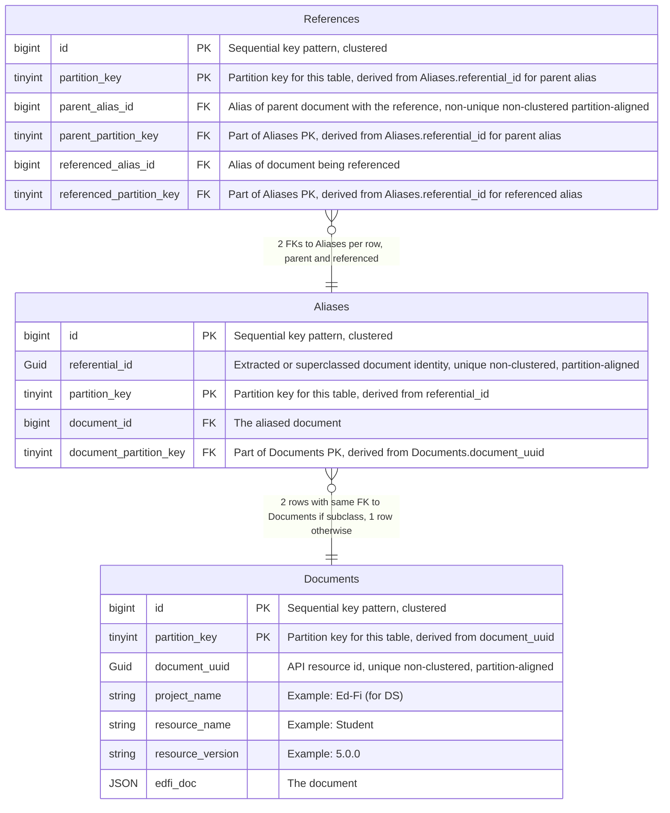
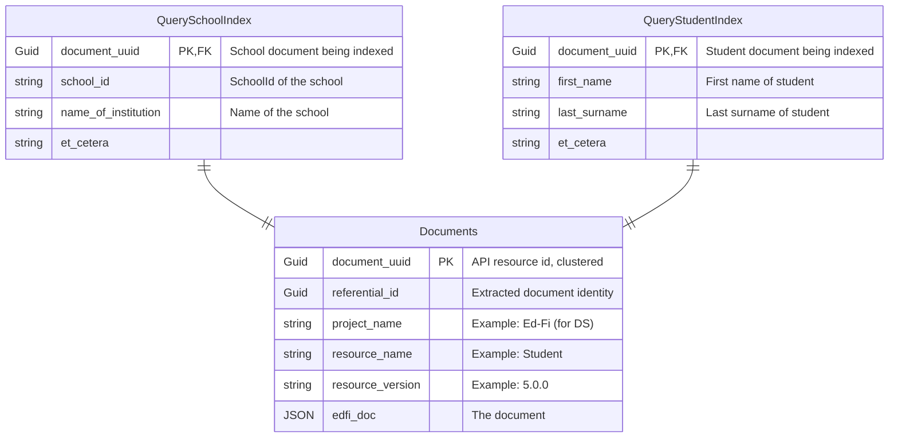
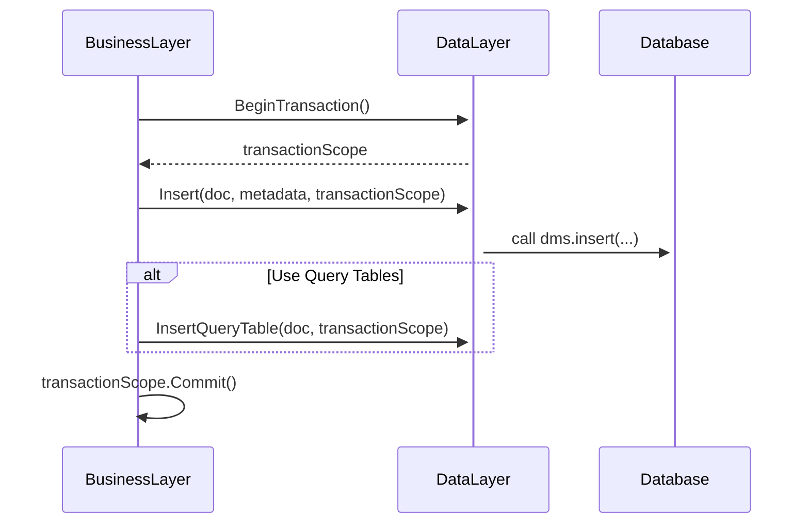

# DMS Feature: Primary Data Storage

> [!NOTE]
> The application architecture will have a plugin system that enables others to
> customize the database storage. The design described below will be implemented
> with Microsoft SQL Server (MSSQL) and PostgreSQL plugins that come out of the
> box with the Data Management Service. Other designs could be built and
> implemented, so long as the REST API implementation remains unchanged.

## Problems to solve via DB design

### Existence and reference validation

The first problem is existence and reference validation. Unlike Meadowlark, we want to leverage foreign key
referential integrity to do this. Note we need to be able to take into account superclass identities, for
example the existence of an EducationOrganization can satisfy reference validation for a School reference, so
there has to be some mapping here. We would also like reference validation to be tunable in some fashion,
meaning you can turn it on or off.

### Query support in relational DB

The next problem is query support. We'll need to know what the different fields are that you're allowed to
query on, and then have some way to index them into the json.

One question is how performant does this need to be? If/when it becomes too slow, moving to a search engine
would be the recommendation because if you want true performance you would use a separate read only store.

### Security

The next thing that you need to be able to support is security. Following the ODS/API, we'll want
Namespace-based for sure, Education Organization-based probably, and possibly Grade Level-based as well. In
some ways this may be similar to query support, as we'll need to know the relevant fields to secure on for
each resource.

### Streaming changes

We'll need the ability to stream out changes. This needs to be something that can be easily integrated with
Kafka and potentially other streaming platforms, with a well-defined message format. Change query support is
related to this, but we won't prejudge whether it will be based off of streaming.

### Simplicity

As maintainability is a primary goal, we want to keep Tanager as simple as possible. Meadowlark demonstrated
that we can simplify over the ODS/API by avoiding code-per-resource and instead use a generalized design
applicable to any resource. While it may not be possible with Tanager to do this completely, we would like to
do it whenever possible.

### Performance

We need to make sure that we design to meet performance goals, and test early and often to ensure that we are
able to hit those goals.

## Solution

> [!TIP]
> See [Design Options for Data Management Service Data Storage](./ALTERNATIVES-DESIGNS.md)
> for detailed analysis of potential solutions, including drawbacks and mitigating factors.

### Write Operations

The DMS will follow a design inspired by NoSQL systems, but taking advantage of
relational database features. This is essentially [Option
B](./ALTERNATIVES-DESIGNS.md#option-b---similar-to-option-a-but-reduce-guid-usage).

To summarize:

* There are three tables for all Resource Types, which simplifies the application code.
  * `Documents` stores the raw JSON and metadata.
  * `References` stores foreign keys.
  * `Aliases` supports model inheritance for Education Organizations.
* Planning ahead for performance considerations:
  * The primary `Documents` table will use a `bigint` (64 bit integer) for the primary key.
  * Out of the box, the `Documents` will be split into 16 different partitions.
    These partitions are in different files, thus reducing contention compared
    to a single partition in one gigantic file.
  * A partition key column, based on the primary key, will improve indexing and
    will help distribute all of the stored records evenly across the available
    partitions.
  * An implementation must be able to modify to more or fewer partitions as
    desired. In this design, the partition key limits the potential number of
    partitions to 256.

The development team has [executed initial
experiments](../../../POC-Applications/POC.Databases/) to compare some aspects
of performance between this structure and the ODS database from the ODS/API
Platform v7. Similar records were inserted into three tables: `Student`,
`StudentSchoolAssociation`, and `StudentSectionAssociation`. Running a virtual
machine with SQL Server 2022 and Windows Defender disabled, large numbers of
inserts were run and timed for direct comparison of the insert performance. The
following tables summarize the initial findings with 1 million records:

| Database | Insert Time | Storage (KB) |
| -------- | ----------- | ------------ |
| DMS      | 02:49:42    | 571,528      |
| ODS      | 03:22:34    | 1,268,968    |

The techniques used in these experiments do not provide perfect comparisons, but
we believe these results are "essentially" comparable. And that comparison is
very favorable, supporting the hypothesis of high performance with this database
design.

### Read Operations

The Data Management Service will be built to support one of two models for
database queries ("GET all" and "GET by search string"):

1. (Preferred) Use a search database _instead_ of the relational database
   (examples: OpenSearch, Elasticsearch).
2. (Alternate) Add query tables in the relational database, which support
   indexing on the searchable fields. There will be one query table per Resource
   and one table for all Descriptors.

See [Design Options for Data Management Service Data
Storage](./ALTERNATIVES-DESIGNS.md) for more information.

### Implementation Notes

The proof-of-concept process helped uncover some details that need to guide the
implementation:

* Compared to `varbinary`, using `nvarchar` for the JSON documents results in
  higher performance and smaller storage requirements.
* The _partition key_ should be defined in a SQL function that takes the
  _primary key_ value as input, so that an implementation can modify the
  partition key without having to recompile the C# application.
* To avoid having the C# call out to the database to query the partition key
  function, the application can call stored procedures. The stored procedures
  will encapsulate the logic of looking up the partition key before performing
  the relevant operation.
* The stored procedures can also encapsulate details of writing to the three
  tables. They treat all three writes as an atomic unit by providing appropriate
  transaction management.
* There should thus be three stored procedures, one each for
  * Insert
  * Update
  * Delete

The stored procedures _should not_ insert data into query tables. Insertion into
query tables will be enabled at runtime by feature flag. They do imply that the
application code should initialize a transaction _in the business logic layer_
before calling _data storage layer_.

The following sequence diagram gives a sense of the desired application design:

