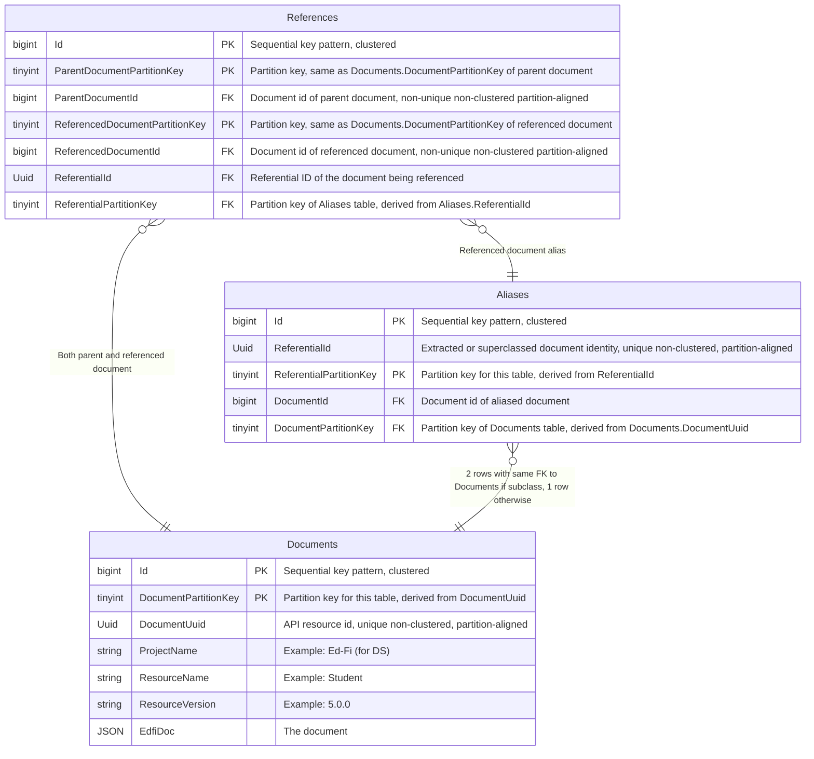
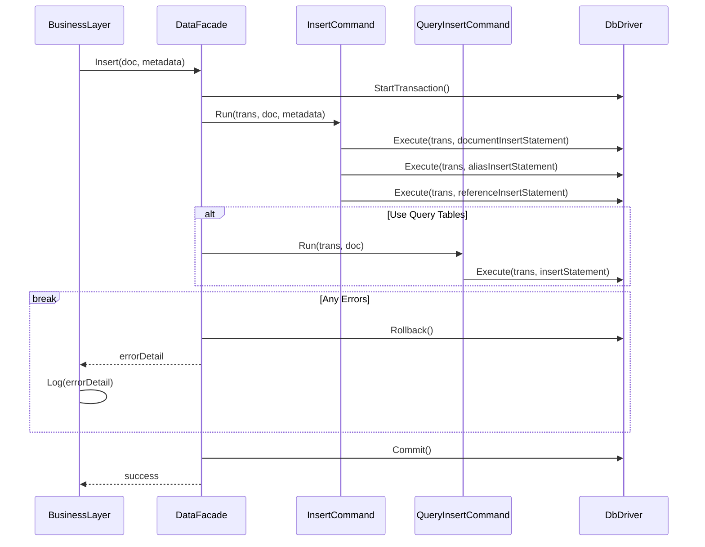
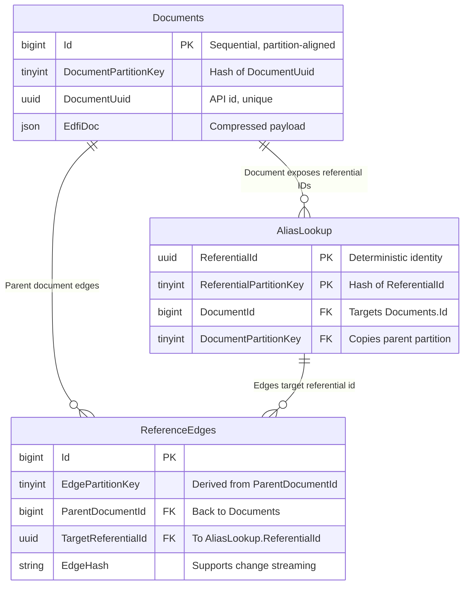
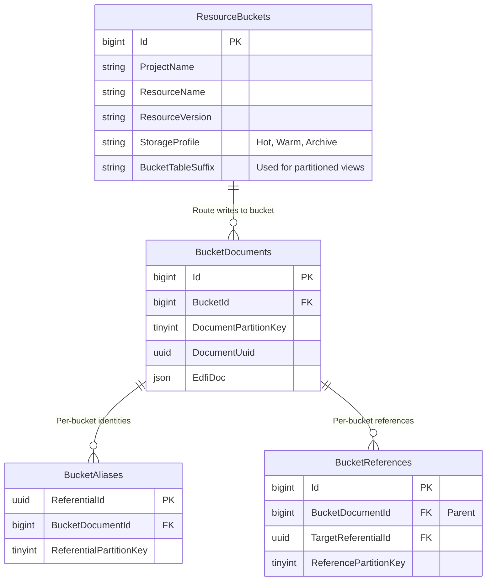
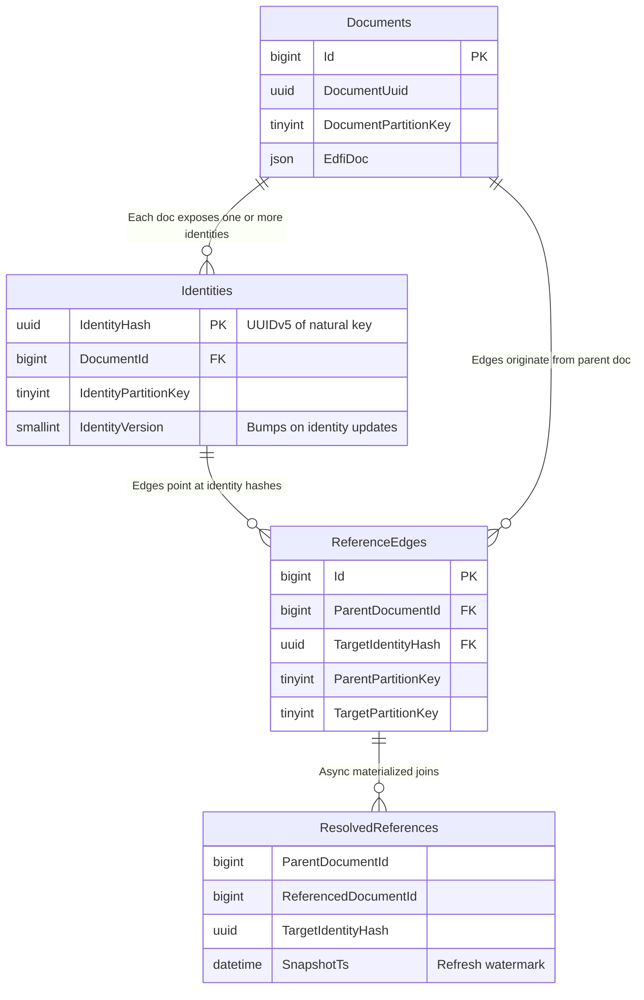

# DMS Feature: Primary Data Storage

This document describes the core relational document data storage used for data modifications.

The application architecture will have a plugin system that enables others to customize the
database storage. The design described below will be implemented with Microsoft SQL Server
(MSSQL) and PostgreSQL plugins that come out of the box with the Data Management Service.
Other designs could be built and implemented, so long as the _REST API implementation_ remains
unchanged.

## Problems to solve via DB design

### Existence and reference validation

The first problem is existence and reference validation. Unlike Meadowlark, we want to leverage foreign key
referential integrity to do this. Note we need to be able to take into account superclass identities, for
example the existence of an EducationOrganization can satisfy reference validation for a School reference, so
there has to be some mapping here. We would also like reference validation to be tunable in some fashion,
meaning you can turn it on or off.

### Query support in relational DB

The next problem is query support. We'll need to know what the different fields are that you're allowed to
query on, and then have some way to index them into the json.

One question is how performant does this need to be? If/when it becomes too slow, moving to a search engine
would be the recommendation because if you want true performance you would use a separate read only store.

_Also see [Queries Using the Relational Database](./RELATIONAL-QUERIES.md) and
[DMS Feature: Read-only Search Database](../SEARCH-DATABASE.md)_

### Security

The next thing that you need to be able to support is security. Following the ODS/API, we'll want
Namespace-based for sure, Education Organization-based probably, and possibly Grade Level-based as well. In
some ways this may be similar to query support, as we'll need to know the relevant fields to secure on for
each resource.

_Also see [Relational Support for Client Authorization](./RELATIONAL-SECURITY.md)._

### Streaming changes

We'll need the ability to stream out changes. This needs to be something that can be easily integrated with
Kafka and potentially other streaming platforms, with a well-defined message format. Change query support is
related to this, but we won't prejudge whether it will be based off of streaming.

### Simplicity

As maintainability is a primary goal, we want to keep DMS as simple as possible. Meadowlark demonstrated
that we can simplify over the ODS/API by avoiding code-per-resource and instead use a generalized design
applicable to any resource. While it may not be possible with DMS to do this completely, we would like to
do it whenever possible.

### Performance

We need to make sure that we design to meet performance goals, and test early and often to ensure that we are
able to hit those goals.

## Solution

> [!TIP]
> See [Design Options for Data Management Service Data Storage](./PRIMARY-DATA-STORAGE-alternatives.md)
> for detailed analysis of potential solutions, including drawbacks and mitigating factors.

### General Structure

This is very much like the Meadowlark implementation of the PostgreSQL backend, except we want to take
advantage of foreign key constraints for reference validation. We also want to introduce partitioning. All
three tables use the sequential surrogate key pattern with size `BIGINT`.

#### Documents Table

The `Documents` table holds all of the documents for all of the entities. `Id` is the sequential surrogate
primary key. `DocumentUuid` is the external GUID expressed in the API as the resource id. It will be indexed
as unique and non-clustered to support both document_uuid uniqueness validation as well as direct access for
GET/UPDATE/DELETE by id operations. `DocumentPartitionKey` is included as part of the primary key. It is
derived from the `DocumentUuid`, either as a modulo or by taking low-order bits, and maps to a partition
number. This will allow the index on `DocumentUuid` to be partition-aligned.

`Documents` also includes metadata about the document, such as project name, resource name and resource
version. The table will also include the document itself as `EdfiDoc`, which will be stored compressed and
off-row.

#### Aliases Table

The `Aliases` table is a partitioned table that maps documents to their referential id(s). It also has `Id` as
a sequential surrogate primary key.

`ReferentialId` is a UUIDv5 (see [RFC 4122](https://datatracker.ietf.org/doc/html/rfc4122#section-4.3)) with
an Ed-Fi namespace ID as the "namespace" and the resource name + the extracted document identity as the
"name". This concept of a deterministic hash UUID allows DMS to determine both document identities and
document references independent of data in the DB. Each document has at least one referential id. Only
subclass documents have a second referential id, which is the document identity in the form of its superclass.
`ReferentialId` will be indexed as unique and non-clustered to support referential_id uniqueness validation.

`ReferentialPartitionKey` is included as part of the primary key. It is derived from the `ReferentialId`,
either as a modulo or by taking low-order bits, and maps to a partition number. This will allow the index on
`ReferentialId` to be partition-aligned.

`Aliases` has a foreign key reference back to the document with this `ReferentialId`.

Delete attempts from the `Aliases` table validate that a document is not referenced by another document.

#### References Table

The `References` table stores every document reference. It also has `Id` as a sequential surrogate primary
key. It shares `DocumentPartitionKey` as its own partition kay as part of the primary key.

The table is composed of both a `ParentDocumentId` and `ReferencedDocumentId` foreign key reference back to
the `Documents` table for the parent and referenced documents in the reference. A `ReferentialId` provides a
foreign key reference back to the `Aliases` table for the document being referenced. The purpose of the
`Aliases` foreign key constraint is to perform reference validation. Insert attempts into this table validate
reference existence. `ParentDocumentId` will be indexed as non-unique, non-clustered and partition-aligned to support
removal on document deletes and updates.

#### Why not a table per resource?

The benefit of this design is that by putting all documents in a single table regardless of resource, we can
use three simple tables to provide reference validation via referential integrity between any two documents
using their extracted referential_id(s). If we split the tables up by resource, we will also require a
specific join table for every resource-pair participating in a reference, which 1) greatly increases
complexity and 2) is redundant because referential_id already encodes the resource type.

#### Why partitioning?

This design is for three very large tables. It's important to note that the largest US school district with
positive attendance tracking could have on the order of 450 million attendance records in a school year. Since
a DMS instance will store a lot more that just attendance, we are targeting support on the order of 1
billion rows in the `Documents` table. If we estimate that each document has on the order of 10 references to
other documents (they can have arrays of references), then we need to be able to support on the order of 10
billion rows in the `References` table.

Determining a good default number of partitions for each table will require experimentation, but 16 partitions
for `Documents` and `Aliases` and 64 partitions for `References` is probably a good starting point. See
[here](https://www.brentozar.com/archive/2013/01/sql-server-table-partitioning-tutorial-videos-and-scripts/)
for a demo on experimenting with partitioning to find a good size. This will be a hash method of partitioning,
where we compute the `partition_key` from an appropriate GUID in the table to allow for partition elimination
on queries and partition-aligned indexing.

#### Query handling

See [Queries Using the Relational Database](./RELATIONAL-QUERIES.md).

### Planning ahead for performance considerations

- The primary `Documents` table will use a `bigint` (64 bit integer) for the primary key.
- Out of the box, the `Documents` will be split into 16 different partitions.
  These partitions are in different files, thus reducing contention compared
  to a single partition in one gigantic file.
- A partition key column, based on the primary key, will improve indexing and
  will help distribute all of the stored records evenly across the available
  partitions.
- An implementation must be able to modify to more or fewer partitions as
  desired. In this design, the partition key limits the potential number of
  partitions to 256.

The development team has [executed initial
experiments](../../../POC-Applications/POC.Databases/) to compare some aspects
of performance between this structure and the ODS database from the ODS/API
Platform v7. Similar records were inserted into three tables: `Student`,
`StudentSchoolAssociation`, and `StudentSectionAssociation`. Running a virtual
machine with SQL Server 2022 and Windows Defender disabled, large numbers of
inserts were run and timed for direct comparison of the insert performance. The
following tables summarize the initial findings with 1 million records:

| Database | Insert Time | Storage (KB) |
| -------- | ----------- | ------------ |
| DMS      | 02:49:42    | 571,528      |
| ODS      | 03:22:34    | 1,268,968    |

The techniques used in these experiments do not provide perfect comparisons, but
we believe these results are "essentially" comparable. And that comparison is
very favorable, supporting the hypothesis of high performance with this database
design.

## Implementation

The proof-of-concept process helped uncover some details that need to guide the
implementation:

- Compared to `varbinary`, using `varchar` for the JSON documents results in
  higher performance, albeit at the cost of approx 20% higher disk space usage.
- The number of partitions can be configured at the application level, although
  it _must not_ be updated after deployment without downtime to re-organize the
  existing records. Partition function can be in C#.
- All operations across these tables need to be in a single atomic transaction.
  - Open question: should the transaction be opened and closed in the business
    layer or in the data access layer?
  - Thinking ahead to the potential of query tables, they might be handled in a
    different class than the main logic. In that case, if transactions are
    handled in the data access layer, then it may make sense to have an internal
    facade so that the business layer only has one call to make. The facade then
    hides the complexity of transaction handling and making multiple repository
    calls.

The following sequence diagram gives a sense of the potential application design:

### Insert Operation

From DMS Core:

- JSON Document
- Document Metadata
- Document UUID - generated
- Document Referential Id - extracted
- If a subclass, the Document Referential Id in superclass form
- Referential Ids of Document references - extracted

Transaction:

1. **UPSERT** If the natural key already exists, call the Update stored procedure and return _its_ result.
1. Insert the JSON Document, Document Metadata and Document UUID in the `Documents` table.
   - Derive `document_partition_key` from `document_uuid`.
   - Get the sequential id from the insert for the next operation.
   - A uniqueness constraint violation on `document_uuid` means this should be retried as an update.
1. Insert an entry in the `Aliases` table for the document.
   - Derive `referential_partition_key` from `referential_id`.
   - `document_id` is this document's sequential id from the `Documents` insert.
   - `document_partition_key` id also from the `Documents` insert.
   - If the document is a subclass, insert a second entry with `referential_id` in superclass form.
   - A uniqueness constraint violation on `referential_id` on the first insert means this should be handled as
     an update.
   - A uniqueness constraint violation on `referential_id` on the superclass insert means failure because
     there already exists a subclass with the same superclass identity.
1. Insert each document reference on the document in the `References` table.
   - `document_id` is this document's sequential id from the `Documents` insert.
   - `document_partition_key` id also from the `Documents` insert.
   - Determine `referenced_alias_id` and `referenced_partition_key` from a lookup on the `Aliases` table index
     for `referential_id`.
   - A missing `referential_id` lookup on `Aliases` indicates a reference validation failure.

### Update Operation (no identity update)

From DMS Core:

- JSON Document
- Document Metadata
- Document UUID
- Referential Ids of Document references - extracted

Transaction:

1. Find the document in the `Documents` table
   - Derive `document_partition_key` from `document_uuid`.
   - Find the document in `Documents` using the index on `document_uuid`.
     - If the document does not exist, fail the transaction and return immediately.
     - _This shouldn't happen, but let's make sure to throw a good error if it does._
   - Get `id` as the document id.
2. Delete the old document references
   - Delete document references on the `References` table using the index on `document_id` and
     `document_partition_key`.
3. Insert the new document references
   - Insert each document reference on the updated document as in the insert operation.
4. Update the JSON document itself on the `Documents` table.

### Update Operation (with identity update)

From DMS Core:

- JSON Document
- Document Metadata
- Document UUID
- Document Referential Id - extracted
- If a subclass, the Document Referential Id in superclass form
- Referential Ids of Document references - extracted

Transaction:

1. Find the document in the `Documents` table
   - Derive `document_partition_key` from `document_uuid`.
   - Find the document in `Documents` using the index on `document_uuid`.
     - If the document does not exist, fail the transaction and return immediately.
   - Get `id` as the document id.
1. Get the Aliases table entry for the document (don't worry about superclass entry)
   - Find the alias(es) in `Aliases` using the index on `document_id`.
   - Delete the original aliases entries for the `document_id`
     - **_ Currently no index _**
   - Add the new alias(es) to the `Aliases` table.
1. Delete the old document references
   - Delete document references on the `References` table using the index on `document_id` and
     `document_partition_key`.
1. Insert the new document references
   - Insert each document reference on the updated document as in the insert operation.
1. Update the JSON document itself on the `Documents` table.

> [!NOTE]
> TODO: describe desired cascading behavior.

### Delete Operation

From DMS Core:

- Document UUID

Transaction:

1. Follow update operation steps through deleting old document references.
1. Delete the document's aliases in the `Aliases` table.
   - A foreign key constraint violation indicates a reference validation failure due to the document having
     references to it.
1. Delete the document in the `Documents` table.

> [!NOTE]
> TODO: describe desired cascading behavior.

### SQL DDL

Use the SQL statements in the proof-of-concept code. Be sure to use the `VARCHAR` version
rather than `VARBINARY`. Do not apply any foreign key cascades in the initial work.

## Alternative Table Designs

> [!NOTE]
> The following designs and text were developed by GitHub Copilot using
> GPT-5.1-Codex, based on the following prompt, with this file itself as
> additional context: "Analyze this design document and offer alternative table
> designs that would meet the objectives."

Each option below preserves deterministic referential IDs, tunable partitioning, and the requirement that a
single transaction envelope spans every write. They offer different trade-offs for existence validation,
query fan-out, and operational isolation.

### Partitioned Doc Store with Reference Edge Table

This variant keeps the single `Documents` table but decomposes the `References` responsibilities into a
lightweight `ReferenceEdges` table plus an `AliasLookup`. Reference existence checks rely on a single
covering index over `AliasLookup(ReferentialPartitionKey, ReferentialId)`, so inserts do not need to join
back to `Documents` immediately. That improves write throughput, allows cache-friendly lookups per
partition, and still enforces referential integrity for delete/update flows.

Here’s how the “Partitioned Doc Store with Reference Edge Table” deviates from the baseline three-table design:

**Alias lookup structure**: In the baseline Aliases, each row uses a surrogate Id plus (ReferentialPartitionKey, ReferentialId) indexing. In the alternative AliasLookup, the deterministic ReferentialId (with its partition key) becomes the primary key itself, so there’s no extra surrogate Id, and every lookup can be satisfied by a single partition-aligned covering index. That makes referential checks cheaper and avoids writing two clustered rows whenever a document has subclass identities.

**Reference edge payload**: The original References table stores both ParentDocumentId and ReferencedDocumentId, meaning every insert needs to resolve the referenced document’s surrogate key and keep it synchronized. The alternative ReferenceEdges drops ReferencedDocumentId entirely and instead records (ParentDocumentId, TargetReferentialId). Existence validation is still enforced because TargetReferentialId has a foreign key to AliasLookup, but the insert path no longer has to touch the Documents table twice (once for parent, once for child). That shrinks lock contention and makes batching/caching of referential lookups straightforward.

**Partitioning focus**: Because ReferenceEdges partitions solely on the parent document key, all writes for a document happen in one partition (instead of tracking both parent and child partition keys). Referential partition keys only matter inside AliasLookup, so you can size reference partitions independently from document partitions. This is useful when reference fan-out outgrows document volume.

**Streaming metadata**: ReferenceEdges introduces an EdgeHash column explicitly intended for change-stream checkpoints. The baseline design has no built-in place to store a deterministic hash per reference row, so streaming consumers must compute their own hashes from multiple columns.

In short, while the table counts stay at three, the responsibilities shift: AliasLookup becomes the sole arbiter of referential identities, and ReferenceEdges carries only parent-side metadata. That separation removes the tight coupling between reference inserts and the referenced document row, which is the core behavioral difference from the original design.

### Resource-Bucketed Hybrid Layout

To improve multi-tenant isolation and allow per-resource tuning, this design adds a `ResourceBuckets` table
that maps `(project, resource, version)` to a storage bucket. Each bucket corresponds to a partitioned trio of
child tables. SQL Server partitioned views or PostgreSQL table inheritance present these child tables as a
single logical schema to the API, while operations teams can move buckets to different filegroups or hosts.

> [!NOTE]
> Stephen's analysis: this is an interesting workaround for regular table partitioning, probably based on the fact that SQL Server formerly only had partitioning in the enterprise edition (now present in all editions). If there is a "Bucket" table per resource type, then we are back to CDC monitoring of dozens of different tables. Is that really so bad? Wonder if this would net any real performance benefit though.

### Document/Identity/Edge with Materialized Reference Paths

This alternative promotes identities to a first-class table so that references only capture `(parent_id,
identity_hash)` pairs. A background task materializes resolved edges for popular query shapes, accelerating
joins without penalizing writes. Reference validation still occurs by enforcing the `ReferenceEdges` foreign
key to `Identities`, while `ResolvedReferences` can be truncated and rebuilt on demand or streamed out for
change-data consumers.

### Insert Performance Assessment

**Partitioned Doc Store + Reference Edge Table**: Best raw insert throughput. It removes the synchronous lookup of ReferencedDocumentId, keeps reference inserts in a single partition keyed by the parent, and validates existence via a covering index on AliasLookup. That cuts locking and reduces per-reference work to two narrow writes (edge row + alias hit).

**Baseline Three-Table Design**: Still efficient but every reference insert requires resolving the child document’s surrogate key and writing both parent and child partition keys. That extra lookup, plus broader clustered rows, adds latency compared with the edge-table variant.

**Resource-Bucketed Hybrid**: Most overhead on insert because the router must resolve the bucket, then write into bucket-specific tables or partitioned views. Benefits show up in operational isolation, not raw speed.

**Identity/Edge + Materialized Paths**: Inserts touch Documents, Identities (possibly twice for subclass), and ReferenceEdges. The same number of synchronous writes as the baseline plus background work for ResolvedReferences, so per-document insert cost is slightly higher.

**Bottom line**: the “Partitioned Doc Store with Reference Edge Table” is the most insertion-friendly design thanks to its leaner reference row, single join per reference, and partition-local writes.
