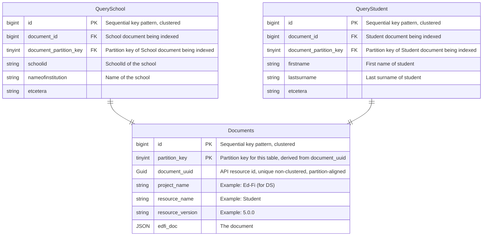

# DMS Feature: Relational Database Queries

> [!TIP]
> See [DMS Feature: Primary Data Storage](./README.md) for detailed background on the database design.

While the preferred method for query handling is via a [search engine](../SEARCH-DATABASE.md), some deployments will not be able to handle the additional operational complexity. In these cases, DMS can be configured to handle queries directly in the main relational datastore, though this comes at a cost of query performance.

## Design Overview

This approach uses resource-specific `*Query` tables that contain denormalized, searchable fields extracted from the JSON documents. Each query table maintains a foreign key relationship to the main `Documents` table.

### Key Characteristics

- **Resource-specific tables**: One query table per resource type (e.g., `QueryStudent`, `QuerySchool`)
- **Denormalized structure**: Query fields are extracted from JSON and stored as typed columns
- **Cross-partition indexing**: Query tables provide efficient access across document partitions
- **Performance trade-off**: Improves read performance at the cost of write complexity



### Architecture Details

#### Foreign Key Relationships
Each query table (e.g., `QueryStudent`) maintains a foreign key to the `Documents` table with one row per document. By including the `Documents` partition key, query tables effectively act as cross-partition indexes while avoiding the performance penalties of actual cross-partition indexes.

#### Queryable Fields
The columns in each query table correspond to fields that are available to API users for GET-by-query operations. This column list is derived from the `queryFieldMapping` in `ApiSchema.json`, which provides:
- The query field name
- The JSONPath to the document element location

Note that queryable document fields are always scalar values, so a JSONPath will never return multiple values.

#### Query Operations
- **Pagination**: Operates exclusively on query tables
- **"Get All" queries**: Use query tables for efficient cross-partition access
- **Indexing strategy**: Individual query fields will be indexed on a case-by-case basis to balance insert performance with query performance

> [!NOTE]
> Deployments requiring fast ad hoc query performance should use DMS's search engine option instead.

### Query Table Processing Strategy

Field extraction occurs in DMS core during document insert/update operations. Query tables can be populated using two approaches:

1. **Asynchronous processing** (preferred): A separate background process updates query tables, minimizing impact on write performance
2. **Synchronous processing** (fallback): When separate processes are not viable, query table insert/update will be in the same transaction as the document insert/update.

### Schema Generation
Query table schemas are pre-generated either:
- Directly into `ApiSchema.json` (integrated approach)
- Into separate query table JSON files (more modular approach)

### Configuration

Inserts/updates into query tables will be configurable at runtime.

### Query Table Maintenance

#### Rebuild Utility
A dedicated utility will be provided to rebuild query tables from the `Documents` table. This utility serves multiple purposes:

**Incremental rebuild**: Identifies `Documents` entries without corresponding query table entries and creates them. This handles:
- Temporary misconfiguration issues in production (e.g., one DMS instance not configured for relational queries)
- Migration scenarios when moving away from search engine configurations

**Full rebuild approaches**:
1. **Simple approach**: Truncate existing query table and rebuild (causes downtime)
2. **Zero-downtime approach**:
   - Create new table (e.g., `QueryStudent_new`)
   - Backfill data from `Documents` table
   - Perform transactional table rename/swap
   - Drop old table

#### Operational Considerations
- Rebuild operations should be scheduled during low-traffic periods
- Progress monitoring and logging are essential for large datasets
- Rollback procedures should be documented and tested

### Database Schema

> [!IMPORTANT]
> The SQL scripts below are for illustrative purposes only. Production implementations should only include columns that are actually queryable according to the resource's `ApiSchema.json` configuration.

```sql
-- Query table with search fields for Student documents
IF NOT EXISTS (select object_id from sys.objects where object_id = OBJECT_ID(N'[dbo].[QueryStudent]') and type = 'U')
BEGIN
CREATE TABLE [dbo].[QueryStudent] (
  id BIGINT IDENTITY(1,1),
  document_partition_key TINYINT NOT NULL,
  document_id BIGINT NOT NULL,
  studentUniqueId VARCHAR(256) NULL,
  personId VARCHAR(256) NULL,
  birthCity VARCHAR(256) NULL,
  birthDate DATETIME2 NULL,
  birthInternationalProvince VARCHAR(256) NULL,
  dateEnteredUS DATETIME2 NULL,
  firstName VARCHAR(256) NULL,
  generationCodeSuffix VARCHAR(256) NULL,
  lastSurname VARCHAR(256) NULL,
  maidenName VARCHAR(256) NULL,
  middleName VARCHAR(256) NULL,
  personalTitlePrefix VARCHAR(256) NULL,
  preferredFirstName VARCHAR(256) NULL,
  preferredLastSurname VARCHAR(256) NULL,
  CONSTRAINT FK_QueryStudent_Documents FOREIGN KEY (document_partition_key, document_id)
    REFERENCES [dbo].[Documents](partition_key, id),
  PRIMARY KEY CLUSTERED (id)
);
END

-- Example: Query by specific field (includes partition elimination)
SELECT d.edfi_doc
FROM Documents d
INNER JOIN QueryStudent q ON (d.partition_key = q.document_partition_key AND d.id = q.document_id)
WHERE q.lastSurname = 'Williams';

-- Example: "GET ALL" query (cross-partition index for all Student documents)
SELECT d.edfi_doc
FROM Documents d
INNER JOIN QueryStudent q ON (d.partition_key = q.document_partition_key AND d.id = q.document_id);
```
