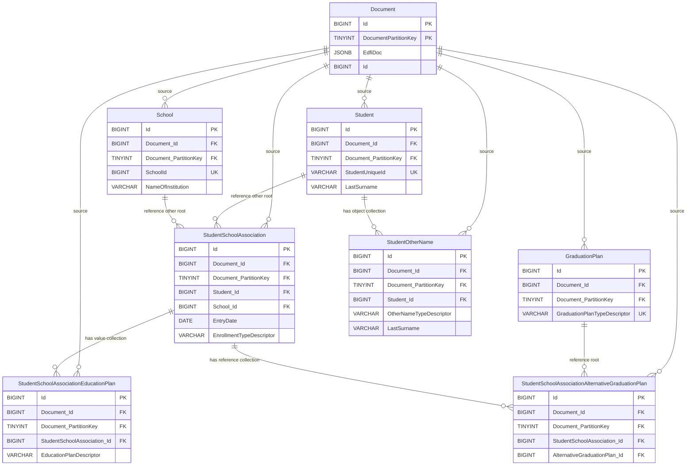
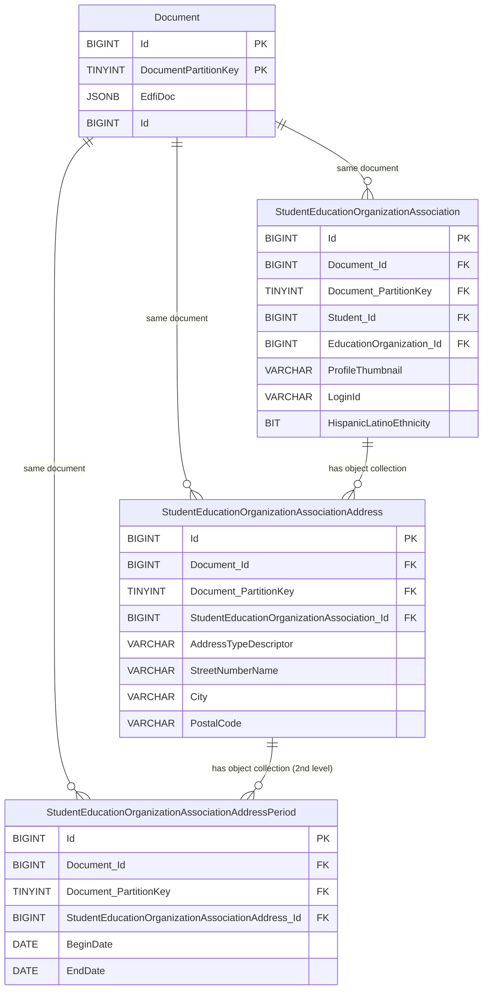

# Ed-Fi Data Management Service: Relational Flattening Design

## Executive Summary

This document describes an approach to storing Ed-Fi JSON Documents flattened into relational tables alongside the existing three-table design, providing relational access to data while maintaining the existing reference validation and uniqueness constraints.

## Assumptions

This design assumes the following technical requirements:
  1. The Document table is the source of truth
  2. Relational flattening must be optional
  3. The flattened tables can be read-only
  4. Deferred synchronization between the Document table and flattened tables is not permitted

## Core Design Principles

### 1. Minimize Complexity
- The simpler the flattening, the faster storage and retrieval operations
- Straightforward table structures reduce cognitive load
- Simple designs are easier to debug and optimize

### 2. Complementary Architecture
- The three-table design (Document, Reference, Alias) remains unchanged
- A single Document row is referenced by all flattened table rows that together make a document
- Reference validation and uniqueness continue to be enforced by the existing tables
- Flattening tables are purely for relational data access

### 3. Surrogate Keys Everywhere
- All flattened tables use `BIGINT IDENTITY(1,1)` as surrogate keys
- Natural keys become unique constraints, never part of a foreign key relationship
- Flattened tables JOIN via surrogate keys for query performance

### 4. Natural Key Resolution Through Compatibility Views
- Cross-resource references use surrogate keys for performance
- Views reconstitute natural key references for querying
- Reference update cascades are unnecessary due to normalization
- Views of flattened tables JOIN to provide natural key view of cross-resource references, looking like ODS/API tables

### 5. Uniqueness Constraints
- Duplicate of three-table design, but useful for direct integration scripting
- Root tables: Natural key fields
- Child tables: Parent FK + identifying fields
- Second-level: Immediate parent FK + identifying fields

### 6. Delete Cascade Behavior

- Document deletion → cascades to all flattened tables for a Document
- Root table deletion → cascades to child tables
- First-level deletion → cascades to second-level tables

### 7. Naming Conventions
- Table and column names are concatenated as needed with no abbreviations or shortening
  - Hash suffixes used when needed to avoid database length limits
- FK columns prefixed with parent table name + "_Id"
  - Example: `Student_Id`, `School_Id`, `StudentSchoolAssociation_Id`
- The following become reserved names: `Id` for properties, `Document`, `Reference` and `Alias` for entities

## ETL Performance with Compatibility Views and Surrogate Keys

### ODS/API Performance Challenges

Existing ODS/API direct database integrations rely on composite natural key joins that create overhead through multi-column comparisons and larger index structures.

### Surrogate Key Performance Opportunity

Compatibility views preserve existing functionality while enabling a smooth transition to DMS. **Note that they do come at a cost** as views require additional joins to reconstruct natural keys. However, these joins use efficient surrogate key lookups that should minimize overhead. Importantly, when ETL processes need performance beyond ODS/API capabilities, developers can bypass views entirely and leverage direct surrogate key joins.

This dual approach provides:

1. **Compatibility** - Existing queries continue working through views with minimal modification
2. **Performance upgrade path** - Critical queries can be optimized incrementally by adopting surrogate keys
3. **Simplified ETL** - Natural keys are included only when required by the ETL

### Performance Gains from Tuning

Switching ETL processes to surrogate keys should deliver quantifiable improvements through reduced key sizes. A typical composite key consuming ~19 bytes (e.g., StudentSchoolAssociation: `SchoolId`, ~10 character `StudentUniqueId`, `EntryDate`) reduces to an 8-byte surrogate key, enabling faster index scans, improved memory utilization, and reduced I/O operations.

## Flattening Examples

### StudentSchoolAssociation Grouping



### Root StudentSchoolAssociation Table

```sql
CREATE TABLE StudentSchoolAssociation (
    Id BIGINT PRIMARY KEY IDENTITY(1,1),               -- Surrogate PK
    Document_Id BIGINT NOT NULL,                       -- Link to Document table
    Document_PartitionKey TINYINT NOT NULL,             -- Partition key from Document
    Student_Id BIGINT NOT NULL,                        -- FK to Student table (also part of identity)
    School_Id BIGINT NOT NULL,                         -- FK to School table (also part of identity)
    EntryDate DATE NOT NULL,                           -- Natural key component (part of identity)
    EnrollmentTypeDescriptor VARCHAR(100),             -- Example data field
    CONSTRAINT FK_StudentSchoolAssociation_Document    -- Back to source
        FOREIGN KEY (Document_Id, Document_PartitionKey)
        REFERENCES Document(Id, DocumentPartitionKey) ON DELETE CASCADE,
    CONSTRAINT FK_StudentSchoolAssociation_Student     -- Reference to Student table
        FOREIGN KEY (Student_Id) REFERENCES Student(Id),
    CONSTRAINT FK_StudentSchoolAssociation_School      -- Reference to School table
        FOREIGN KEY (School_Id) REFERENCES School(Id),
    CONSTRAINT UQ_StudentSchoolAssociation_Identity    -- Natural key uniqueness
        UNIQUE (Student_Id, School_Id, EntryDate)
);
```

### Root Student Table

```sql
-- Simple root table
CREATE TABLE Student (
    Id BIGINT PRIMARY KEY IDENTITY(1,1),          -- Surrogate PK
    Document_Id BIGINT NOT NULL,                  -- Link to Document table
    Document_PartitionKey TINYINT NOT NULL,        -- Partition key from Document
    StudentUniqueId VARCHAR(100) NOT NULL,        -- Natural key
    LastSurname VARCHAR(100) NOT NULL,            -- Example data field
    CONSTRAINT FK_Student_Document                -- Back to source
        FOREIGN KEY (Document_Id, Document_PartitionKey)
        REFERENCES Document(Id, DocumentPartitionKey) ON DELETE CASCADE,
    CONSTRAINT UQ_Student_StudentUniqueId UNIQUE (StudentUniqueId)  -- Natural key uniqueness
);
```

### Root School Table

```sql
-- Simple root table
CREATE TABLE School (
    Id BIGINT PRIMARY KEY IDENTITY(1,1),                -- Surrogate PK
    Document_Id BIGINT NOT NULL,                         -- Link to Document table
    Document_PartitionKey TINYINT NOT NULL,              -- Partition key from Document
    SchoolId BIGINT NOT NULL,                           -- Natural key
    NameOfInstitution VARCHAR(255) NOT NULL,            -- Example data field
    CONSTRAINT FK_School_Document                       -- Back to source
        FOREIGN KEY (Document_Id, Document_PartitionKey)
        REFERENCES Document(Id, DocumentPartitionKey) ON DELETE CASCADE,
    CONSTRAINT UQ_School_SchoolId UNIQUE (SchoolId)     -- Natural key uniqueness
);
```

### Root GraduationPlan Table

```sql
-- Simple root table
CREATE TABLE GraduationPlan (
    Id BIGINT PRIMARY KEY IDENTITY(1,1),                -- Surrogate PK
    Document_Id BIGINT NOT NULL,                         -- Link to Document table
    Document_PartitionKey TINYINT NOT NULL,              -- Partition key from Document
    GraduationPlanTypeDescriptor VARCHAR(100) NOT NULL, -- Natural key component (part of identity)
    CONSTRAINT FK_GraduationPlan_Document               -- Back to source
        FOREIGN KEY (Document_Id, Document_PartitionKey)
        REFERENCES Document(Id, DocumentPartitionKey) ON DELETE CASCADE,
    CONSTRAINT UQ_GraduationPlan_Identity               -- Natural key uniqueness
        UNIQUE (GraduationPlanTypeDescriptor)
);
```

### StudentOtherName Table (array of Common on Student)

```sql
CREATE TABLE StudentOtherName (
    Id BIGINT PRIMARY KEY IDENTITY(1,1),            -- Surrogate PK
    Student_Id BIGINT NOT NULL,                     -- FK to root
    Document_Id BIGINT NOT NULL,                     -- Link to Document (same as root table)
    Document_PartitionKey TINYINT NOT NULL,          -- Partition key from Document (same as root table)
    OtherNameTypeDescriptor VARCHAR(100) NOT NULL,  -- Part of identity for sub-table
    LastSurname VARCHAR(100) NOT NULL,              -- Example data field
    CONSTRAINT FK_StudentOtherName_Student          -- Back to root table
        FOREIGN KEY (Student_Id) REFERENCES Student(Id) ON DELETE CASCADE,
    CONSTRAINT FK_StudentOtherName_Document         -- Back to source
        FOREIGN KEY (Document_Id, Document_PartitionKey)
        REFERENCES Document(Id, DocumentPartitionKey) ON DELETE CASCADE,
    CONSTRAINT UQ_StudentOtherName_Type              -- Uniqueness on FK to parent + array identity
        UNIQUE (Student_Id, OtherNameTypeDescriptor)
);
```

### StudentSchoolAssociationEducationPlan Table (array of single value)

```sql
CREATE TABLE StudentSchoolAssociationEducationPlan (
    Id BIGINT PRIMARY KEY IDENTITY(1,1),                    -- Surrogate PK
    StudentSchoolAssociation_Id BIGINT NOT NULL,            -- FK to root
    Document_Id BIGINT NOT NULL,                             -- Link to Document
    Document_PartitionKey TINYINT NOT NULL,                  -- Partition key from Document
    EducationPlanDescriptor VARCHAR(100) NOT NULL,          -- The single value
    CONSTRAINT FK_SSAEducationPlan_StudentSchoolAssociation -- Back to root table
        FOREIGN KEY (StudentSchoolAssociation_Id)
        REFERENCES StudentSchoolAssociation(Id) ON DELETE CASCADE,
    CONSTRAINT FK_SSAEducationPlan_Document                 -- Back to source
        FOREIGN KEY (Document_Id, Document_PartitionKey)
        REFERENCES Document(Id, DocumentPartitionKey) ON DELETE CASCADE,
    CONSTRAINT UQ_SSAEducationPlan_Type                     -- Uniqueness on FK to root + value
        UNIQUE (StudentSchoolAssociation_Id, EducationPlanDescriptor)
);
```

### StudentSchoolAssociationAlternativeGraduationPlan Table (array of references)

```sql
CREATE TABLE StudentSchoolAssociationAlternativeGraduationPlan (
    Id BIGINT PRIMARY KEY IDENTITY(1,1),                    -- Surrogate PK
    StudentSchoolAssociation_Id BIGINT NOT NULL,            -- FK to root
    Document_Id BIGINT NOT NULL,                             -- Link to Document
    Document_PartitionKey TINYINT NOT NULL,                  -- Partition key from Document
    AlternativeGraduationPlan_Id BIGINT NOT NULL,           -- FK to GraduationPlan root table
    CONSTRAINT FK_SSAAltGradPlan_StudentSchoolAssociation   -- Back to root table
        FOREIGN KEY (StudentSchoolAssociation_Id)
        REFERENCES StudentSchoolAssociation(Id) ON DELETE CASCADE,
    CONSTRAINT FK_SSAAltGradPlan_AltGraduationPlan          -- Reference to GraduationPlan
        FOREIGN KEY (AlternativeGraduationPlan_Id)
        REFERENCES GraduationPlan(Id),
    CONSTRAINT FK_SSAAltGradPlan_Document                   -- Back to source
        FOREIGN KEY (Document_Id, Document_PartitionKey)
        REFERENCES Document(Id, DocumentPartitionKey) ON DELETE CASCADE
    CONSTRAINT UQ_SAAltGradPlan_AltGraduationPlan           -- Uniqueness on FK to root + reference
        UNIQUE (StudentSchoolAssociation_Id, AlternativeGraduationPlan_Id)
);
```

## StudentEducationOrganizationAssociation Multi-Level Grouping


A focused multi-level example showing `StudentEducationOrganizationAssociation` as the only root table:



### First-Level Sub-Table: Address

```sql
-- First-level child table: Address collection
CREATE TABLE StudentEducationOrganizationAssociationAddress (
    Id BIGINT PRIMARY KEY IDENTITY(1,1),                           -- Surrogate PK
    StudentEducationOrganizationAssociation_Id BIGINT NOT NULL,    -- FK to root
    Document_Id BIGINT NOT NULL,                                    -- Link to Document
    Document_PartitionKey TINYINT NOT NULL,                         -- Partition key from Document
    AddressTypeDescriptor VARCHAR(100) NOT NULL,                   -- Part of identity
    StreetNumberName VARCHAR(150) NOT NULL,                        -- Part of identity
    CONSTRAINT FK_SEOAAddress_StudentEducationOrganizationAssociation
        FOREIGN KEY (StudentEducationOrganizationAssociation_Id)
        REFERENCES StudentEducationOrganizationAssociation(Id) ON DELETE CASCADE,
    CONSTRAINT FK_SEOAAddress_Document
        FOREIGN KEY (Document_Id, Document_PartitionKey)
        REFERENCES Document(Id, DocumentPartitionKey) ON DELETE CASCADE,
    CONSTRAINT UQ_SEOAAddress_Identity
        UNIQUE (StudentEducationOrganizationAssociation_Id, AddressTypeDescriptor, StreetNumberName)
);
```

### Second-Level Sub-Table: AddressPeriod

```sql
-- Second-level child table: Period collection within Address
CREATE TABLE StudentEducationOrganizationAssociationAddressPeriod (
    Id BIGINT PRIMARY KEY IDENTITY(1,1),                               -- Surrogate PK
    StudentEducationOrganizationAssociationAddress_Id BIGINT NOT NULL, -- FK to parent Address table (not root)
    Document_Id BIGINT NOT NULL,                                        -- Link to Document
    Document_PartitionKey TINYINT NOT NULL,                             -- Partition key from Document
    BeginDate DATE NOT NULL,                                           -- Part of identity
    EndDate DATE,                                                      -- Optional field
    CONSTRAINT FK_SEOAAddressPeriod_SEOAAddress
        FOREIGN KEY (StudentEducationOrganizationAssociationAddress_Id)
        REFERENCES StudentEducationOrganizationAssociationAddress(Id) ON DELETE CASCADE,
    CONSTRAINT FK_SEOAAddressPeriod_Document
        FOREIGN KEY (Document_Id, Document_PartitionKey)
        REFERENCES Document(Id, DocumentPartitionKey) ON DELETE CASCADE,
    CONSTRAINT UQ_SEOAAddressPeriod_Identity
        UNIQUE (StudentEducationOrganizationAssociationAddress_Id, BeginDate)
);
```

## Index Considerations

 - Most flattened table insert/update/delete interaction will be through the Document table
 - Most other joins will be on surrogate keys

```sql
-- Document relationship indexes
CREATE INDEX IX_Student_Document_Id ON Student(Id, Document_PartitionKey);
CREATE INDEX IX_StudentAddress_Document_Id ON StudentAddress(Id, Document_PartitionKey);
```


## Natural Key Resolution Through Views

While the flattened tables use surrogate keys for all relationships, direct database access use cases require the natural keys be included. Views provide a solution for natural key resolution.

### View Design Principles

1. **Natural Key Exposure**: Every surrogate key reference is expanded to show all natural key columns from the referenced table
2. **Consistent Naming**: Natural key columns are prefixed with the referenced table name for clarity
3. **Hierarchical Resolution**: Views resolve keys at all levels - from root references down through nested collections

### View Implementation Examples

#### StudentSchoolAssociation_View

This view resolves the Student and School surrogate keys to their natural keys, building upon the tables defined earlier:

```sql
CREATE VIEW StudentSchoolAssociation_View AS
SELECT
    ssa.Id,
    ssa.Document_Id,
    ssa.Document_PartitionKey,

    -- Resolved Student natural key
    ssa.Student_Id,
    s.StudentUniqueId AS Student_StudentUniqueId,

    -- Resolved School natural key
    ssa.School_Id,
    sch.SchoolId AS School_SchoolId,

    -- Original StudentSchoolAssociation fields
    ssa.EntryDate,
    ssa.EnrollmentTypeDescriptor
FROM StudentSchoolAssociation ssa
INNER JOIN Student s ON ssa.Student_Id = s.Id
INNER JOIN School sch ON ssa.School_Id = sch.Id;
```

#### StudentOtherName_View

For child collections, views resolve parent surrogate keys:

```sql
CREATE VIEW StudentOtherName_View AS
SELECT
    son.Id,
    son.Document_Id,
    son.Document_PartitionKey,

    -- Resolved Student natural key
    son.Student_Id,
    s.StudentUniqueId AS Student_StudentUniqueId,

    -- StudentOtherName fields
    son.OtherNameTypeDescriptor,
    son.LastSurname
FROM StudentOtherName son
INNER JOIN Student s ON son.Student_Id = s.Id;
```

#### StudentSchoolAssociationEducationPlan_View

This view demonstrates resolution of composite natural keys through association tables:

```sql
CREATE VIEW StudentSchoolAssociationEducationPlan_View AS
SELECT
    ssaep.Id,
    ssaep.Document_Id,
    ssaep.Document_PartitionKey,

    -- Resolved StudentSchoolAssociation natural keys (composite)
    ssaep.StudentSchoolAssociation_Id,
    s.StudentUniqueId AS StudentSchoolAssociation_Student_StudentUniqueId,
    sch.SchoolId AS StudentSchoolAssociation_School_SchoolId,
    ssa.EntryDate AS StudentSchoolAssociation_EntryDate,

    -- StudentSchoolAssociationEducationPlan fields
    ssaep.EducationPlanDescriptor
FROM StudentSchoolAssociationEducationPlan ssaep
INNER JOIN StudentSchoolAssociation ssa ON ssaep.StudentSchoolAssociation_Id = ssa.Id
INNER JOIN Student s ON ssa.Student_Id = s.Id
INNER JOIN School sch ON ssa.School_Id = sch.Id;
```

#### StudentSchoolAssociationAlternativeGraduationPlan_View

This view shows resolution of multiple reference types - both the parent association and the referenced GraduationPlan:

```sql
CREATE VIEW StudentSchoolAssociationAlternativeGraduationPlan_View AS
SELECT
    ssaagp.Id,
    ssaagp.Document_Id,
    ssaagp.Document_PartitionKey,

    -- Resolved StudentSchoolAssociation natural keys
    ssaagp.StudentSchoolAssociation_Id,
    s.StudentUniqueId AS StudentSchoolAssociation_Student_StudentUniqueId,
    sch.SchoolId AS StudentSchoolAssociation_School_SchoolId,
    ssa.EntryDate AS StudentSchoolAssociation_EntryDate,

    -- Resolved GraduationPlan natural key
    ssaagp.AlternativeGraduationPlan_Id,
    gp.GraduationPlanTypeDescriptor AS AlternativeGraduationPlan_GraduationPlanTypeDescriptor

FROM StudentSchoolAssociationAlternativeGraduationPlan ssaagp
INNER JOIN StudentSchoolAssociation ssa ON ssaagp.StudentSchoolAssociation_Id = ssa.Id
INNER JOIN Student s ON ssa.Student_Id = s.Id
INNER JOIN School sch ON ssa.School_Id = sch.Id
INNER JOIN GraduationPlan gp ON ssaagp.AlternativeGraduationPlan_Id = gp.Id;
```

### Multi-Level Natural Key Resolution

For the multi-level hierarchy shown in the StudentEducationOrganizationAssociation example, views resolve keys through multiple levels:

#### StudentEducationOrganizationAssociationAddress_View

```sql
CREATE VIEW StudentEducationOrganizationAssociationAddress_View AS
SELECT
    seoaa.Id,
    seoaa.Document_Id,
    seoaa.Document_PartitionKey,

    -- Resolved StudentEducationOrganizationAssociation natural keys
    seoaa.StudentEducationOrganizationAssociation_Id,
    s.StudentUniqueId AS SEOA_Student_StudentUniqueId,
    eo.EducationOrganizationId AS SEOA_EducationOrganization_Id,

    -- Address fields (these form the natural key at this level)
    seoaa.AddressTypeDescriptor,
    seoaa.StreetNumberName,
    seoaa.City,
    seoaa.PostalCode
FROM StudentEducationOrganizationAssociationAddress seoaa
INNER JOIN StudentEducationOrganizationAssociation seoa
    ON seoaa.StudentEducationOrganizationAssociation_Id = seoa.Id
INNER JOIN Student s ON seoa.Student_Id = s.Id
INNER JOIN EducationOrganization eo ON seoa.EducationOrganization_Id = eo.Id;
```

#### StudentEducationOrganizationAssociationAddressPeriod_View

This second-level view resolves keys through the entire hierarchy:

```sql
CREATE VIEW StudentEducationOrganizationAssociationAddressPeriod_View AS
SELECT
    seoaap.Id,
    seoaap.Document_Id,
    seoaap.Document_PartitionKey,

    -- Resolved Address natural keys (includes parent SEOA natural keys)
    seoaap.StudentEducationOrganizationAssociationAddress_Id,
    s.StudentUniqueId AS SEOA_Student_StudentUniqueId,
    eo.EducationOrganizationId AS SEOA_EducationOrganization_Id,
    seoaa.AddressTypeDescriptor AS Address_AddressTypeDescriptor,
    seoaa.StreetNumberName AS Address_StreetNumberName,

    -- Period fields
    seoaap.BeginDate,
    seoaap.EndDate
FROM StudentEducationOrganizationAssociationAddressPeriod seoaap
INNER JOIN StudentEducationOrganizationAssociationAddress seoaa
    ON seoaap.StudentEducationOrganizationAssociationAddress_Id = seoaa.Id
INNER JOIN StudentEducationOrganizationAssociation seoa
    ON seoaa.StudentEducationOrganizationAssociation_Id = seoa.Id
INNER JOIN Student s ON seoa.Student_Id = s.Id
INNER JOIN EducationOrganization eo ON seoa.EducationOrganization_Id = eo.Id;
```

## MetaEd Generation Examples (AI Generated)

**Note**: These are largely AI-generated examples of MetaEd and C# code, intended to be skimmed for illustration only.

With this design, MetaEd would generate:

1. **Flattened Table DDL Scripts**: CREATE TABLE statements for each entity
2. **Information for Metadata-driven DMS flattening**: Metadata in ApiSchema to enable DMS to flatten each entity
3. **View Generation**: CREATE VIEW statements overlay for each flattened table


### Flattened Table DDL Script Generation

Note: An alternative would be for a C# application separate from DMS to generate flattened DDL, but this example uses MetaEd.

MetaEd generates flattened DDL by traversing entity structures and creating tables for root entities and their nested collections:

```typescript
function generateFlattenedTableDDL(entity: DomainEntity | Association): string[] {
    const ddlScripts: string[] = [];
    const tableName = entity.name;

    // Generate root table
    const rootTableDDL = generateRootTable(entity);
    ddlScripts.push(rootTableDDL);

    // Process nested collections (Common and inline properties)
    entity.properties.forEach(prop => {
        if (prop.isCollection && prop.type === 'Common') {
            const childTableDDL = generateChildTable(entity, prop);
            ddlScripts.push(childTableDDL);

            // Handle second-level collections within Common
            if (prop.commonEntity) {
                prop.commonEntity.properties.forEach(nestedProp => {
                    if (nestedProp.isCollection) {
                        const secondLevelDDL = generateSecondLevelTable(
                            entity, prop, nestedProp
                        );
                        ddlScripts.push(secondLevelDDL);
                    }
                });
            }
        }
    });

    return ddlScripts;
}

function generateRootTable(entity: DomainEntity | Association): string {
    const tableName = entity.name;
    const columns: string[] = [
        'Id BIGINT PRIMARY KEY IDENTITY(1,1)',
        'Document_Id BIGINT NOT NULL',
        'Document_PartitionKey TINYINT NOT NULL'
    ];

    // Add reference columns for associations
    if (entity.entityType === 'Association') {
        entity.identityProperties
            .filter(prop => prop.isReference)
            .forEach(ref => {
                const refTableName = ref.referencedEntity.name;
                columns.push(`${refTableName}_Id BIGINT NOT NULL`);
            });
    }

    // Add natural key columns
    entity.identityProperties
        .filter(prop => !prop.isReference)
        .forEach(prop => {
            const sqlType = mapToSqlType(prop.type);
            columns.push(`${prop.name} ${sqlType} NOT NULL`);
        });

    // Add data columns
    entity.properties
        .filter(prop => !prop.isCollection && !prop.isReference)
        .forEach(prop => {
            const sqlType = mapToSqlType(prop.type);
            const nullable = prop.isRequired ? 'NOT NULL' : '';
            columns.push(`${prop.name} ${sqlType} ${nullable}`.trim());
        });

    // Build constraints
    const constraints: string[] = [
        `CONSTRAINT FK_${tableName}_Document
            FOREIGN KEY (Document_Id, Document_PartitionKey)
            REFERENCES Document(Id, DocumentPartitionKey) ON DELETE CASCADE`
    ];

    // Add reference FKs for associations
    if (entity.entityType === 'Association') {
        entity.identityProperties
            .filter(prop => prop.isReference)
            .forEach(ref => {
                const refTableName = ref.referencedEntity.name;
                constraints.push(`CONSTRAINT FK_${tableName}_${refTableName}
                    FOREIGN KEY (${refTableName}_Id) REFERENCES ${refTableName}(Id)`);
            });
    }

    // Add unique constraint for natural key
    const naturalKeyColumns = getNaturalKeyColumns(entity);
    if (naturalKeyColumns.length > 0) {
        constraints.push(`CONSTRAINT UQ_${tableName}_Identity
            UNIQUE (${naturalKeyColumns.join(', ')})`);
    }

    return `CREATE TABLE ${tableName} (
    ${columns.join(',\n    ')},
    ${constraints.join(',\n    ')}
);`;
}

function generateChildTable(
    parentEntity: DomainEntity | Association,
    commonProp: CommonProperty
): string {
    const parentName = parentEntity.name;
    const tableName = `${parentName}${commonProp.name}`;

    const columns: string[] = [
        'Id BIGINT PRIMARY KEY IDENTITY(1,1)',
        `${parentName}_Id BIGINT NOT NULL`,
        'Document_Id BIGINT NOT NULL',
        'Document_PartitionKey TINYINT NOT NULL'
    ];

    // Add identifying columns from Common
    commonProp.commonEntity.properties
        .filter(prop => prop.isIdentifying)
        .forEach(prop => {
            const sqlType = mapToSqlType(prop.type);
            columns.push(`${prop.name} ${sqlType} NOT NULL`);
        });

    // Add data columns from Common
    commonProp.commonEntity.properties
        .filter(prop => !prop.isCollection && !prop.isIdentifying)
        .forEach(prop => {
            const sqlType = mapToSqlType(prop.type);
            const nullable = prop.isRequired ? 'NOT NULL' : '';
            columns.push(`${prop.name} ${sqlType} ${nullable}`.trim());
        });

    // Build constraints
    const constraints: string[] = [
        `CONSTRAINT FK_${tableName}_${parentName}
            FOREIGN KEY (${parentName}_Id) REFERENCES ${parentName}(Id) ON DELETE CASCADE`,
        `CONSTRAINT FK_${tableName}_Document
            FOREIGN KEY (Document_Id, Document_PartitionKey)
            REFERENCES Document(Id, DocumentPartitionKey) ON DELETE CASCADE`
    ];

    // Add unique constraint for parent FK + identifying columns
    const identifyingColumns = commonProp.commonEntity.properties
        .filter(prop => prop.isIdentifying)
        .map(prop => prop.name);

    if (identifyingColumns.length > 0) {
        constraints.push(`CONSTRAINT UQ_${tableName}_Identity
            UNIQUE (${parentName}_Id, ${identifyingColumns.join(', ')})`);
    }

    return `CREATE TABLE ${tableName} (
    ${columns.join(',\n    ')},
    ${constraints.join(',\n    ')}
);`;
}
```

### Metadata-driven DMS flattening

#### ApiSchema Extensions for Flattening Support

To enable dynamic metadata-driven flattening the ResourceSchema needs additional metadata that describes how to map JSON documents to relational tables. These additions would be generated by MetaEd and consumed by DMS at runtime.

##### ResourceSchema Additions

```typescript
// Add to ResourceSchema.ts
export type FlatteningMetadata = {
  /**
   * The root table name for this resource in the flattened schema
   */
  rootTableName: string;

  /**
   * Mapping of JSON paths to flattened table columns
   */
  columnMappings: ColumnMapping[];

  /**
   * Collections that become separate tables
   */
  collectionTables: CollectionTableMetadata[];

  /**
   * Foreign key relationships to other resources
   */
  resourceReferences: ResourceReference[];

  /**
   * SQL type hints for properties
   */
  sqlTypeHints: { [jsonPath: string]: SqlTypeHint };
};

export type ColumnMapping = {
  /**
   * The JSON path in the document (e.g., "$.studentUniqueId")
   */
  jsonPath: JsonPath;

  /**
   * The column name in the flattened table
   */
  columnName: string;

  /**
   * Whether this column is part of the natural key
   */
  isIdentity: boolean;

  /**
   * Whether this column is required (NOT NULL)
   */
  isRequired: boolean;

  /**
   * SQL data type for the column
   */
  sqlType: string;
};

export type CollectionTableMetadata = {
  /**
   * JSON path to the collection (e.g., "$.addresses")
   */
  collectionPath: JsonPath;

  /**
   * Name of the table for this collection
   */
  tableName: string;

  /**
   * Foreign key column name referencing parent table
   */
  parentForeignKeyColumn: string;

  /**
   * Properties within the collection that form its identity
   */
  identityProperties: string[];

  /**
   * Column mappings for this collection table
   */
  columnMappings: ColumnMapping[];

  /**
   * Nested collections within this collection
   */
  nestedCollections?: CollectionTableMetadata[];
};

export type ResourceReference = {
  /**
   * JSON path to the reference (e.g., "$.studentReference.studentUniqueId")
   */
  referencePath: JsonPath;

  /**
   * The resource being referenced
   */
  referencedResource: MetaEdResourceName;

  /**
   * Foreign key column name in the flattened table
   */
  foreignKeyColumn: string;

  /**
   * Natural key properties
   */
  naturalKeys: string[];
};

export type SqlTypeHint = {
  baseType: 'VARCHAR' | 'INT' | 'BIGINT' | 'DATE' | 'DATETIME2' | 'DECIMAL' | 'BIT';
  length?: number;
  precision?: number;
  scale?: number;
};

// Extended ResourceSchema with flattening support
export type FlattenableResourceSchema = BaseResourceSchema & {
  /**
   * Metadata for relational flattening
   */
  flatteningMetadata?: FlatteningMetadata;
};
```

##### Example Flattening Metadata in ApiSchema.json

```json
{
  "resources": {
    "StudentSchoolAssociation": {
      "resourceName": "StudentSchoolAssociation",
      "identityJsonPaths": [
        "$.studentReference.studentUniqueId",
        "$.schoolReference.schoolId",
        "$.entryDate"
      ],
      "flatteningMetadata": {
        "rootTableName": "StudentSchoolAssociation",
        "columnMappings": [
          {
            "jsonPath": "$.entryDate",
            "columnName": "EntryDate",
            "isIdentity": true,
            "isRequired": true,
            "sqlType": "DATE"
          },
          {
            "jsonPath": "$.enrollmentTypeDescriptor",
            "columnName": "EnrollmentTypeDescriptor",
            "isIdentity": false,
            "isRequired": false,
            "sqlType": "VARCHAR(100)"
          }
        ],
        "collectionTables": [
          {
            "collectionPath": "$.educationPlans",
            "tableName": "StudentSchoolAssociationEducationPlan",
            "parentForeignKeyColumn": "StudentSchoolAssociation_Id",
            "identityProperties": ["educationPlanDescriptor"],
            "columnMappings": [
              {
                "jsonPath": "$.educationPlanDescriptor",
                "columnName": "EducationPlanDescriptor",
                "isIdentity": true,
                "isRequired": true,
                "sqlType": "VARCHAR(100)"
              }
            ]
          }
        ],
        "resourceReferences": [
          {
            "referencePath": "$.studentReference",
            "referencedResource": "Student",
            "foreignKeyColumn": "Student_Id",
            "naturalKeys": ["studentUniqueId"]
          },
          {
            "referencePath": "$.schoolReference",
            "referencedResource": "School",
            "foreignKeyColumn": "School_Id",
            "naturalKeys": ["schoolId"]
          }
        ],
        "sqlTypeHints": {
          "$.entryDate": {
            "baseType": "DATE"
          },
          "$.enrollmentTypeDescriptor": {
            "baseType": "VARCHAR",
            "length": 100
          }
        }
      }
    }
  }
}
```

#### C# Code to Process Flattening Metadata

```csharp
public class MetadataDrivenFlattener
{
    private readonly IDbConnection _connection;
    private readonly ApiSchema _apiSchema;
    private readonly ILogger<MetadataDrivenFlattener> _logger;

    public MetadataDrivenFlattener(
        IDbConnection connection,
        ApiSchema apiSchema,
        ILogger<MetadataDrivenFlattener> logger)
    {
        _connection = connection;
        _apiSchema = apiSchema;
        _logger = logger;
    }

    public async Task FlattenDocumentAsync(
        string resourceName,
        Guid documentUuid,
        byte documentPartitionKey,
        JObject jsonDocument,
        IDbTransaction transaction = null)
    {
        var resourceSchema = _apiSchema.GetResourceSchema(resourceName);
        if (resourceSchema?.FlatteningMetadata == null)
        {
            _logger.LogDebug("No flattening metadata for resource {ResourceName}", resourceName);
            return;
        }

        var metadata = resourceSchema.FlatteningMetadata;

        // Insert root table
        var rootId = await InsertRootTableAsync(
            metadata,
            documentUuid,
            documentPartitionKey,
            jsonDocument,
            transaction);

        // Process collection tables
        foreach (var collection in metadata.CollectionTables)
        {
            await InsertCollectionAsync(
                collection,
                rootId,
                documentUuid,
                documentPartitionKey,
                jsonDocument.SelectToken(collection.CollectionPath) as JArray,
                transaction);
        }
    }

    private async Task<long> InsertRootTableAsync(
        FlatteningMetadata metadata,
        Guid documentUuid,
        byte documentPartitionKey,
        JObject json,
        IDbTransaction transaction)
    {
        // Resolve foreign keys for references
        var foreignKeyValues = new Dictionary<string, long>();
        foreach (var reference in metadata.ResourceReferences)
        {
            var refValue = json.SelectToken(reference.ReferencePath);
            if (refValue != null)
            {
                foreignKeyValues[reference.ForeignKeyColumn] =
                    await ResolveForeignKeyAsync(
                        reference, refValue as JObject, transaction);
            }
        }

        // Build INSERT statement dynamically
        var columns = new List<string> { "DocumentUuid", "DocumentPartitionKey" };
        var parameters = new Dictionary<string, object>
        {
            ["@DocumentUuid"] = documentUuid,
            ["@DocumentPartitionKey"] = documentPartitionKey
        };

        // Add mapped columns
        foreach (var mapping in metadata.ColumnMappings)
        {
            var value = json.SelectToken(mapping.JsonPath);
            if (value != null || mapping.IsRequired)
            {
                columns.Add(mapping.ColumnName);
                parameters[$"@{mapping.ColumnName}"] =
                    ConvertJsonValue(value, mapping.SqlType);
            }
        }

        // Add foreign key columns
        foreach (var fk in foreignKeyValues)
        {
            columns.Add(fk.Key);
            parameters[$"@{fk.Key}"] = fk.Value;
        }

        var sql = $@"
            INSERT INTO {metadata.RootTableName}
            ({string.Join(", ", columns)})
            VALUES
            ({string.Join(", ", columns.Select(c => $"@{c}"))});
            SELECT CAST(SCOPE_IDENTITY() as bigint);";

        return await _connection.QuerySingleAsync<long>(sql, parameters, transaction);
    }

    private async Task<long> ResolveForeignKeyAsync(
        ResourceReference reference,
        JObject referenceJson,
        IDbTransaction transaction)
    {
        var lookupConditions = reference.LookupProperties
            .Select(prop => $"{prop} = @{prop}")
            .ToList();

        var lookupParams = reference.LookupProperties
            .ToDictionary(
                prop => $"@{prop}",
                prop => (object)referenceJson[prop]?.ToString()
            );

        var sql = $@"
            SELECT Id
            FROM {reference.ReferencedResource}
            WHERE {string.Join(" AND ", lookupConditions)}";

        return await _connection.QuerySingleAsync<long>(sql, lookupParams, transaction);
    }

    private async Task InsertCollectionAsync(
        CollectionTableMetadata collection,
        long parentId,
        Guid documentUuid,
        byte documentPartitionKey,
        JArray items,
        IDbTransaction transaction)
    {
        if (items == null || items.Count == 0) return;

        var parametersList = new List<object>();

        foreach (var item in items)
        {
            var parameters = new Dictionary<string, object>
            {
                [collection.ParentForeignKeyColumn] = parentId,
                ["DocumentUuid"] = documentUuid,
                ["DocumentPartitionKey"] = documentPartitionKey
            };

            // Map collection properties
            foreach (var mapping in collection.ColumnMappings)
            {
                var value = item.SelectToken(mapping.JsonPath);
                parameters[mapping.ColumnName] =
                    ConvertJsonValue(value, mapping.SqlType);
            }

            parametersList.Add(parameters);
        }

        var columns = parametersList.First()
            .Cast<KeyValuePair<string, object>>()
            .Select(kvp => kvp.Key);

        var sql = $@"
            INSERT INTO {collection.TableName}
            ({string.Join(", ", columns)})
            VALUES
            ({string.Join(", ", columns.Select(c => $"@{c}"))})";

        await _connection.ExecuteAsync(sql, parametersList, transaction);

        // Process nested collections if any
        if (collection.NestedCollections != null)
        {
            foreach (var nested in collection.NestedCollections)
            {
                // Implementation for nested collections...
            }
        }
    }

    private object ConvertJsonValue(JToken token, string sqlType)
    {
        if (token == null || token.Type == JTokenType.Null)
            return DBNull.Value;

        var upperType = sqlType.ToUpper();

        if (upperType.Contains("INT"))
            return token.Value<long>();
        if (upperType.Contains("DATE") && !upperType.Contains("DATETIME"))
            return token.Value<DateTime>().Date;
        if (upperType.Contains("DATETIME"))
            return token.Value<DateTime>();
        if (upperType.Contains("BIT") || upperType.Contains("BOOL"))
            return token.Value<bool>();
        if (upperType.Contains("DECIMAL") || upperType.Contains("NUMERIC"))
            return token.Value<decimal>();

        return token.ToString();
    }
}
```

### View Generation

MetaEd generation of the natural key resolution views:

```typescript
function generateNaturalKeyView(
    entity: DomainEntity | Association,
    flatteningMetadata: FlatteningMetadata
): string {
    const viewName = `${entity.name}_View`;
    const selections: string[] = [];
    const joins: string[] = [];
    const processedAliases = new Set<string>();

    // Always include base columns
    selections.push('base.Id', 'base.Document_Id', 'base.Document_PartitionKey');

    // Process references for associations and domain entities
    if (entity.entityType === 'Association' || entity.entityType === 'DomainEntity') {
        entity.properties
            .filter(prop => prop.isReference)
            .forEach(refProp => {
                const refEntity = refProp.referencedEntity;
                const refTableName = refEntity.name;
                const columnName = `${refTableName}_Id`;
                const alias = refTableName.toLowerCase();

                // Include the surrogate key
                selections.push(`base.${columnName}`);

                if (!processedAliases.has(alias)) {
                    processedAliases.add(alias);

                    // Add join to referenced table
                    joins.push(`INNER JOIN ${refTableName} ${alias}
                        ON base.${columnName} = ${alias}.Id`);

                    // Add natural key columns from referenced entity
                    refEntity.identityProperties.forEach(idProp => {
                        const columnAlias = `${refTableName}_${idProp.name}`;
                        selections.push(`${alias}.${idProp.name} AS ${columnAlias}`);
                    });

                    // If referenced entity is also an association, recursively add its references
                    if (refEntity.entityType === 'Association') {
                        resolveNestedReferences(
                            refEntity,
                            selections,
                            joins,
                            alias,
                            refTableName,
                            processedAliases
                        );
                    }
                }
            });
    }

    // Add entity's own scalar properties (non-reference, non-collection)
    entity.properties
        .filter(prop => !prop.isReference && !prop.isCollection)
        .forEach(prop => {
            const columnName = mapPropertyToColumnName(prop);
            selections.push(`base.${columnName}`);
        });

    return `CREATE VIEW ${viewName} AS
SELECT
    ${selections.join(',\n    ')}
FROM ${entity.name} base
${joins.join('\n')};`;
}

function resolveNestedReferences(
    entity: Association,
    selections: string[],
    joins: string[],
    parentAlias: string,
    parentPrefix: string,
    processedAliases: Set<string>
): void {
    entity.properties
        .filter(prop => prop.isReference)
        .forEach(refProp => {
            const refEntity = refProp.referencedEntity;
            const refTableName = refEntity.name;
            const nestedAlias = `${parentAlias}_${refTableName.toLowerCase()}`;

            if (!processedAliases.has(nestedAlias)) {
                processedAliases.add(nestedAlias);

                // Add nested join
                joins.push(`INNER JOIN ${refTableName} ${nestedAlias}
                    ON ${parentAlias}.${refTableName}_Id = ${nestedAlias}.Id`);

                // Add natural key columns with full path prefix
                refEntity.identityProperties.forEach(idProp => {
                    const columnAlias = `${parentPrefix}_${refTableName}_${idProp.name}`;
                    selections.push(`${nestedAlias}.${idProp.name} AS ${columnAlias}`);
                });
            }
        });
}

function generateViewsForCollections(
    entity: DomainEntity | Association,
    flatteningMetadata: FlatteningMetadata
): string[] {
    const views: string[] = [];

    // Generate views for collection tables
    flatteningMetadata.collectionTables.forEach(collection => {
        views.push(generateCollectionView(entity, collection, flatteningMetadata));

        // Generate views for nested collections
        if (collection.nestedCollections) {
            collection.nestedCollections.forEach(nested => {
                views.push(generateNestedCollectionView(
                    entity, collection, nested, flatteningMetadata
                ));
            });
        }
    });

    return views;
}

function generateCollectionView(
    parentEntity: DomainEntity | Association,
    collection: CollectionTableMetadata,
    metadata: FlatteningMetadata
): string {
    const viewName = `${collection.tableName}_View`;
    const selections: string[] = [];
    const joins: string[] = [];

    // Base columns from collection table
    selections.push(
        'col.Id',
        'col.Document_Id',
        'col.Document_PartitionKey',
        `col.${collection.parentForeignKeyColumn}`
    );

    // Join back to parent and get its natural keys
    joins.push(`INNER JOIN ${metadata.rootTableName} parent
        ON col.${collection.parentForeignKeyColumn} = parent.Id`);

    // Add parent's natural key columns
    metadata.columnMappings
        .filter(cm => cm.isIdentity)
        .forEach(cm => {
            selections.push(`parent.${cm.columnName} AS Parent_${cm.columnName}`);
        });

    // Resolve parent's references to natural keys
    metadata.resourceReferences.forEach(ref => {
        const refAlias = ref.referencedResource.toLowerCase();

        joins.push(`INNER JOIN ${ref.referencedResource} ${refAlias}
            ON parent.${ref.foreignKeyColumn} = ${refAlias}.Id`);

        ref.naturalKeys.forEach(prop => {
            const columnAlias = `Parent_${ref.referencedResource}_${prop}`;
            selections.push(`${refAlias}.${prop} AS ${columnAlias}`);
        });
    });

    // Add collection's own columns
    collection.columnMappings.forEach(cm => {
        selections.push(`col.${cm.columnName}`);
    });

    return `CREATE VIEW ${viewName} AS
SELECT
    ${selections.join(',\n    ')}
FROM ${collection.tableName} col
${joins.join('\n')};`;
}

function mapPropertyToColumnName(prop: EntityProperty): string {
    // Convert camelCase to PascalCase for SQL column names
    const name = prop.name;
    return name.charAt(0).toUpperCase() + name.slice(1);
}
```
