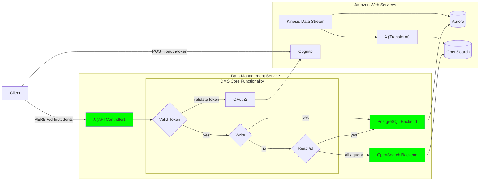
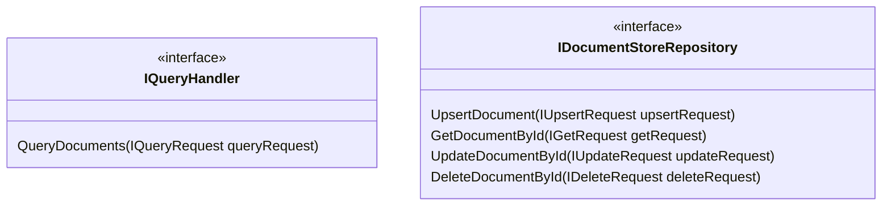

# Plugin Architecture

Where these new application need to interact with external services, the Gateway
code for those services will be in custom C# assemblies with a facade that
implements a shared interface. The custom assembly will utilize C# [plugin
support](
https://learn.microsoft.com/en-us/dotnet/core/tutorials/creating-app-with-plugin-support)
so that different plugins can be supplied at runtime without having to recompile
the application.

Examples of assemblies that could be plugin aware:

* Backend support for different data stores (PostgreSQL, Microsoft SQL Server,
  Opensearch, etc.)
* Identity Provider token mapper and client management
  [gateway](https://martinfowler.com/articles/gateway-pattern.html).

> [!NOTE]
> As [described below](#frontend-architecture), a plugin architecture for
> frontend development might not be feasible.

## Hypothetical Example on AWS

The Ed-Fi Alliance's first priority in Project Tanager is to build a reference
architecture using Docker containers that can run in a local development
environment, in an "on-premises" data warehouse, or in cloud-managed Docker
services. However, the purpose of this plugin architecture is to make it easy to
optimize for cloud provider managed services, which may offer better performance and cost compared to other solutions.

For example, one could optimize the Data Management Service solution on AWS:

* Run as an AWS Lambda function (frontend plugin),
* Connecting to Aurora in PostgreSQL mode for write operations and for reading a
  specific object,
* Utilize Kinesis Data Streams to monitor the Aurora database and write to
  OpenSearch via a Lambda function, and
* Using OpenSearch for "get all" and "get by query" requests.



Not shown above: the [Configuration Service](./CS/), which would utilize Cognito
and another datastore. In this situation, the referential integrity requirements
of the core Ed-Fi Resource API do not come into play, and a document-based
solution - using DynamoDB or DocumentDB - might be feasible for storing client
application configuration information.

## Implementation

### Plugin Detection and Configuration

1. A "core" application library will expose C# interface definitions for the
  different types of plugins.
2. .NET projects will implement those interfaces.
3. A command-line application host will look for plugin configuration in
   environment variables or the appSettings file, then will use the configured
   plugin names to load .NET assemblies from the runtime binary directory.

### Backend Architecture

The core Data Management Service business logic will forward data access and
modification requests to a class implementing one of two interfaces, which are
defined in `EdFi.DataManagementService.Core.External.Interface`:

* `IDocumentStoreRepository` supports create, update, and delete functionality,
  as well as reading by ID.
* `IQueryHandler` supports read all or read by query requests.

The "GET by ID" functionality is separated from the query handling to protect
against eventual consistency confusion. In the case where the query handler is
using a different data store than the document repository, there may be a small
lag between writes to each system. A client application that has just written a
document would reasonably expect that it is immediately available for retrieval,
hence the retrieval by ID will pull directly from the data store used for the
write operations.

> [!TIP]
> These two interfaces could be implemented by the same C# class referencing the
> same backend datastore, for example if a given deployment chooses to use
> PostgreSQL for all storage and retrieval instead of using a search database.



To implement a new backend:

1. Create a new C# project.
2. Create a dependency on library `EdFi.DataManagementService.Core.External`.
3. Implement one or both interfaces described above.
4. Document required app settings

> [!WARNING]
> More detail needed on using the plugin architecture. More will is probably
> necessary to support arbitrary configuration information. The plugin architecture
> might require an initialization step that accepts a configuration provider
> that the plugin can query to retrieve needed information.

### Frontend Architecture

In order to support cloud function implementations, it will be useful to treat
the ASP.NET frontend as one of many possible frontend implementations. To do so
might require separation of the console application from the frontend
implementation.

Each of the big-three cloud providers' serverless function technologies have
.NET libraries that can extend ASP.NET applications. For AWS and Azure, the
csproj file will contain some additional attributes and there may be some
customization in the web application builder phase (in `Program.cs`). For
example, the `serverless.AspNetCoreMinimalAPI` dotnet template from AWS adds the
following to the `program.cs` for a Minimal API implementation:

```csharp
// Add AWS Lambda support. When application is run in Lambda Kestrel is swapped out as the web server with Amazon.Lambda.AspNetCoreServer. This
// package will act as the webserver translating request and responses between the Lambda event source and ASP.NET Core.
builder.Services.AddAWSLambdaHosting(LambdaEventSource.RestApi);
```

Google cloud functions instead do not modify the csproj file or the web
application builder phase. However, both Azure and Google functions require that
the controller / handler function have an extra provider-specific attribute
decorator. And there might be additional customization needed for setting up
appropriate logging.

At this time, it appears that there would be similar, but different,
controller/handler code for each hosting strategy. Until we begin building
alternative interfaces, it is difficult to tell if there is any reason to create
a single "startup application" with plugins that could activate the hosting
environment (plain ASP.NET, or cloud function).

### Identity Provider

As described in [Authentication and Authorization Requirements](./AUTH.md), each
identity provider has their own approach for creating client credentials (via
the Configuration Service), and possibly for loading claim information (in the
Data Management Service). These differences can be smoothed out through the
plugin architecture.

_Details to be determined_
