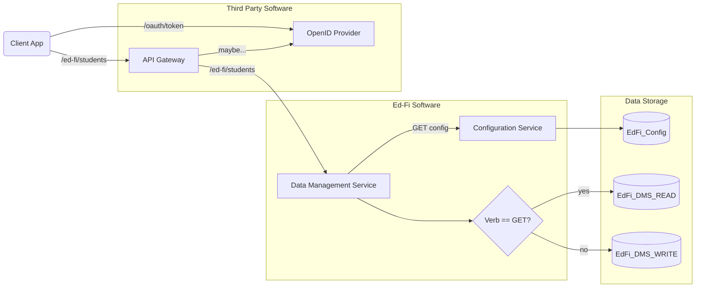
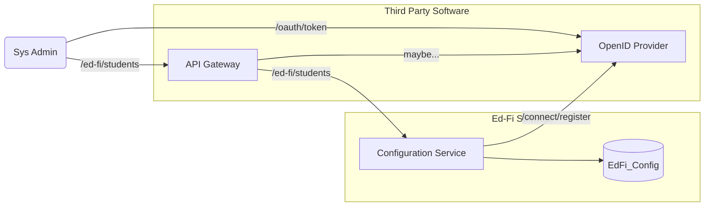
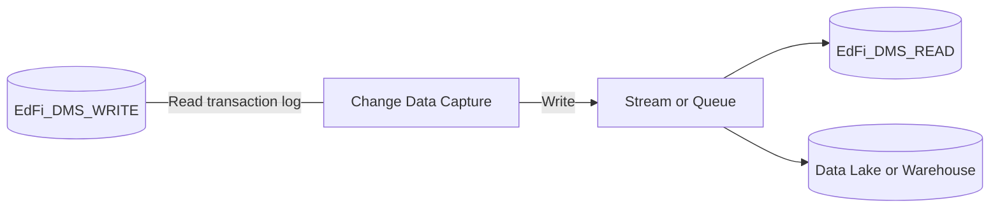

# Introducing Project Tanager

Project Tanager will build a suite of applications that implement relevant Ed-Fi
API specifications in support of educational data interoperability. These
applications will eventually replace the Ed-Fi ODS/API and related software. The
software will be fully compatible with / compliant to the [Ed-Fi API
Guidelines](https://github.com/Ed-Fi-Alliance-OSS/Ed-Fi-API-Standards/tree/main/api-guidelines)
and appropriate [Ed-Fi API
Specifications](https://github.com/Ed-Fi-Alliance-OSS/Ed-Fi-API-Standards/tree/main/api-specifications).

Those Guidelines and Specifications describe the logical requirements for any
software that will be "Ed-Fi compatible". The remainder of this document
describes Project Tanager's motivation and architectural vision at the level of
technical implementation.

> [!TIP]
> "Project Tanager" is a project code name, not a product name. There
> will never be a "Tanager 1.0", for example.

## Motivation

The Ed-Fi ODS/API (Suite 2 and Suite 3) and its predecessor Ed-Fi ODS (Suite 1)
have successfully helped education organizations with their data
interoperability challenges for over ten years. Success, and the rapid pace of
technological innovation, have driven new requirements that are challenging to
meet with the current architecture of the ODS/API. Some of these challenges include:

1. Deep reliance on NHibernate for mapping C# objects to SQL commands.
   NHibernate was once a pioneer, but now has been overtaken by other libraries.
   It now creates a significant technical hurdle for new contributors to the
   application and is difficult to refactor around.
2. The relational database structure was well designed for supporting
   referential integrity across entities from the Ed-Fi Unifying Data Model
   (UDM), but the community needs have outgrown this design:
   1. Multi-part primary keys do not scale well in large databases.
   2. When writing queries, it can be easy to miss one of the columns in a
      multi-part join, resulting in too much data being retrieved.
   3. Inheritance-based normalization means that the database structure does not
      match the UDM. For example, data for a `school` entity are stored in two
      tables: `EducationOrganizations` and `Schools`. This makes custom report
      development harder (must be able to understand the table hierarchy).
   4. Change data capture (CDC) can make data instantly available in a streaming
      platform such as Kafka - but if the stored data structure does not match
      the UDM, then the streamed data also will not match the UDM.
3. The C# code generation process beautifully converts the abstract model
   definition into C# classes. _Many_ classes. Maintenance of the code
   generation process is non-trivial, and [Project
   Meadowlark](https://github.com/Ed-Fi-Exchange-OSS/Meadowlark) has proven the
   theory that we can take an abstract model and create appropriate REST
   endpoints and validation at runtime, without needing to generate code for
   every entity.
4. When incorporating an Ed-Fi API into a large ecosystem, software and
   infrastructure management can be streamlined by using a third party OAuth 2
   provider that also supports other software systems.
5. Alternate data storage technologies and designs can open up operational
   efficiencies and new use cases. For example, some use cases may benefit from
   relaxed referential integrity. API performance might be enhanced by
   redirecting read queries to a search-oriented database such as OpenSearch or
   Elasticsearch, which also reduces the burden of indexing on the primary
   datastore.

The ODS/API application has thousands of lines of well-tested, well-crafted, and
productive code. Project Tanager will look to leverage (that is, copy) code from
ODS/API wherever possible. However, it will start from a clean slate so that we
create a new internal design that fully supports the desired feature sets and
addresses the challenges listed above.

## Architectural Vision

### Ed-Fi API's

The software platform will instantiate the following Ed-Fi API specifications:

* Discovery API
* Resources API
* Descriptor API
* Change Queries API
* Identity API
* Admin API

And, it will be capable of hosting Profile-based API definitions.

To the extent possible, the software design will be independent of the API
version, although there may be a lower limit to the API version that will be
implemented. For example, it should be possible to run the Resources API for
either Data Standard 4 or Data Standard 5 through the same software, ideally
with no need to recompile.

The system will also support standards-based extensions to the Resources API
(and by implication, the Change Queries API and Descriptors API).

### Components

The following diagram illustrates the planned components of the software
platform to be developed under Project Tanager, from the perspective of an API
client that wants to manipulate or retrieve data from a compatible Ed-Fi API
host.

Key components of this system are:

* **Client App**: any application or script that wants to connect to the Ed-Fi
  API host, written in any programming language. The Client App must request an
  access token from the OpenID Provider and use that token when issuing requests
  to the Ed-Fi Data Management Service (via the API Gateway).
* **API Gateway**: commercial or open-source software for managing and routing
  HTTP requests. In some situations, the API gateway may be able to use the
  OpenID provider to check the validity of an access token before
  forwarding the HTTP request to the Data Management Service.
* **OpenID Provider**: commercial or open-source software that supports OpenID
  Connect, which is an extension to the OAuth 2.0 standard.
* **Data Management Service**: an Ed-Fi API host. It is the direct analogue to
  the Ed-Fi ODS/API application, which supports HTTP requests based on the Ed-Fi
  Resources API, Descriptor API, and other API definitions.
  * **EdFi_DMS_WRITE**: a data store supporting insert, update, and delete operations.
  * **EdFi_DMS_READ**: a data store support read operations. Could be the same
    as the "Write" data store or could be in a separate service.
* **Configuration Service**: a microservice for managing configuration
  information used to control the Data Management Service at start up.
  * **EdFi_Config**: a simple database for storing configuration information,
    including data describing data authorization permissions.

The next diagram is from the perspective of a system administrator interacting
with this platform to create a new set of client credentials for use by the
Client App described above.

### Populating Downstream Data Stores

Change Data Capture (CDC) technology can be used in the `EdFi_DMS_WRITE`
database to copy data into a streaming platform, such as Kafka, which can in
turn populate other data stores: for instance, a data lake, or a search-oriented
database that can support the requirements for the `EdFi_DMS_READ` database
(alternately, the "read" database could be the same as the "write" database,
or could be populated using database-native replication).

## Further Reading

* [Operational Concerns](./OPERATIONS.md)
* [Ed-Fi Data Management Service Features and Design](./DMS/README.md)
* [Ed-Fi Configuration Service Features and Design](./CS/README.md)
* [Authentication and Authorization Requirements](./AUTH.md)

> [!NOTE]
> As with most software projects, these design documents are intended to help
> think through and communicate about features before and while they are being
> developed. Efforts will be made to keep them true to the implementation, but
> please beware that some implementation details may necessarily stray from the
> initial vision described in these files.
