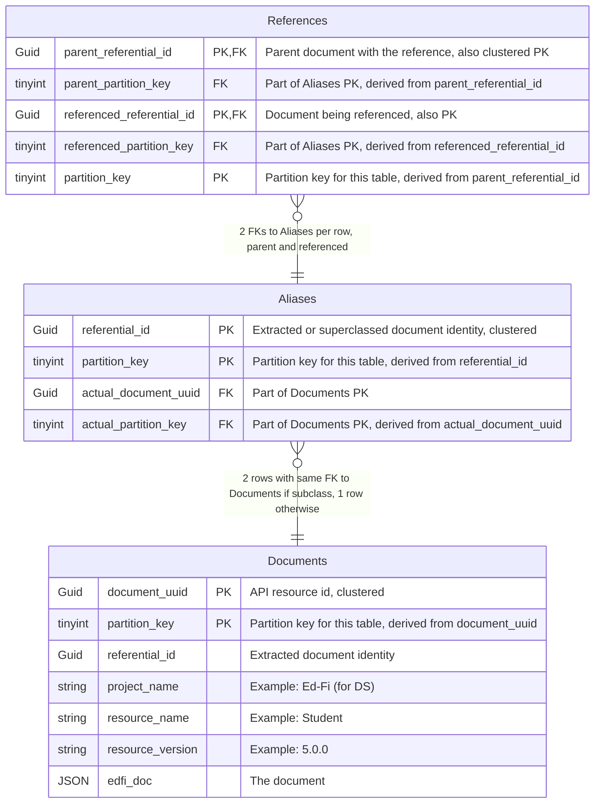
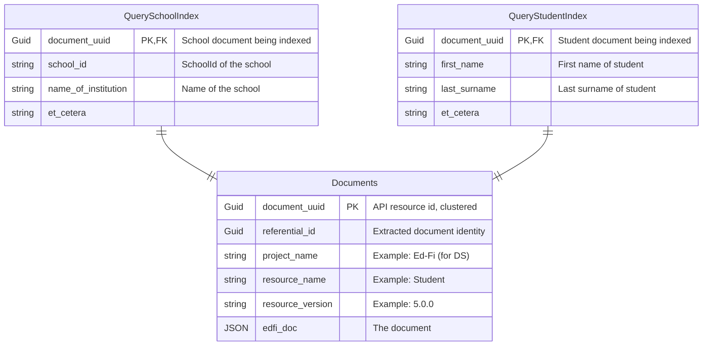
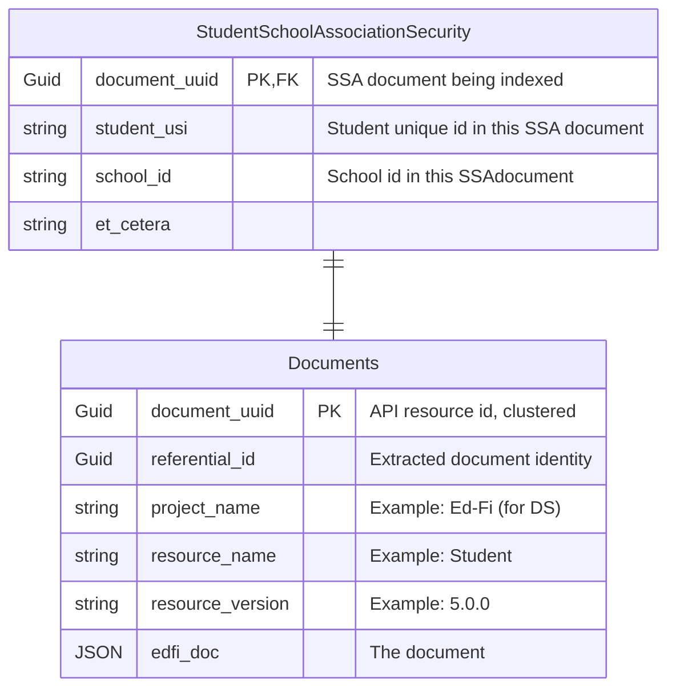
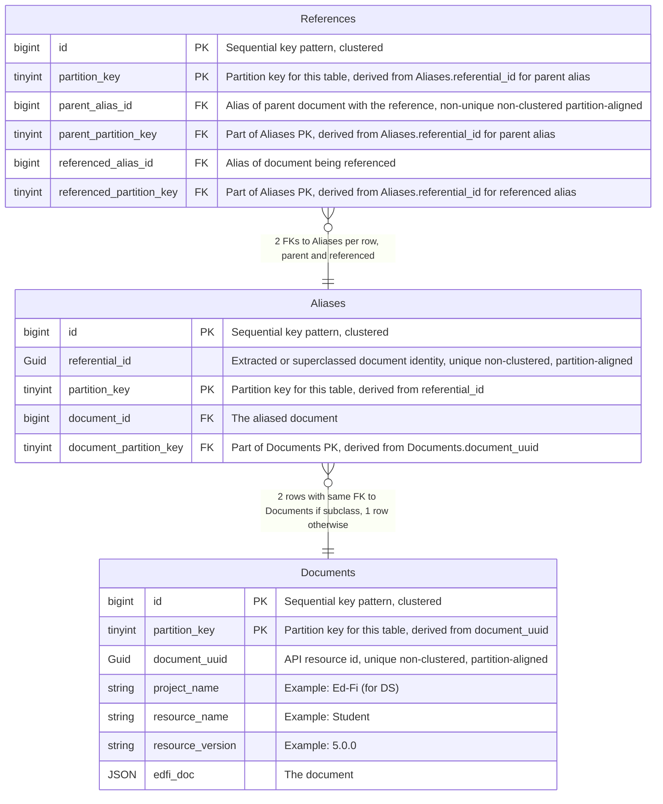
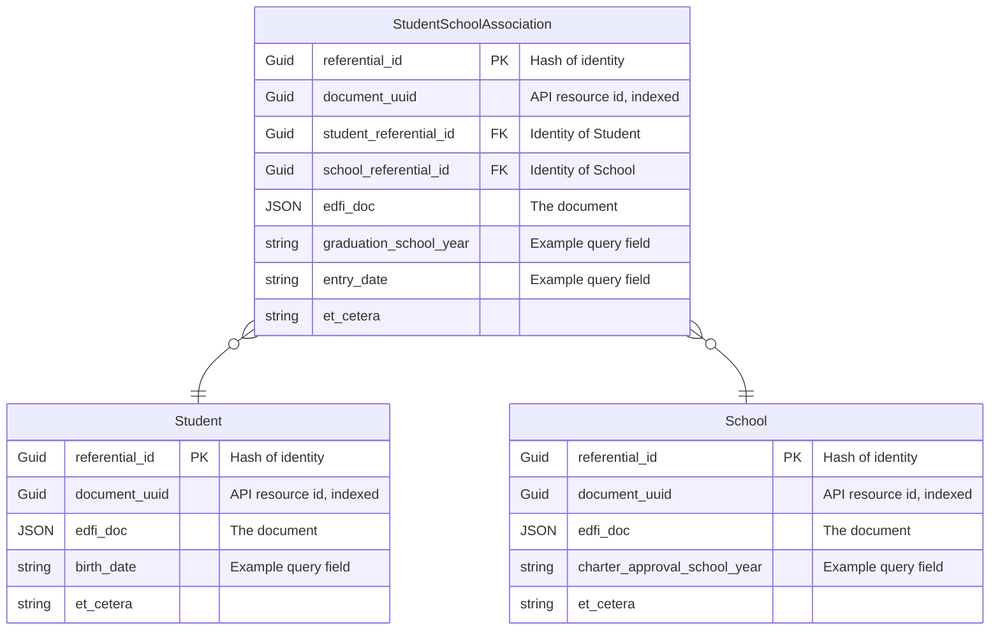
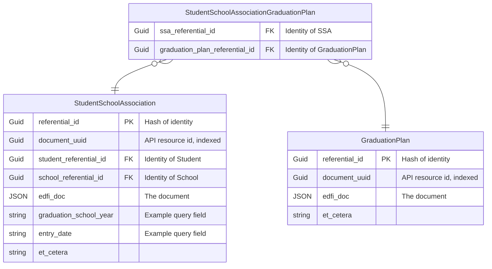
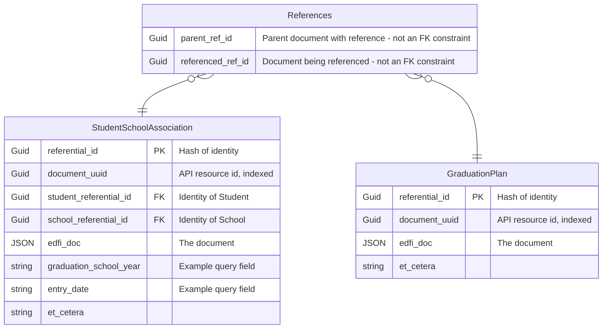

# Design Options for Data Management Service Data Storage

## Problems to solve via DB design

### Existence and reference validation

The first problem is existence and reference validation. Unlike Meadowlark, we want to leverage foreign key
referential integrity to do this. Note we need to be able to take into account superclass identities, for
example the existence of an EducationOrganization can satisfy reference validation for a School reference, so
there has to be some mapping here. We would also like reference validation to be tunable in some fashion,
meaning you can turn it on or off.

### Query support in relational DB

The next problem is query support. We'll need to know what the different fields are that you're allowed to
query on, and then have some way to index them into the json.

One question is how performant does this need to be? If/when it becomes too slow, moving to a search engine
would be the recommendation because if you want true performance you would use a separate read only store.

### Document Security

The next thing that you need to be able to support is security. Following the ODS/API, we'll want
Namespace-based for sure, Education Organization-based probably, and possibly Grade Level-based as well. In
some ways this may be similar to query support, as we'll need to know the relevant fields to secure on for
each resource.

### Streaming changes

We'll need the ability to stream out changes. This needs to be something that can be easily integrated with
Kafka and potentially other streaming platforms, with a well-defined message format. Change query support is
related to this, but we won't prejudge whether it will be based off of streaming.

### Simplicity

As maintainability is a primary goal, we want to keep Tanager as simple as possible. Meadowlark demonstrated
that we can simplify over the ODS/API by avoiding code-per-resource and instead use a generalized design
applicable to any resource. While it may not be possible with Tanager to do this completely, we would like to
do it whenever possible.

### Performance

We need to make sure that we design to meet performance goals, and test early and often to ensure that we are
able to hit those goals.

## Potential Solutions

### Option A - Similar to Meadowlark, GUIDs as PKs, Partitions by GUID hash

#### General Structure

This is very much like the Meadowlark implementation of the PostgreSQL backend, except we want to take
advantage of foreign key constraints for reference validation. We also want to introduce partitioning.

We will have a `Documents` table that will hold all of the documents for all of the entities. This will be a
partitioned table so that we can properly manage the table size. The documents table will have a
`document_uuid` as part of the clustered PK. This is the external GUID expressed in the API as the resource
id. It will also have a `partition_key` as part of the clustered PK. This maps the `document_uuid` to a
partition.

`Documents` will also have an un-indexed `referential_id`. It will be a UUIDv5 (see [RFC
4122](https://datatracker.ietf.org/doc/html/rfc4122#section-4.3)) with an Ed-Fi namespace ID as the
"namespace" and the resource name + the extracted document identity as the "name". This concept of a
deterministic hash UUID allows Tanager to determine both document identities and document references
independent of data in the DB. This ID will not be provided to API clients.

The table will also include the document itself as `edfi_doc` as well as metadata like resource name, version,
timestamps, etc.

SQL Server does not have a JSON-specific datatype and instead JSON is typically stored in an NVARCHAR(MAX)
column. Two (non-exclusive) options to mitigate size/performance issues are to 1) store the JSON as COMPRESSed
VARBINARY(MAX) instead of a string and 2) set sp_tableoption `large value types out of row` to `1` for the
`Documents` table, which will move the JSON blob off the row and only store a pointer on-row. See
[here](https://bornsql.ca/blog/think-twice-about-storing-json-in-your-sql-server-database/#comment-22382).

There will also be an `Aliases` table, whose primary purpose is to faciliate reference validation for
superclass references.

#### Reference validation

There will be a `References` table which stores every document reference. It will be composed of two
`referential_id`s, one for the parent of the reference and one for the document being referenced. Both will be
part of a clustered PK. This table will also be partitioned, likely with a greater number of partitions than
`Documents` since there are typically many more references than documents. There will be foreign key
references to the `Aliases` table, one for every reference between documents.

The `Aliases` table serves several important functions. First, it is a mapping between a document's external
id (`document_uuid`) and its extracted identity (`referential_id`). Second, it enumerates all valid
`referential_id`s. And finally, it resolves the issue of converting from superclass references to concrete
subclass references.

For example, suppose a School document is inserted with schoolId = 1. This is encoded as `referential_id`
which is a hashed result of "Schoo1", and "schoolId = 1". Note that School is a subclass of
EducationOrganization. Now suppose a StudentEducationOrganizationAssociation document is inserted. It
references the School above as its EducationOrganization. However, EducationOrganization references are
superclass references, meaning the document contains no subclass information. It extracts from the document as
"educationOrganizationId = 1" and the resulting `referential_id` is a hash of "EducationOrganization" and
"educationOrganizationId = 1". This should pass reference validation, and yet the `referential_id`s are
different.

The solution is for inserts of a subclass document to simply add a second row in the `Aliases` table with a
`referential_id` in the superclass form. In this case, both `referential_id`s are in the `Aliases` table and
so there is no referential integrity issue with an insert into the `References` table.

It's important to note that the engineering of referential integrity for reference validation is the sole
purpose of the `References` and `Aliases` tables. By design, there should be no benefit to joining these
tables.

#### Why not a table per resource?

The benefit of this design is that by putting all documents in a single table regardless of resource, we can
use two simple tables to provide reference validation via referential integrity between any two documents
using their extracted referential_id. If we split the tables up by resource, we will also require a specific
join table for every resource-pair participating in a reference, which 1) greatly increases complexity and 2)
is redundant because referential_id already encodes the resource type.

#### Why partitioning?

This design is for three very large tables. It's important to note that a large school district with positive
attendance tracking could have on the order of 450 million attendance records in a school year. Since a
Tanager instance will store a lot more that just attendance, we are targeting support on the order of 1
billion rows in the `Documents` table. If we estimate that each document has on the order of 10 references to
other documents (they can have arrays of references), then we need to be able to support on the order of 10
billion rows in the `References` table.

Determining a good default number of partitions for each table will require experimentation, but 16 partitions
for `Documents`  and `Aliases` and 64 partitions for `References` is probably a good starting point. See
[here](https://www.brentozar.com/archive/2013/01/sql-server-table-partitioning-tutorial-videos-and-scripts/)
for a demo on experimenting with partitioning to find a good size. This will be a hash method of partitioning,
where we compute the `partition_key` from the table's GUID PK. We looked at automatically creating
`partition_key` with persistent computed columns, but it appears that partition elimination (narrowing a query
to a single partition, as opposed to checking each one) requires the partition_key to be in the WHERE clause
of a query.

#### Why random GUIDs as primary keys?

We should expand on the reasoning behind the choice of random GUIDs as primary keys on our tables. While they
bring many advantages to the project, they have higher storage requirements than other index data types. They
also require a different (but not necessarily more complex) index maintenance style from sequential keys to
minimize page splitting issues.

As mentioned above, the `referential_id` of a document provides a hash of the identity of the document. This
identity is composed of the document's resource type (e.g. School) along with the extracted values of the
document that make up its identity (e.g. schoolId). Therefore, a `referential_id` is computable solely from
the contents of a document. In the same way, the `referential_id` for any references one document may have to
another document are also computable from the contents.

Since `referential_id` can be derived from a document without a DB lookup and since they can uniquely identify
both a document and its references, we can use them as foreign key constraints between the `referential_id`s
in the `References` and `Aliases` tables to enforce reference validation if they are PKs and FKs.

Now, storing all of our documents in a single `Documents` brings challenges that random GUID keys like
`document_uuid` are well suited to address. If sequential PKs are used, rapid inserts would quickly cause
last-page insert contention on the table, also known as PAGELATCH_EX waits. With properly managed random
GUIDs, inserts are evenly distributed across pages, avoiding insert contention.

This same benefit of randomness also applies when designing the partition scheme for the `Documents` table
where the `partition_key` is derived from `document_uuid`. Using the PK as the partition key means fast
partition elimination, and the randomness of the GUIDs provides for even distribution of inserts across
partitions.

#### How insert/update/delete will work

All three will be implemented as transactions.

##### Insert

1. Insert the document in the `Documents` table.
1. Insert an entry in the `Aliases` table for the document. If the document is a subclass, insert a second
entry with a derived superclass version of the `referential_id`.
1. Insert each document reference on the document in the `References` table.
   * Notes:
      * A PK constraint violation on `Documents` indicates this should be handled as an update, not an insert.
      * A PK constraint violation on the first insert into `Aliases` means this should be handled as an update.
      * A PK constraint violation on a superclass insert into `Aliases` means there already exists a subclass
        with the same superclass identity.
      * A FK constraint violation on `References` indicates a reference validation failure.

##### Update (ignoring identity updates)

1. Find the document in `Documents` by `document_uuid` (indexed) from request.
1. Delete the document's current document references (indexed) in the `References` table.
1. Insert each document reference on the updated document in the `References` table.
1. Updates the JSON document itself on the `Documents` table.
   * Notes:
      * A FK constraint violation on `References` indicates a reference validation failure on an updated
   reference.

##### Delete

1. Find the document in `Documents` by `document_uuid` (indexed) from request.
    * Read the `referential_id` for delete in `Aliases` table.
    * If subclass, read JSON document and derive superclass `referential_id`.
    * (These steps are a tradeoff to avoid a non-unique non-clustered index on `Aliases.actual_document_uuid`
      just for deletes.)
1. Delete the document's document references (indexed) in the `References` table.
1. Delete the document's aliases in the `Aliases` table.
1. Delete the document in the `Documents` table.
   * Notes:
      *  A FK constraint violation on `Aliases` indicates a failure because the document is being referenced by
   another document.

#### Query handling

Looking at queries, these will be handled by some sidecar tables that will be need to be generated as a table
per resource. (The example will ignore partitioning which will be similar to the `Documents` table.)

For example, `QuerySchoolIndex` would have a `document_uuid` foreign keyed to the `Documents` table with a row
per School document. The other columns will be the list of queryable columns that are available to an API user
for GET-by-query. Those columns will be indexed so they can be searched. These tables will likely need to be
partitioned as well.

The next question is how this tables get populated. Probably the best way would be for it to be via a separate
process so as not to slow down the performance of inserts. However, if you're in a deployment situation where
a search engine is not an option, a separate process may not be viable either. In that case, we'll need to
extract the indexable fields from the document before insert.

The query table schema can be pre-generated of course, but also the JSON Paths to the queryable elements, and
even the SQL insert statements -- though they'd have to target all supported databases.

Since these query tables will likely be joined to the `Documents` table, they should have the same PK and
partitioning scheme as the `Documents`, including collocation. See
[here](https://learn.microsoft.com/en-us/sql/relational-databases/partitions/partitioned-tables-and-indexes?redirectedfrom=MSDN&view=sql-server-ver15#queries).

#### Security

We expect that security can be handled the same way as queries, with sidecar tables generated per resource
with the fields relevant to security extracted into columns.

#### Issues

Let's consider some downsides to this approach and how we can mitigate them. The most obvious is that all
resources are stored in a single table which presents a inconvenience when you only want to see specific
resources. A solution to that would be to create a view per entity, where the views just select out the JSON
for entities of a particular resource type. For example, there would be a view `edfi.schools` which just does
a `SELECT edfi_doc from Documents where resource_name = "School"`.

Another potential downside is partitioning itself. However, designing for partitioning up front is better than
adding on later, and there are resources for attendance and assessments with potential to need partitioning on
their own. Hash partitioning is conceptually straightforward and operationally you just decide on the number
of partitions to hash into.

Probably the biggest potential downside is a common SQL server community concern around using GUIDs as a
primary key. However, the real issue is that random GUID keys need to be managed differently than sequential
keys. The benefit of the sequential key pattern is that inserts fill data pages in a orderly fashion to avoid
page splits. You rarely run into page splits because you are only appending to the last page. The downside is
that rapid index inserts create hot page contention. Regardless, all other pages are completely full due to a
goal fill-factor of 100%.

With a random GUID key pattern, a full data page is a terrible place for a new key to be randomly inserted.
Every insert would cause a page split. Therefore, if your plan is to randomly distribute keys across data
pages, it would be crazy to always keep the pages full.

The answer to this issue is simple, just run at a lower fill-factor. Now the inserts are randomly distributed
across pages with no splitting, and with the added benefit of faster inserts due to no hot page contention.
The index maintenance goal is now to maintain a fill-factor (say 80% to start) that allows room to avoid
splitting between maintenance sessions. [Experimentation](https://www.youtube.com/watch?v=nc4CMo7VSPo) shows
that index rebuilds after 1% fragmentation combine with an avoidance of reorganizes are the best way to
maintain free space random inserts. Interestingly, because the amount of total free space grows as pages are
added, over time you can raise the fill-factor and/or maintenance will be needed less frequently.

### Option B - Similar to Option A but reduce GUID usage

Option B is just like Option A except that we use a sequential bigint PK instead of a GUID PK in an attempt to
minimize GUID indexing. An important part of making this work efficiently with partitioning is to use
partition keys derived from GUIDs even when the GUID is not a column on the table.

With the design below, we are able to maintain partition elimination (seeking only to the relevant partition)
with all of our access patterns. Additionally, there are only two GUID columns, `Documents.document_uuid` and
`Aliases.referential_id`, and they can both be indexed non-clustered and partition-aligned (meaning an index
per partition, not a single cross-partition index).

#### Opt B: How insert/update/delete will work

All three will be implemented as transactions. Partition key usage is omitted for brevity, but is derivable
from the `document_uuid` or `reference_id` traceable to each action.

##### Opt B: Insert

1. Insert the document in the `Documents` table.
    * Get the sequential id for the next insert
1. Insert an entry in the `Aliases` table for the document.
    * Get the sequential id for the next insert.
    * If the document is a subclass, insert a second entry with a derived superclass version of the
      `referential_id`. (Don't need this sequential id for next insert.)
1. Insert each document reference on the document in the `References` table.
   * Notes:
      * Via INSERT with SELECT WHERE on `Aliases.referential_id` to determine `referenced_alias_id`.
      * A PK constraint violation on `Documents` indicates this should be handled as an update, not an insert.
      * A PK constraint violation on the first insert into `Aliases` means this should be handled as an update.
      * A PK constraint violation on a superclass insert into `Aliases` means there already exists a subclass
        with the same superclass identity.
      * A FK constraint violation on `References` indicates a reference validation failure.

##### Opt B: Update (ignoring identity updates)

1. Find the document in `Documents` by `document_uuid` from request.
1. Delete the document's current document references in the `References` table.
    * Via DELETE with SELECT WHERE on `Documents.document_uuid` JOINed through `Aliases.document_id` to
      determine `References.parent_alias_id`.
1. Insert each document reference on the updated document in the `References` table.
    * Via INSERT with SELECT WHERE on `Aliases.referential_id` to determine `References.referenced_alias_id`,
      save and reuse `References.parent_alias_id`.
1. Updates the JSON document itself on the `Documents` table.
   * Notes:
      * A FK constraint violation on `References` indicates a reference validation failure on an updated
   reference.

##### Opt B: Delete

1. Find the document in `Documents` by `document_uuid` from request.
1. Delete the document's document references in the `References` table.
    * Via DELETE with SELECT WHERE on `Documents.document_uuid` JOINed through `Aliases.document_id` to
      determine `References.parent_alias_id`.
1. Delete the document's aliases in the `Aliases` table.
1. Delete the document in the `Documents` table.
   * Notes:
      *  A FK constraint violation on `Aliases` indicates a failure because the document is being referenced by
   another document.

### Option C - One table per resource

Option C moves closer to the ODS/API design by having a table per resource. So for example we would have a
`GraduationPlan` table and separate from that a `StudentSchoolAssociation` table and so on. This adds a large
amount of complexity.

In this example, we have a `StudentSchoolAssociation` table with the `referential_id` as the primary key. It
also includes the external `document_uuid`, the JSON document itself, and all of the queryable columns on it.
We also include the reference_ids specific to the entities referenced by this resource. So in this case there
would be a `student_referential_id` referencing a School and a `school_referential_id`

A problem that you run into with this approach is that you sometimes have many-to-many relationships between
entities. So you need a join table of reference IDs, which are tables that are not data standard concepts. An
example of this would be that `StudentSchoolAssociation` has a collection of `GraduationPlans` so we would
need a `StudentSchoolAssociationGraduationPlan` table. Aside from these tables not being Data Standard
concepts, this brings in a whole issue of potentially needing to model things with an object relational mapper
for these relationships, which means we are now having to generate C# classes which is exactly what we want to
avoid. Unfortunately the option of a single references table here is not available to us once we split out
tables by resource because you cannot foreign key to multiple tables. At least, it's not available if you want
to defer the heavy lifting on referential integrity/reference validation to the database.

### Option D: One table per resource, single reference table

Option D is like Option C except it has the single reference table like Option A to avoid the problem of join
tables.

The problem is that with a single `References` table, we cannot rely on referential integrity to do reference
validation. This means that we have to manage referential integrity entirely with Tanager. Our experience with
this in Meadowlark showed a couple issues. The most important is that it is error-prone and easy to get wrong.
The second is that while Meadowlark was able to get this down to simple index lookups, it still required
several round trips to accomplish reference validation.

We could mitigate the round trips by pushing reference validation into stored procedures. However, addressing
the potential for errors requires a very heavy investment in testing. This would be even more complex if we
had to do testing on stored procedures.

## Proposed Proof of Concept for Option B

Option B is our preferred alternative. However, before implementing in Tanager we need to test the usage of
partitions with partition-aligned GUID indexes via simulation.

A plan to test it via script:

* Create the DB schema, including query tables for 2 resources with 4 or 5 query fields.
* Insert a million rows into each table to start. (We'd really like to get more like 100 million in order to
  get the right order of magnitude for large districts, but a test like that takes a long time.) Use randomly
  generated GUIDs.
  * Monitor index fragmentation with the tools from [this
    presentation](https://www.youtube.com/watch?v=nc4CMo7VSPo), and do index maintenance as necessary
* Review insert performance.
* Review query performance with a couple of likely scenarios.
* Review storage requirements.
* Review index maintenance requirements.
