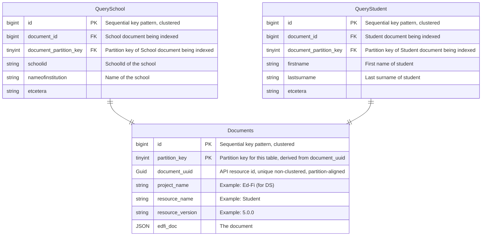

# DMS Feature: Queries Using the Relational Database

> [!TIP]
> See [DMS Feature: Primary Data Storage](./README.md) for detailed background on the database design.

While the preferred method of query handling is via [search engine](../SEARCH-DATABASE.md), some
deployments will not be able to handle the additional operational complexity. In these cases DMS can
be configured to handle queries in the main datastore at a cost of performance.

## Design

Queries are handled by resource-specific "query" tables that include each searchable field. These tables are
not well suited to partitioning, but are no worse than the ODS/API in table size per resource.



For example, `QueryStudent` has a foreign key to the `Documents` table with a row per Student document. Because
the query tables include the `Documents` partition key, query tables act as a cross-partition index on the
Documents table while avoiding the downsides of an actual cross-partition index. For this reason, "Get All"
queries will use these tables as well.

The other columns on a query table are a list of queryable columns that are available to an API user for
GET-by-query. Pagination will operate on query tables only. Like the ODS/API there will be no indexes on
individual query fields, preferring insert performance over ad hoc query performance. Deployments needing fast
ad hoc query performance should consider using DMS's search engine option.

The next question is how this tables get populated. The best way would be via a separate process so as not to
slow down insert performance inserts. However, in a deployment where a search engine is not an option, a
separate process may not be viable either. In this case, we'll need to extract the queryable fields from the
document before insert.

The query table schema will be pre-generated, as will the JSON Paths to the queryable elements. The JSON Paths
will be included with the API query field names in the ApiSchema.json file. The query field names will be all
lowercased, and for ease of query construction the column names should be identical (i.e. not snake case).

## Implementation

### Business Logic

Insertion into query tables will be enabled at runtime by feature flag. The
insertion must be in the same atomic transaction context as the core table
inserts.

### DDL

The scripts below are for illustrative purposes only. Each table should only provide the queryable columns.

```sql
-- Query table with search fields for Student documents
IF NOT EXISTS (select object_id from sys.objects where object_id = OBJECT_ID(N'[dbo].[QueryStudent]') and type = 'U')
BEGIN
CREATE TABLE [dbo].[QueryStudent] (
  id BIGINT IDENTITY(1,1),
  document_partition_key TINYINT NOT NULL,
  document_id BIGINT NOT NULL,
  studentUniqueId VARCHAR(256) NULL,
  personId VARCHAR(256) NULL,
  birthCity VARCHAR(256) NULL,
  birthDate DATETIME2 NULL,
  birthInternationalProvince VARCHAR(256) NULL,
  dateEnteredUS DATETIME2 NULL,
  firstName VARCHAR(256) NULL,
  generationCodeSuffix VARCHAR(256) NULL,
  lastSurname VARCHAR(256) NULL,
  maidenName VARCHAR(256) NULL,
  middleName VARCHAR(256) NULL,
  personalTitlePrefix VARCHAR(256) NULL,
  preferredFirstName VARCHAR(256) NULL,
  preferredLastSurname VARCHAR(256) NULL,
  CONSTRAINT FK_QueryStudent_Documents FOREIGN KEY (document_partition_key, document_id)
    REFERENCES [dbo].[Documents](partition_key, id),
  PRIMARY KEY CLUSTERED (id)
);
END

-- Example SQL query for a lastSurname. Join includes partition elimination on Documents table
SELECT d.edfi_doc
FROM Documents d INNER JOIN QueryStudent q
  ON (d.partition_key = q.document_partition_key AND d.id = q.document_id)
WHERE q.lastSurname = 'Williams';

-- Example SQL query for a "GET ALL". Acts as a cross-partition index for all Student documents
SELECT d.edfi_doc
FROM Documents d INNER JOIN QueryStudent q
  ON (d.partition_key = q.document_partition_key AND d.id = q.document_id);
```
