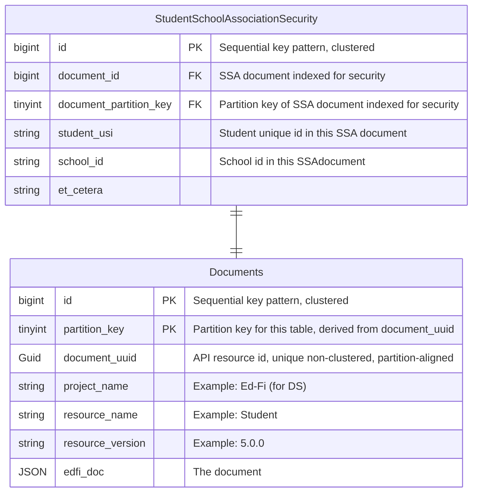

# Relational Support for Client Authorization

:::note

Draft design notes

:::

We expect that security will be handled structurally the same way as queries, with sidecar tables generated
per resource with the fields relevant to security extracted into columns. In these cases however, indexes on
the security fields may be required.
