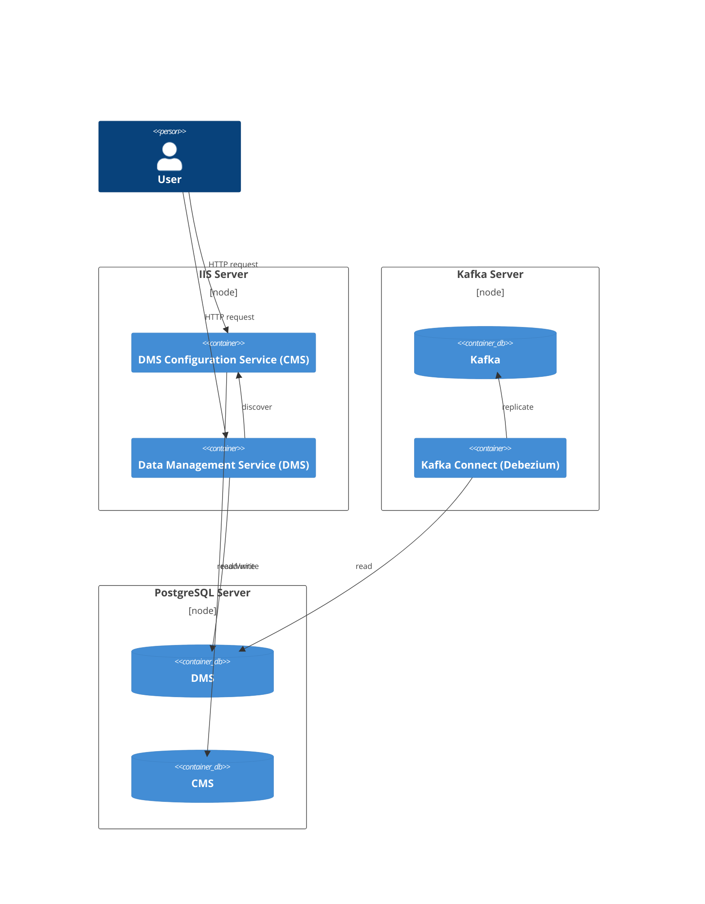

# On-premises Deployment in Windows Server

This section describes how to set up the Data Management Service in a Windows environment using native binaries (without Docker or Linux virtualization).

> [!WARNING]
> As a proof of concept, this will not be a well-secured system. Every service
> is capable of certificate-based encryption, but the configuration steps are
> outside the scope of the article.

## Architecture

The instructions below deploy to 3 separate servers, but you could deploy all the services to the same server for experimentation:

1. IIS Server, hosting both the Data Management Service (DMS) and the DMS Configuration Service (CMS). This sample deployment uses CMS as the OAuth provider instead of Keycloak.
2. PostgreSQL Server, with separate databases for CMS and DMS (note that it's also possible to deploy them in the same database with separate schemas).
3. Kafka Server, and optionally Kafka  UI. Must also run a Kafka Connect instance for source connections.



## Setting up the DB server (PostgreSQL)

1. Install using the PostgreSQL [installer](https://docs.ed-fi.org/reference/ods-api/getting-started/binary-installation/postgresql-installation-notes/). CMS/DMS are compatible with PostgreSQL versions 16 and 18.
2. If you plan to use change data capture (CDC) with Kafka streaming, set `wal_level = logical` in `postgresql.conf`, and then restart PostgreSQL.
3. Manually create an empty DB named `edfi_configurationservice` (you could use PgAdmin).

## Setting up the application server (IIS)

The next steps deploy CMS and DMS to IIS, to the `/cmd` and `/dms` subpaths. Another option is to deploy them using [Kestrel](https://learn.microsoft.com/en-us/aspnet/core/fundamentals/servers/kestrel) and place a reverse proxy in front of them, often on another server acting as a load balancer in a cluster.

1. Enable IIS. CMS/DMS are compatible with Windows Server 2022, Windows Server 2025, and Windows 11.
2. Download and install .net 10 Hosting Bundle [from here](https://dotnet.microsoft.com/en-us/download/dotnet/10.0).
3. Create the `C:\inetpub\edfi\cms` and `C:\inetpub\edfi\dms` folders.
4. In a computer with .net 10 **SDK** (or with Visual Studio installed), follow these steps:
    1. Navigate to `Data-Management-Service\src\config\frontend\EdFi.DmsConfigurationService.Frontend.AspNetCore` and run `dotnet publish`. This will publish CMS into a directory.
    2. Copy the published files (usually located in `Data-Management-Service\src\config\frontend\EdFi.DmsConfigurationService.Frontend.AspNetCore\bin\Release\net10.0\publish`) and paste them in the `C:\inetpub\edfi\cms` folder in the IIS server.
    3. Similarly, navigate to `Data-Management-Service\src\dms\frontend\EdFi.DataManagementService.Frontend.AspNetCore` and run `dotnet publish`. This will publish DMS into a directory.
    4. Copy the published files (usually located in `Data-Management-Service\src\dms\frontend\EdFi.DataManagementService.Frontend.AspNetCore\bin\Release\net10.0\publish`) and paste them in the `C:\inetpub\edfi\dms` folder in the IIS server.
5. Open IIS.
6. Right-click on the `Sites` folder, click on `Add Website`, set `edfi` as the Site Name, select the `C:\inetpub\edfi` folder, and click on `OK`.
7. Right-click on `Application Pools` and add an Application Pool named `cms`. Repeat this step to add an Application Pool named `dms`.
8. Expand the `edfi` site, right-click on the `cms` folder, click on `Convert to Application`, select the `cms` Application Pool, and click on `OK`. Repeat this step for the `dms` folder, select the `dms` Application Pool.

## Configure DMS and CMS

If you browse the newly created sites, you will see that CMS and DMS fail to start. This is because we still need to make a few configuration changes:

### In the DB server

The `setup-openiddict.ps1` script requires `psql` to be installed and available from the PATH. You can run `psql --version` to verify if it's correctly installed.

`psql` would already be available on the DB server because it is installed by the PostgreSQL installer. For convenience, you can execute the next commands from there, but you could also execute them, for example, from your development machine.

1. Install PowerShell v7 by following [these instructions](https://learn.microsoft.com/en-us/powershell/scripting/install/install-powershell-on-windows?view=powershell-7.5). PowerShell v7 is needed by the `setup-openiddict.ps1` script that we'll use later.
1. Download CMS/DMS's code by cloning (or downloading as .zip) [the repository](https://github.com/Ed-Fi-Alliance-OSS/Data-Management-Service).
1. In PowerShell v7, go to the `Data-Management-Service\eng\docker-compose` directory and execute:

    ```powershell
    -join ((48..57) + (65..90) + (97..122) | Get-Random -Count 16 | ForEach-Object {[char]$_})
    ```

    The command above generates a 16-character random string that we will use as the `EncryptionKey`; there's no minimum length validation, but the longer, the safer it is.
1. Set the `EncryptionKey` parameter of the command below to the random string you just generated, take note of it because we'll use it again:

    ```powershell
    ./setup-openiddict.ps1 -InitDb -ConnectionString "host=localhost;port=5432;username=postgres;password=;database=edfi_configurationservice;Application Name=CMS" -EncryptionKey "SomeRandomString" -EnvironmentFile $null -PostgresContainerName $null`
    ```

    The command above generates a 2048-bit RSA key pair for JWT signing and stores it in the `dmscs.OpenIddictKey` table, encrypted with the given `EncryptionKey`.

### In the IIS server

1. Go to `C:\inetpub\edfi\cms` and edit the `appsettings.json` file.
2. Set `AppSettings.DeployDatabaseOnStartup` to `true` so that the CMS tables get created when it starts.
3. Set `AppSettings.PathBase` to `/cms`.
4. Set `IdentitySettings.Authority` to `http://localhost/cms`.
5. Update `IdentitySettings.EncryptionKey` with the `EncryptionKey` you used in the `setup-openiddict.ps1` script above.
6. Set a random `IdentitySettings.ClientSecret` and take note of it (there's no minimum length validation, but the longer the secret, the safer it is).
7. Update `DatabaseSettings.DatabaseConnection` with the connection string of the CMS database.
8. Update `Serilog.WriteTo.Args.path` to the folder where logs should be stored.
9. In IIS, restart the `cms` Application Pool so that these changes take effect.
10. Open `http://localhost/cms` in a browser.
11. Open `cms` logs and verify that it started successfully.

### Back to the DB server

setup-openiddict.ps1

1. At this point, CMS's tables should have been automatically created.
2. In PowerShell v7, open the `Data-Management-Service\eng\docker-compose` directory.

    Set the `NewClientSecret` parameter in the command below to the value you set for the `IdentitySettings.ClientSecret` in CMS's `appsettings.json`

    ```powershell
    ./setup-openiddict.ps1 -InsertData -NewClientId "DmsConfigurationService" -NewClientName "DMS Configuration Service" -NewClientSecret "SomeRandomString" -ClientScopeName "edfi_admin_api/full_access" -ConnectionString "host=localhost;port=5435;username=postgres;password=;database=edfi_configurationservice;Application Name=CMS" -HashIterations 210000 -EnvironmentFile $null -PostgresContainerName $null
    ```

    The command above creates the client that CMS will use to authenticate with OpenIddict.
3. Create a new random string that we will use as the secret that DMS will use to authenticate the calls that it makes to CMS. There's no minimum length validation, but the longer the secret, the safer it is. Set it in the `NewClientSecret` parameter below and execute the command:

    ```powershell
    ./setup-openiddict.ps1 -InsertData -NewClientId "CMSReadOnlyAccess" -NewClientName "CMS ReadOnly Access" -NewClientSecret "SomeRandomString" -ClientScopeName "edfi_admin_api/readonly_access" -ConnectionString "host=localhost;port=5435;username=postgres;password=;database=edfi_configurationservice;Application Name=CMS" -HashIterations 210000 -EnvironmentFile $null -PostgresContainerName $null
    ```

### In your development machine

We will use CMS API to create an Instance, a Vendor and an Application. First, we have to generate a CMS token.

Using the [REST Client VS Code extension](https://marketplace.visualstudio.com/items?itemName=humao.rest-client), Postman, or a similar tool, execute:

```http
POST {{CMS_base_path}}/connect/token
Content-Type: application/x-www-form-urlencoded

client_id=DmsConfigurationService
&client_secret=s3creT@09
&grant_type=client_credentials
&scope=edfi_admin_api/full_access
```

Take note of the returned token, set it in the `{{access_token}}` below, initialize the `<DB server IP or Hostname>` placeholder, and execute:

```http
### Create Instance
POST {{CMS_base_path}}/v2/dmsInstances
Content-Type: application/json
Authorization: Bearer {{access_token}}

{
    "instanceType": "Local",
    "instanceName": "Local DMS Instance 1",
    "connectionString": "host=<DB server IP or Hostname>;port=5432;username=postgres;password=;database=edfi_datamanagementservice;Application Name=DMS"
}
```

Then execute:

```http
### Create Vendor
POST {{CMS_base_path}}/v2/vendors
Content-Type: application/json
Authorization: Bearer {{access_token}}

{
    "company": "Test Vendor",
    "contactName": "Test",
    "contactEmailAddress": "test@gmail.com",
    "namespacePrefixes": "uri://ed-fi.org,uri://gbisd.edu,uri://tpdm.ed-fi.org"
}
```

Then execute:

```http
### Create Application
POST {{CMS_base_path}}/v2/applications
Content-Type: application/json
Authorization: Bearer {{access_token}}

{
  "vendorId": 1,
  "applicationName": "Test",
  "claimSetName": "EdFiSandbox",
  "educationOrganizationIds": [255901],
  "dmsInstanceIds": [1]
}
```

Take note of the returned `key` and `secret`; we will use them to generate a DMS token later.

### Back to the IIS server

1. Go to `C:\inetpub\edfi\dms` and edit the `appsettings.json` file.
2. Set `AppSettings.DeployDatabaseOnStartup` to `true` so that the DMS tables get created when it starts.
3. Set `AppSettings.PathBase` to `/dms`.
4. Set `IdentitySettings.ClientSecret` to the value you set when you executed `setup-openiddict.ps1` to create the DMS client.
5. Replace all occurrences of `http://localhost:5126` with `http://localhost/cms`.
6. Update `Serilog.WriteTo.Args.path` to the folder where logs should be stored.
7. In IIS, restart the `dms` Application Pool so that these changes take effect.
8. Open `http://localhost/dms` in a browser.
9. Open `dms` logs and verify that it started successfully.

### Back to your development machine

Let's test that DMS is working as expected by calling the `Students` endpoint, which should return an empty array.

First, we have to generate a DMS token.

#### Using the REST Client VS Code extension, Postman, or a similar tool

Set the `{{application_key}}`, and `{{application_secret}}` to the `key` and `secret` returned from the Applications endpoint above.

```http
### Get DMS OAuth Token
POST {{DMS_base_path}}/oauth/token
Content-Type: application/json
Authorization: Basic {{application_key}}:{{application_secret}}

{
    "grant_type": "client_credentials"
}
```

Set `{{dms_access_token}}` below and execute:

```http
### Get Students
GET {{DMS_base_path}}/data/ed-fi/students
Authorization: Bearer {{dms_access_token}}
```

You should get an empty array in the response.

## Optional: Setting up CDC and Kafka streaming

Kafka can be installed on either Linux or Windows; however, consider that hosting it on Windows is discouraged per [Apache Kafka's documentation](https://kafka.apache.org/41/operations/hardware-and-os/#os):
> We have seen a few issues running on Windows and Windows is not currently a well supported platform ...

For this example, we will install both Kafka and Kafka Connect on the same server, in standalone mode.
We will configure DMS to use _topic-per-instance_ architecture, where each instance publishes to its own dedicated Kafka topic.

1. Download and install the Java runtime [from here](https://adoptium.net/temurin/releases?version=17). The minimum supported version is 17.
2. Download the `.tgz` of the latest Kafka binaries [from here](https://kafka.apache.org/community/downloads/).
3. Extract the `.tgz` with the PowerShell command:

    ```pwsh
    tar -xzf kafka_xyz.tgz
    ```

4. It is important to keep the path short, as one of the utilities throws an error if the path name is "too long", so move the extracted files to, for example, `C:\kafka`.
5. Create the `C:\kafka\plugins` directory.
6. Go to the latest [Debezium](https://debezium.io/releases/) release, download the PostgreSQL connector, extract it using the same PowerShell command as above, and place the `debezium-connector-postgres` folder in `C:\kafka\plugins`.
7. Download the latest [Expandjsonsmt](https://github.com/RedHatInsights/expandjsonsmt/releases) release, extract it, and place the `.jar` in `C:\kafka\plugins`.
8. Open `config\server.properties`. Find the `log.dirs` line and change to a location for logging, for example, `log.dirs=c:/kakfa/logs`.
9. Open `config/connect-standalone.properties`, which configures Kafka Connect. Set these two values:

    ```txt
    offset.storage.file.filename=c:/kafka/connect.offsets
    plugin.path=c:/kafka/plugins
    ```

10. Start Kafka by running the following commands in a terminal window:

    ```pwsh
    .\bin\windows\kafka-storage.bat random-uuid
    ```

    Copy the generated UUID and set it in the `{{SomeUUID}}` placeholder below:

    ```pwsh
    .\bin\windows\kafka-storage.bat format --standalone -t {{SomeUUID}} -c config/server.properties
    ```

    Start Kafka by executing:

    ```pwsh
    .\bin\windows\kafka-server-start.bat config/server.properties
    ```

11. Start Kafka Connect in a separate terminal window:

    The next command requires `WMIC`, which comes pre-installed on older Windows versions. If running on Windows 11 or Windows Server 2025, you might need to install `WMIC` as [described here](https://techcommunity.microsoft.com/blog/windows-itpro-blog/how-to-install-wmic-feature-on-demand-on-windows-11/4189530).

    ```pwsh
    .\bin\windows\connect-standalone.bat config/connect-standalone.properties
    ```

12. On the DB server, execute this SQL for the `edfi_datamanagementservice` database:

    ```sql
    CREATE PUBLICATION to_debezium_instance_1 FOR TABLE dms.document, dms.educationorganizationhierarchytermslookup;
    ```

13. Modify the connector template located at `Data-Management-Service\eng\docker-compose\instance_connector_template.json`:
    1. Set `{{INSTANCE_ID}}` to `1`.
    2. Set `{{DATABASE_NAME}}` to `edfi_datamanagementservice`.
    3. Set `{{POSTGRES_PASSWORD}}` to the database's password.
    4. Set `database.hostname` to the DB server IP or Hostname.

14. Using the REST Client VS Code extension, Postman, or a similar tool, execute the next request.

    Replace `{{template}}` with the modified template from the previous step:

    ```http
    ### Create Kafka Connector
    POST {{Kafka_Connect_base_path}}/connectors
    Content-Type: application/json

    {{template}}
    ```

15. In a separate terminal window, go to Kafka's download directory and execute:

      ```pwsh
      .\bin\windows\kafka-console-consumer.bat --bootstrap-server localhost:9092 --topic edfi.dms.1.document --from-beginning
      ```

    The command above will subscribe and show you the messages on the `edfi.dms.1.document` topic. Try posting a resource in DMS to get a test message.

### Optional: Kafka UI

[UI for Apache Kafka](https://github.com/provectus/kafka-ui) is a nice utility for looking directly at messages in Kafka topics - especially helpful while debugging connectivity for other processes (did my message arrive? is it formatted correctly?).

The next commands aid in downloading and running kafka-ui:

```pwsh
mkdir ui
pushd ui

Invoke-RestMethod https://github.com/provectus/kafka-ui/releases/download/v0.7.2/kafka-ui-api-v0.7.2.jar -OutFile kafka-ui-api-v0.7.2.jar

$env:KAFKA_CLUSTERS_0_NAME="local"
$env:KAFKA_CLUSTERS_0_BOOTSTRAPSERVERS="localhost:9092"
$env:DYNAMIC_CONFIG_ENABLED="true"

java --add-opens java.rmi/javax.rmi.ssl=ALL-UNNAMED -jar kafka-ui-api-v0.7.2.jar
```
