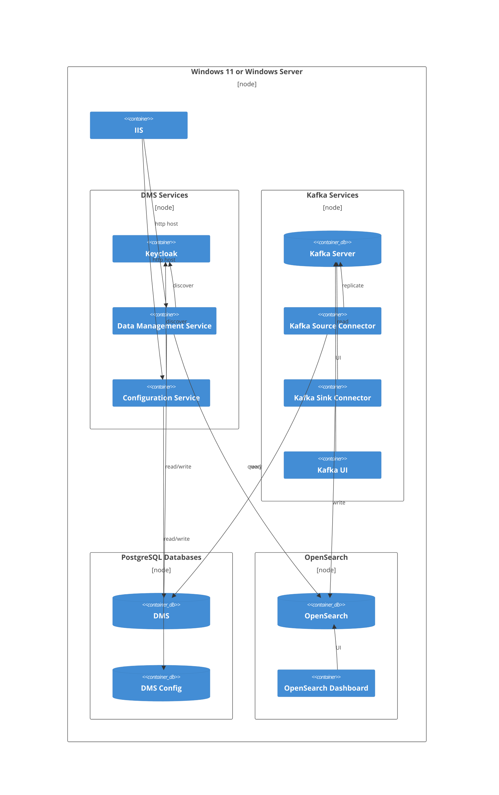

# On-premises Deployment in Windows Server

## Objective

Experiment with deployment of the Data Management Service Platform in a Windows
environment.

## Technical Requirements

* No Docker.
* Ensure that all required systems have a stable Windows installation.
* Provide pointers to service installation instructions, rather than provide
  detailed instructions here.
* Provide instructions and/or _basic_ scripts for installing the DMS and DMS
  Configuration Service in IIS. ⚠️ _As a POC, does not need to be security hardened or perfect installation scripts. Just quick helpers._
* Provide instructions on app settings configuration, including logging to file.
* And, provide introductory notes for next steps toward securing the system.

## Architecture

For this proof of concept, all services can be installed on the same machine,
although this is unlikely to be a good idea for a production service. In
summary, the machine needs to run the following services:

* IIS, hosting both the Data Management Service (DMS) and the DMS Configuration Service
* PostgreSQL, with either one or two databases containing the schemas for the
  DMS and the Configuration Service.
* OpenSearch, and optionally OpenSearch Dashboard.
* Kafka, and optionally Kafka  UI. Must also run either one or two instances of
  the Kafka Connect server for source and sink connections.



> [!WARNING]
> As a proof of concept, this will not be a well-secured system. Every service
> is capable of certificate-based encryption, but the configuration steps are
> outside the scope for the article.

## Proof of Concept Installation

### Software Development Kits

Required development toolkits:

* [.NET 8 SDK](https://dotnet.microsoft.com/en-us/download), for building the
  two DMS applications.
* Java Developer Kit (JDK) 17+; recommended to use the one from
  [Adoptium](https://adoptium.net)

### Keycloak

> [!NOTE]
> [Keycloak downloads](https://www.keycloak.org/downloads). [Getting started on
> bare metal](https://www.keycloak.org/getting-started/getting-started-zip) Once
> it is running, should use the `setup-keycloak.ps1` script from the DMS to
> configure it.

### Kafka

#### Downloads

[Download](https://kafka.apache.org/downloads) the v3.9 `.tgz` file (note: newer
versions of Windows come with the requisite tools for extracting the files, or
use 7Zip). Download the OpenSearch and Debezium connectors. Save in `c:\kafka`;
it is important to keep the path short, as one of the utilities throws an error
if the path name is "too long".

```powershell
cd c:\
Invoke-RestMethod https://dlcdn.apache.org/kafka/3.9.0/kafka_2.13-3.9.0.tgz -outFile kafka_2.13-3.9.0.tgz
tar xvf .\kafka_2.13-3.9.0.tgz .
mv kafka_2.13-3.9.0 kafka
cd kafka

mkdir plugins
pushd plugins

Invoke-RestMethod https://github.com/aiven/opensearch-connector-for-apache-kafka/releases/download/v3.1.0/opensearch-connector-for-apache-kafka-3.1.0.tar -outfile opensearch-connector-for-apache-kafka-3.1.0.tar
tar xvf .\opensearch-connector-for-apache-kafka-3.1.0.tar

Invoke-RestMethod https://repo1.maven.org/maven2/io/debezium/debezium-connector-postgres/3.1.0.Final/debezium-connector-postgres-3.1.0.Final-plugin.tar.gz -outfile debezium-connector-postgres-3.1.0.Final-plugin.tar.gz
tar xzvf .\debezium-connector-postgres-3.1.0.Final-plugin.tar.gz

popd
```

#### Ed-Fi Connect Transform

You will also need the custom transform created by the Ed-Fi Alliance, which is
not yet available as a standalone `.jar` file. Requires installing
[Gradle](https://gradle.org/install/).

```powershell
git clone https://github.com/Ed-Fi-Alliance-OSS/Ed-Fi-Kafka-Connect
pushd Ed-Fi-Kafka-Connect\kafka\ed-fi-kafka-connect-transforms
gradle installDist --no-daemon

cp -R build\libs\* c:\kafka\plugins\ed-fi-kafka-connect-transform

popd
```

#### Configuring Kafka Services

Open the `config\zookeeper.properties` file. Find the `dataDir` line and change
to the location where you want to store Kafka's database, for example,
`dataDir=c:/kafka/zookeeper-data`. Note that forward slashes are required here.

Now open `config\server.properties`. Find the `log.dirs` line and change to a location for logging, for example `log.dirs=c:/kakfa/logs`.

Next, setup Kafka Connect via `connect-standalone.properties`. Set these two values:

* `offset.storage.file.filename=c:/kafka/connect.offsets`
* `plugin.path=c:/kafka/plugins`

#### Starting Kafka Services

For manual startup, you'll need three different terminal windows to run the following commands:

1. Start Zookeeper with `.\bin\windows\zookeeper-server-start.bat .\config\zookeeper.properties`.
2. Start Kafka with `.\bin\windows\kafka-server-start.bat .\config\server.properties`.
3. And start Kafka Connect with `.\bin\windows\connect-standalone.bat .\config\connect-standalone.properties`

#### Optional Kafka UI

[UI for Apache Kafka](https://github.com/provectus/kafka-ui) is a nice utility
for looking directly at messages in Kafka topics - especially helpful while
debugging connectivity for other processes (did my message arrive? is it
formatted correctly?).

```powershell
mkdir ui
pushd ui

Invoke-RestMethod https://github.com/provectus/kafka-ui/releases/download/v0.7.2/kafka-ui-api-v0.7.2.jar -OutFile kafka-ui-api-v0.7.2.jar

$env:KAFKA_CLUSTERS_0_NAME="local"
$env:KAFKA_CLUSTERS_0_BOOTSTRAPSERVERS="localhost:9092"
$env:DYNAMIC_CONFIG_ENABLED="true"

java --add-opens java.rmi/javax.rmi.ssl=ALL-UNNAMED -jar kafka-ui-api-v0.7.2.jar
```

### OpenSearch

> [!NOTE]
> [OpenSearch and OpenSearch Dashboards
> Documentation](https://opensearch.org/docs/latest/about/). Dashboard is
> optional, helps you see what is actually in your database.
>
> Project Meadowlark docs [have some
> notes](https://github.com/Ed-Fi-Exchange-OSS/Meadowlark/blob/main/Meadowlark-js/backends/meadowlark-opensearch-backend/docker/readme.md?plain=1)
> on using OpenSearch that could be useful here. In fact, I might make that into
> a separate "showcase" entirely.

### Running DMS and DMS Config in IIS

> [!NOTE]
> TODO: describe any appsettings changes required. Describe how to run in IIS. Logging to file.

### Demonstration / Screenshots

> [!NOTE]
> TODO: post a screenshot or two of the working systems in a Windows
> Server 2022 VM.
