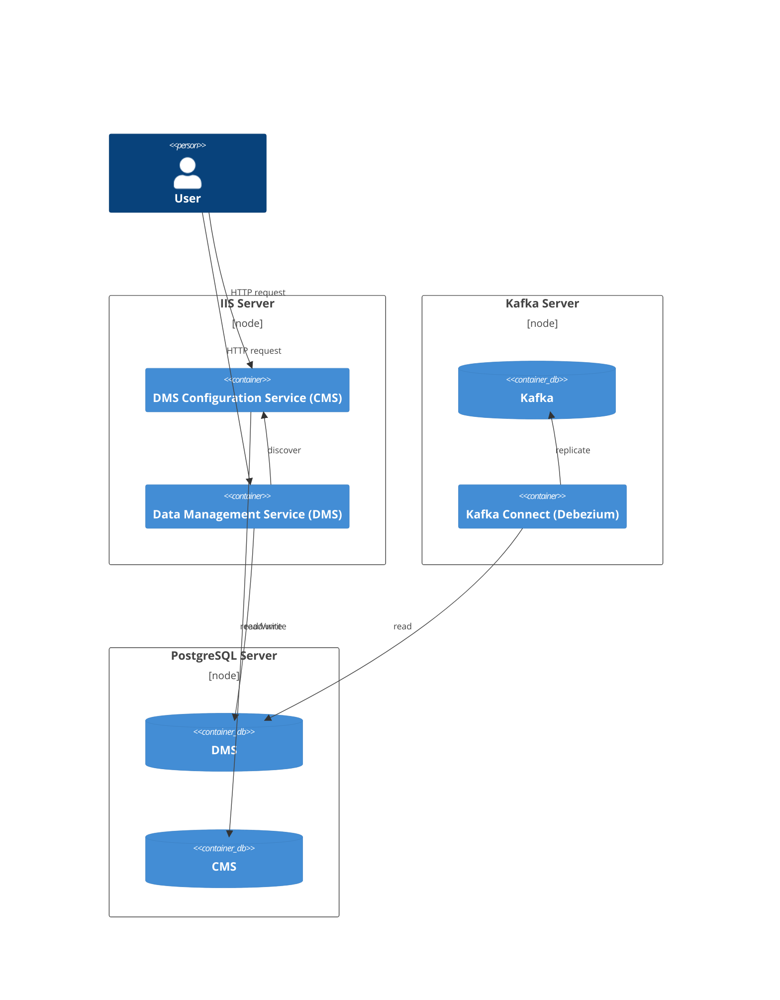
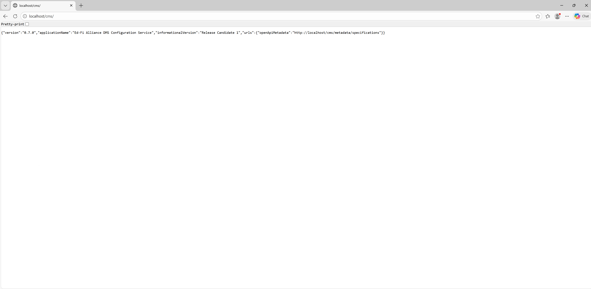
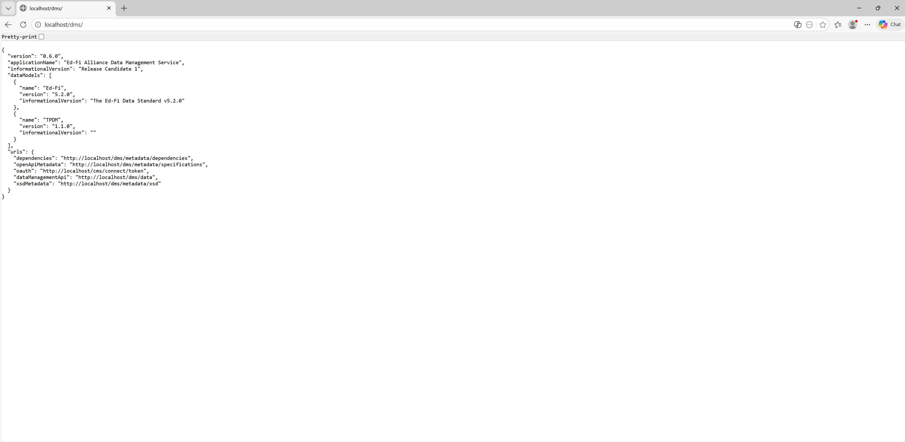
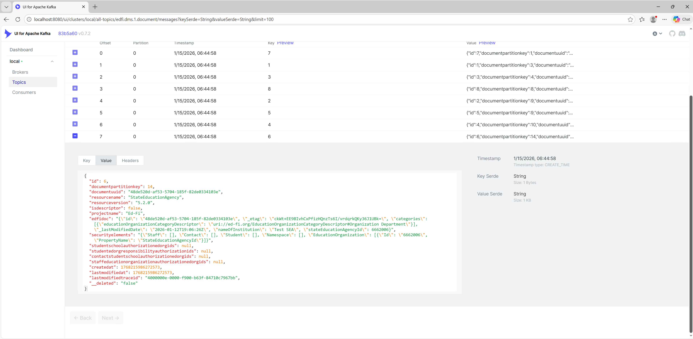

# On-Premises Deployment for Windows Server

This guide describes how to set up the Data Management Service (DMS) in a Windows environment using native binaries, without relying on Docker or Linux virtualization.

> [!WARNING]
> As a proof of concept, this will not be a well-secured system. Every service
> is capable of certificate-based encryption, but the configuration steps are
> outside the scope of the article.

## Architecture

The following instructions describe a deployment across three separate servers. For experimentation, you can deploy all services onto a single server.

1. **IIS Server**: Hosts both the Data Management Service (DMS) and the DMS Configuration Service (CMS). This sample deployment uses CMS as the OAuth provider instead of Keycloak.
2. **PostgreSQL Server**: Hosts separate databases for CMS and DMS. It's also possible to deploy them in the same database with separate schemas.
3. **Kafka Server**: Optionally with Kafka UI. A Kafka Connect instance is also required for source connections.



## Setting Up the PostgreSQL Database Server

1. Install PostgreSQL using [its installer](https://www.enterprisedb.com/downloads/postgres-postgresql-downloads). CMS and DMS are compatible with PostgreSQL 16 and 18.
2. If you plan to use Change Data Capture (CDC) with Kafka streaming, set `wal_level = logical` in `postgresql.conf` and restart PostgreSQL.
3. Manually create an empty database named `edfi_configurationservice`. You can use a tool like PgAdmin for this.

## Setting Up the IIS Application Server

The following steps will deploy CMS and DMS to IIS under the `/cms` and `/dms` subpaths, respectively. Alternatively, you can deploy them using [Kestrel](https://learn.microsoft.com/en-us/aspnet/core/fundamentals/servers/kestrel) and use a reverse proxy, which is often placed on a separate server that acts as a load balancer in a clustered environment.

1. Enable IIS. CMS and DMS are compatible with Windows Server 2022, Windows Server 2025, and Windows 11.
2. Download and install the .NET 10 Hosting Bundle from the [official .NET website](https://dotnet.microsoft.com/en-us/download/dotnet/10.0).
3. Create the `C:\inetpub\edfi\cms` and `C:\inetpub\edfi\dms` folders.
4. On a computer with the .NET 10 **SDK** (or Visual Studio) installed, follow these steps:
    1. Navigate to `Data-Management-Service\src\config\frontend\EdFi.DmsConfigurationService.Frontend.AspNetCore` and run `dotnet publish`. This will publish the CMS to a directory.
    2. Copy the published files (usually located in `Data-Management-Service\src\config\frontend\EdFi.DmsConfigurationService.Frontend.AspNetCore\bin\Release\net10.0\publish`) and paste them into the `C:\inetpub\edfi\cms` folder on the IIS server.
    3. Similarly, navigate to `Data-Management-Service\src\dms\frontend\EdFi.DataManagementService.Frontend.AspNetCore` and run `dotnet publish`. This will publish the DMS to a directory.
    4. Copy the published files (usually located in `Data-Management-Service\src\dms\frontend\EdFi.DataManagementService.Frontend.AspNetCore\bin\Release\net10.0\publish`) and paste them into the `C:\inetpub\edfi\dms` folder on the IIS server.
5. Open IIS Manager.
6. Right-click the `Sites` folder and select `Add Website`. Set the Site Name to `edfi`, select the `C:\inetpub\edfi` folder as the physical path, and click `OK`.
7. Right-click `Application Pools` and add a new pool named `cms`. Repeat this to add another pool named `dms`.
8. Expand the `edfi` site, right-click the `cms` folder, and select `Convert to Application`. Choose the `cms` application pool and click `OK`. Repeat this process for the `dms` folder, selecting the `dms` application pool.

## Configuring DMS and CMS

If you browse to the newly created sites, you will see that they fail to start. This is because a few more configuration changes are needed:

### On the Database Server

The `setup-openiddict.ps1` script requires `psql` to be installed and available in the system's PATH. You can verify the installation by running `psql --version`.

`psql` is installed along with PostgreSQL, so it should already be available on the database server. For convenience, you can execute the following commands from the database server, but they can also be run from a development machine.

1. Install PowerShell v7 by following [these instructions](https://learn.microsoft.com/en-us/powershell/scripting/install/install-powershell-on-windows?view=powershell-7.5). PowerShell v7 is needed by the `setup-openiddict.ps1` script that we'll use later.
1. Download the CMS/DMS source code by cloning or downloading the [repository](https://github.com/Ed-Fi-Alliance-OSS/Data-Management-Service).
1. In PowerShell v7, go to the `Data-Management-Service\eng\docker-compose` directory and execute:

    ```powershell
    -join ((48..57) + (65..90) + (97..122) | Get-Random -Count 16 | ForEach-Object {[char]$_})
    ```

    The command above generates a 16-character random string to use as the `EncryptionKey`. While there is no minimum length validation, a longer key is more secure.
1. Set the `EncryptionKey` parameter in the following command to the random string you just generated. Take note of it, as it will be needed again later:

    ```powershell
    ./setup-openiddict.ps1 -InitDb -ConnectionString "host=localhost;port=5432;username=postgres;password=;database=edfi_configurationservice;Application Name=CMS" -EncryptionKey "SomeRandomString" -EnvironmentFile $null -PostgresContainerName $null`
    ```

    This command generates a 2048-bit RSA key pair for JWT signing and stores it in the `dmscs.OpenIddictKey` table, encrypted with the `EncryptionKey` you provided.

### On the IIS Server

1. Go to `C:\inetpub\edfi\cms` and edit the `appsettings.json` file.
2. Set `AppSettings.DeployDatabaseOnStartup` to `true` so the CMS tables will be created on startup.
3. Set `AppSettings.PathBase` to `/cms`.
4. Set `IdentitySettings.Authority` to `http://localhost/cms`.
5. Update `IdentitySettings.EncryptionKey` with the `EncryptionKey` you generated for the `setup-openiddict.ps1` script.
6. Set a random string for `IdentitySettings.ClientSecret` and take note of it. There's no minimum length validation, but the longer the secret, the safer it is.
7. Update `DatabaseSettings.DatabaseConnection` with the connection string for the CMS database.
8. Update `Serilog.WriteTo.Args.path` to your desired log folder.
9. In IIS, restart the `cms` application pool to apply the changes.
10. Open `http://localhost/cms` in a web browser.
11. Check the CMS logs to verify a successful startup.

### On the Database Server (Part 2)

1. At this point, the CMS tables should have been automatically created.
2. In a PowerShell v7 terminal, navigate to the `Data-Management-Service\eng\docker-compose` directory.

    Set the `NewClientSecret` parameter in the command below to the value you configured for `IdentitySettings.ClientSecret` in the CMS `appsettings.json` file.

    ```powershell
    ./setup-openiddict.ps1 -InsertData -NewClientId "DmsConfigurationService" -NewClientName "DMS Configuration Service" -NewClientSecret "SomeRandomString" -ClientScopeName "edfi_admin_api/full_access" -ConnectionString "host=localhost;port=5435;username=postgres;password=;database=edfi_configurationservice;Application Name=CMS" -HashIterations 210000 -EnvironmentFile $null -PostgresContainerName $null
    ```

    This command creates the client that CMS will use for authentication with OpenIddict.
3. Next, create another random string to use as the secret for DMS to authenticate its calls to CMS. There's no minimum length validation, but the longer the secret, the safer it is. Set it as the `NewClientSecret` parameter in the command below:

    ```powershell
    ./setup-openiddict.ps1 -InsertData -NewClientId "CMSReadOnlyAccess" -NewClientName "CMS ReadOnly Access" -NewClientSecret "SomeRandomString" -ClientScopeName "edfi_admin_api/readonly_access" -ConnectionString "host=localhost;port=5435;username=postgres;password=;database=edfi_configurationservice;Application Name=CMS" -HashIterations 210000 -EnvironmentFile $null -PostgresContainerName $null
    ```

### On Your Development Machine

Now, we will use the CMS API to create an Instance, a Vendor, and an Application. First, you need to generate a CMS token.

Using a tool like the [REST Client for Visual Studio Code](https://marketplace.visualstudio.com/items?itemName=humao.rest-client) or Postman, execute the following request:

```http
# Get CMS OAuth Token
POST http://iis-server/cms/connect/token
Content-Type: application/x-www-form-urlencoded

client_id=DmsConfigurationService
&client_secret=s3creT@09
&grant_type=client_credentials
&scope=edfi_admin_api/full_access
```

Take note of the returned token. Set it as the `{access_token}` and fill in the `<DB server IP or Hostname>` placeholder in the request below, then execute it:

```http
# Create Instance
POST http://iis-server/cms/v2/dmsInstances
Content-Type: application/json
Authorization: Bearer {access_token}

{
    "instanceType": "Local",
    "instanceName": "Local DMS Instance 1",
    "connectionString": "host=<DB server IP or Hostname>;port=5432;username=postgres;password=;database=edfi_datamanagementservice;Application Name=DMS"
}
```

Then execute:

```http
# Create Vendor
POST http://iis-server/cms/v2/vendors
Content-Type: application/json
Authorization: Bearer {access_token}

{
    "company": "Test Vendor",
    "contactName": "Test",
    "contactEmailAddress": "test@gmail.com",
    "namespacePrefixes": "uri://ed-fi.org,uri://gbisd.edu,uri://tpdm.ed-fi.org"
}
```

Then execute:

```http
# Create Application
POST http://iis-server/cms/v2/applications
Content-Type: application/json
Authorization: Bearer {access_token}

{
  "vendorId": 1,
  "applicationName": "Test",
  "claimSetName": "EdFiSandbox",
  "educationOrganizationIds": [255901],
  "dmsInstanceIds": [1]
}
```

Take note of the returned `key` and `secret`. These will be used to generate a DMS token later.

### On the IIS Server (Part 2)

1. Go to `C:\inetpub\edfi\dms` and edit the `appsettings.json` file.
2. Set `AppSettings.DeployDatabaseOnStartup` to `true` so the DMS tables will be created on startup.
3. Set `AppSettings.PathBase` to `/dms`.
4. Set `IdentitySettings.ClientSecret` to the value you used when running the `setup-openiddict.ps1` script for the DMS client.
5. Replace all occurrences of `http://localhost:5126` with `http://localhost/cms`.
6. Update `Serilog.WriteTo.Args.path` to your desired log folder.
7. In IIS, restart the `dms` application pool to apply the changes.
8. Open `http://localhost/dms` in a web browser.
9. Check the DMS logs to verify a successful startup.

### On Your Development Machine (Part 2)

Let's test that the DMS is working correctly by calling the `Students` endpoint. It should return an empty array.

First, you need to generate a DMS token.

#### Using a REST Client

Set `{application_key}` and `{application_secret}` to the `key` and `secret` you received from the Applications endpoint in the previous section.

```http
# Get DMS OAuth Token
POST http://iis-server/dms/oauth/token
Content-Type: application/json
Authorization: Basic {application_key}:{application_secret}

{
    "grant_type": "client_credentials"
}
```

Set the returned `{dms_access_token}` in the following request and execute it:

```http
# Get Students
GET http://iis-server/dms/data/ed-fi/students
Authorization: Bearer {dms_access_token}
```

The response should be an empty array.

## Optional: Setting Up CDC and Kafka Streaming

Kafka can be installed on either Linux or Windows. However, hosting on Windows is discouraged, as noted in the [official Apache Kafka documentation](https://kafka.apache.org/41/operations/hardware-and-os/#os):
> We have seen a few issues running on Windows and Windows is not currently a well supported platform ...

For this example, we will install both Kafka and Kafka Connect in standalone mode on the same server.
We will configure the DMS to use a _topic-per-instance_ architecture, where each instance publishes to its own dedicated Kafka topic.

1. Download and install a Java 17 or higher runtime from [Adoptium](https://adoptium.net/temurin/releases?version=17).
2. Download the latest Kafka binaries from the [official website](https://kafka.apache.org/community/downloads/).
3. Extract the `.tgz` with the PowerShell command:

    ```pwsh
    tar -xzf kafka_xyz.tgz
    ```

4. It is important to use a short extraction path (e.g., `C:\kafka`), as some utilities may fail with long path names.
5. Create the `C:\kafka\plugins` directory.
6. Download the PostgreSQL connector from the latest [Debezium release](https://debezium.io/releases/), extract it, and move the `debezium-connector-postgres` folder to `C:\kafka\plugins`.
7. Download the latest `Expandjsonsmt` release from [GitHub](https://github.com/RedHatInsights/expandjsonsmt/releases), extract it, and place the JAR file in `C:\kafka\plugins`.
8. Open `config\server.properties`, find the `log.dirs` line, and change it to a suitable logging location, for example: `log.dirs=c:/kafka/logs`.
9. Open `config/connect-standalone.properties`, which configures Kafka Connect. Set these two values:

    ```txt
    offset.storage.file.filename=c:/kafka/connect.offsets
    plugin.path=c:/kafka/plugins
    ```

10. Start Kafka by running the following commands in a new terminal:

    ```pwsh
    .\bin\windows\kafka-storage.bat random-uuid
    ```

    Copy the generated UUID and set it in the `{{SomeUUID}}` placeholder below:

    ```pwsh
    .\bin\windows\kafka-storage.bat format --standalone -t {{SomeUUID}} -c config/server.properties
    ```

    Start Kafka by executing:

    ```pwsh
    .\bin\windows\kafka-server-start.bat config/server.properties
    ```

11. In a separate terminal, start Kafka Connect:

    This command requires `WMIC`, which comes pre-installed on older Windows versions. If running on Windows 11 or Windows Server 2025, you might need to install `WMIC` as [described here](https://techcommunity.microsoft.com/blog/windows-itpro-blog/how-to-install-wmic-feature-on-demand-on-windows-11/4189530).

    ```pwsh
    .\bin\windows\connect-standalone.bat config/connect-standalone.properties
    ```

12. On the database server, execute the following SQL against the `edfi_datamanagementservice` database:

    ```sql
    CREATE PUBLICATION to_debezium_instance_1 FOR TABLE dms.document, dms.educationorganizationhierarchytermslookup;
    ```

13. Modify the `instance_connector_template.json` file located in `Data-Management-Service\eng\docker-compose`:
    1. Set `{{INSTANCE_ID}}` to `1`.
    2. Set `{{DATABASE_NAME}}` to `edfi_datamanagementservice`.
    3. Set `{{POSTGRES_PASSWORD}}` to the database's password.
    4. Set `database.hostname` to the DB server IP or Hostname.

14. Using a REST client, execute the following request.

    Replace `{connector_definition}` with the content of the modified template file:

    ```http
    # Create Kafka Connector
    POST http://kafka-server:8083/connectors
    Content-Type: application/json

    {connector_definition}
    ```

15. In a new terminal, navigate to the Kafka directory and run the following command:

      ```pwsh
      .\bin\windows\kafka-console-consumer.bat --bootstrap-server localhost:9092 --topic edfi.dms.1.document --from-beginning
      ```

    This command subscribes to the `edfi.dms.1.document` topic and displays its messages. Post a resource to the DMS to see a test message.

### Optional: Kafka UI

[UI for Apache Kafka](https://github.com/provectus/kafka-ui) is a nice utility for looking directly at messages in Kafka topics - especially helpful while debugging connectivity for other processes (did my message arrive? is it formatted correctly?).

The following commands will download and run Kafka UI:

```pwsh
mkdir ui
pushd ui

Invoke-RestMethod https://github.com/provectus/kafka-ui/releases/download/v0.7.2/kafka-ui-api-v0.7.2.jar -OutFile kafka-ui-api-v0.7.2.jar

$env:KAFKA_CLUSTERS_0_NAME="local"
$env:KAFKA_CLUSTERS_0_BOOTSTRAPSERVERS="localhost:9092"
$env:DYNAMIC_CONFIG_ENABLED="true"

java --add-opens java.rmi/javax.rmi.ssl=ALL-UNNAMED -jar kafka-ui-api-v0.7.2.jar
```

Open the Kafka UI by navigating to `http://localhost:8080` in your browser.

## Screenshots

### CMS Screenshot



### DMS Screenshot



### Kafka UI Screenshot


