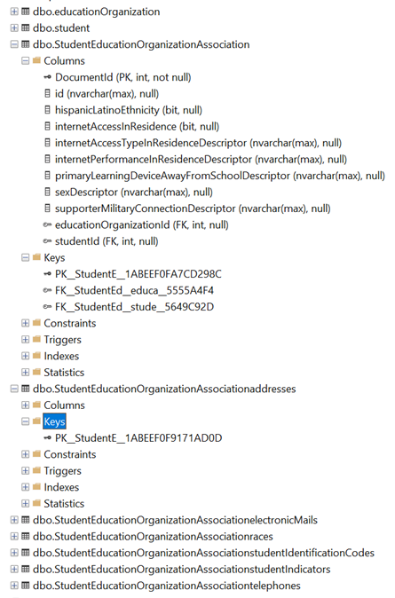
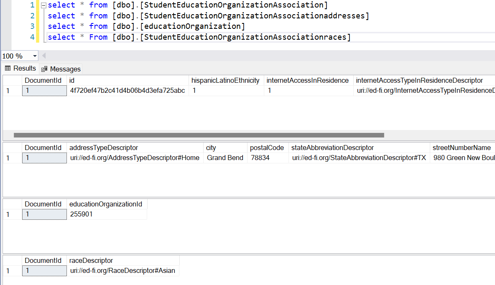

# Towards a Flattened MSSQL Backend

## Objective

The "single table" design effectively supports both referential integrity and
the outbox pattern for simplified streaming data out. This facilitates the use
of streaming data for populating other data stores, such as a search database or
a data lake. This design also forces creation of searchable indexes somewhere
other than on the single table - for example, in an OpenSearch database.

But some organizations do not want these features. They add unnecessary
complexity and cost for their installations. Instead, they would prefer to have
a traditional relational database structure, with fully indexing capability in
the relational tables.

This POC demonstrate that an incoming JSON object can be flattened and stored in tables
similar to the `EdFi_ODS` database, as an alternative to using the PostgreSQL
--> Debezium --> Kafka --> OpenSearch architecture.

This proof-of-concept might be further refined into a formal design document for
the Ed-Fi Data Management Service (DMS).

## Technical Requirements

* Flatten an object, spreading nested objects across separate tables, with table
  and column names based on the keys in the JSON document.
* Create the required tables, with foreign key relationships.
* Use Microsoft SQL Server.

## Architecture

This will be a simple C# command line application to process a JSON file, with
no integration into the DMS at this time.

> [!NOTE]
> This code was largely written by GitHub Copilot, with minor code corrections
> by the author. The following files include the complete prompts used.
>
> * [Initial prompt](./initial%20prompt.md) - for flattened the incoming document.
> * [Create tables prompt](./create%20table%20prompt.md) - for creating the MSSQL tables.

## Proof-of-Concept

This POC requires presence of the .NET 8 SDK.

1. Startup MSSQL in Docker:

   ```shell
   docker compose up -d
   ```

2. Run the CLI tool in this directory, providing `sample.json` as the input file.

   ```shell
   dotnet run ./sample.json
   ```

3. Connect to `localhost,1435` in SQL Server Management Studio or another tool
   to inspect the tables and records.

### Screenshots

This screenshot shows all of the tables that were created, expands the columns
for `StudentEducationOrganizationAssociation`, and shows that foreign keys were
created.



The next screenshot shows `select *` queries on several of the tables,
demonstrating that records were created, as desired.



## Notes Toward a Full Design

* Need to use the JSON schema coming from MetaEd.
  * Provides more detail on data types.
  * And more detail on relationships.
* Will need to convert Descriptors into relationships.
* No need to worry about limits on string length - the input validation in the
  API will keep string lengths down. (Just don't let anyone directly insert into
  the database, bypassing the API!).
* Consider whether or not to adopt the ODS database's table hierarchies. Would
  be simpler to avoid; however, this reduces the benefit for education
  organizations who are trying to query this as if it were the ODS database:
  they will need to modify to bring back the hierarchy tables. Could possibly
  use views to replace, i.e. `edfi.educationOrganization` would be a view that
  unions together all of the data from the various entities that derive from
  education organization.
* Can put both write and query interfaces into the same library, so that all
  incoming requests are processed right here in the relational database, without
  the need for streaming to OpenSearch.
