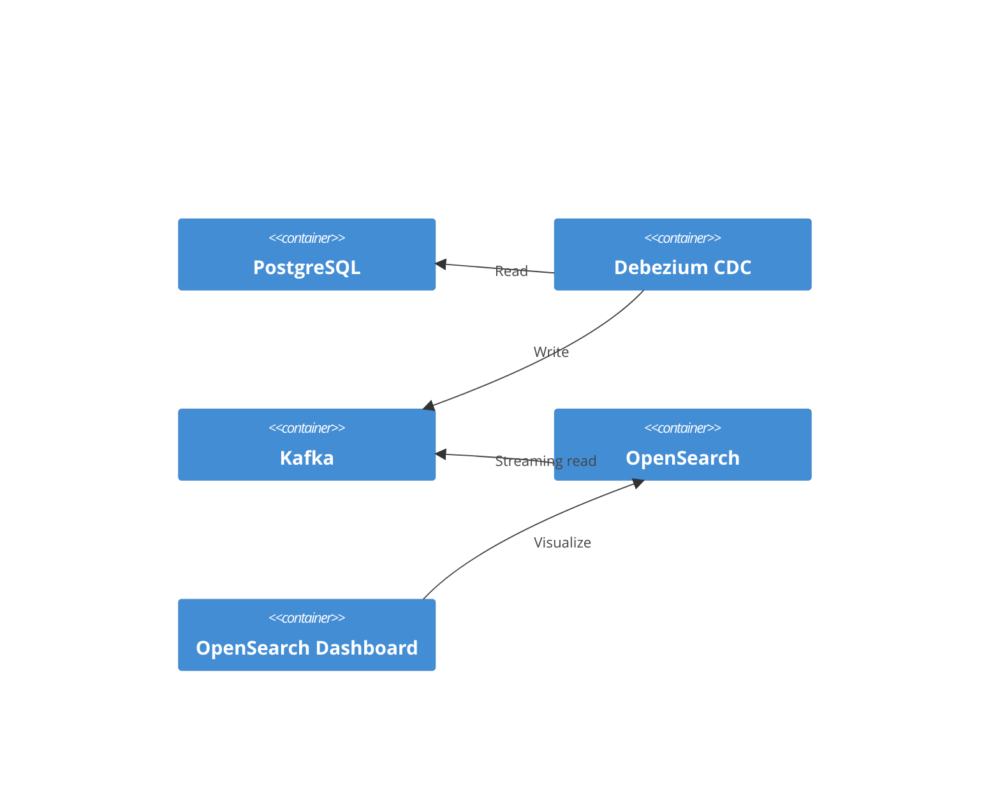
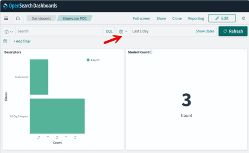

# Simple Dashboards in OpenSearch

## Objective

Build a dashboard with some simple visualizations using OpenSearch Dashboard.
Since OpenSearch is being populated by a stream in realtime, this dashboard is
in effect a realtime dashboard.

## Technical Requirements

Read any Ed-Fi data that has been pushed into OpenSearch via the Ed-Fi Kafka
Connector.

> [!TIP]
> Elasticsearch and Kibana _should_ be very similar to this.

## Architecture



## Proof-of-Concept

1. Startup the DMS Platform from the [DMS source code
   repository](https://github.com/Ed-Fi-Alliance-OSS/Data-Management-Service):

   ```powershell
   cd Data-Management-Service
   git checkout 0.4.0
   eng/docker-compose
   cp .env.example .env
   ./start-local-dms.ps1 -EnableConfig -EnableSearchEngineUI -r

   # One time Keycloak setup
   ./setup-keycloak.ps1
   ```

   > [!TIP]
   > For more information on the sample Docker startup, see
   > [docker-compose/README.md](https://github.com/Ed-Fi-Alliance-OSS/Data-Management-Service/blob/main/eng/docker-compose/README.md)

2. Load some data into DMS using [OpenSearch-Dashboard-POC.http](./OpenSearch-Dashboard-POC.http).

    > [!NOTE]
    > TODO: Augment these showcases with instructions on using VS Code,
    > Visual Studio, or Rider (among others) to execute `.http` files.

3. Open the [OpenSearch Dashboard](http://localhost:5601/) in your browser.
4. Navigate to **Management > Dashboards Management > Index patterns**.
5. Create two new indexes:
   1. `ed-fi$student` with `_lastModifiedDate` as the time field.
   2. `ed-fi$*descriptor` with `_lastModifiedDate` as the time field.
6. Navigate to **Dashboards > Visualize** and create two visualizations.

   1. Create a **metric** called "Student Count" on index pattern `ed-fi$student`
      1. Be sure to click the Save button.
   2. Create a "horizontal bar chart" called "Descriptors" on index pattern `ed-fi$_descriptor_

      > [!WARNING]
      > This is a contrived and silly, quick-and-dirty example. There are probably
      > much better things to visualize!

      * Split the bar chart between Education Organization Category Descriptor
        and Grade Level Descriptor: look for **Buckets** on the right side of
        the page. Expand that and choose "Filters" in the **Aggregation**
        dropdown. Then add the following filters:
        * `resourcename='GradeLevelDescriptor'` with label `Grade Level` (click
          the little tagging icon 🏷️ next to the trash can to get to the
          labels).
        * `resourcename='EducationOrganizationCategoryDescriptor'` with label
          `Ed Org Category`.

7. Navigate to **Dashboards > Dashboards** to create a new dashboard. Add your
   two visualizations there and save it.

   > [!TIP]
   > Don't see your data? Pay close attention to the time frame selection (look
   > at the arrow in the screenshot): records might have been "last modified"
   > outside the currently selected timeframe.

   
