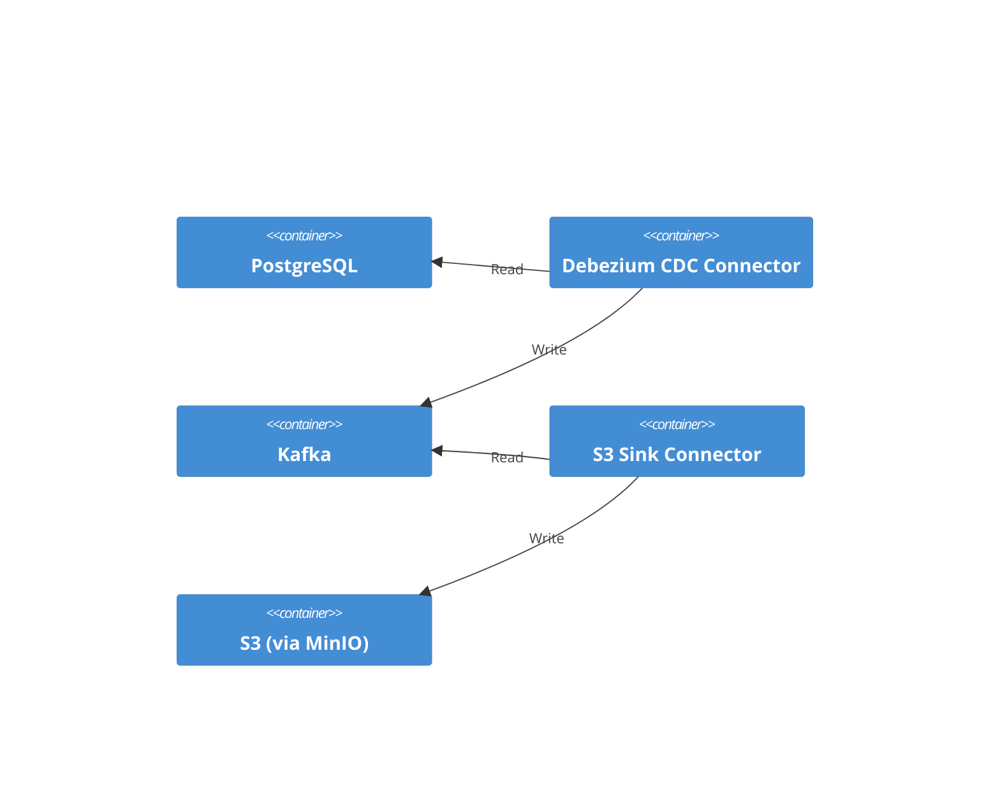
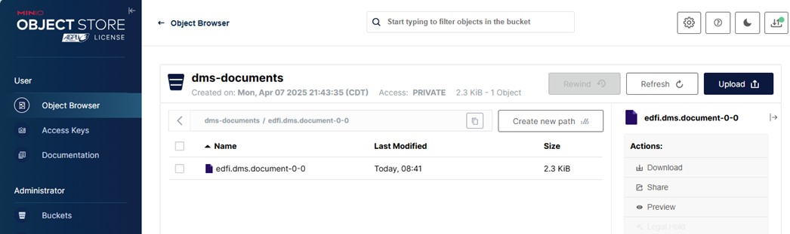
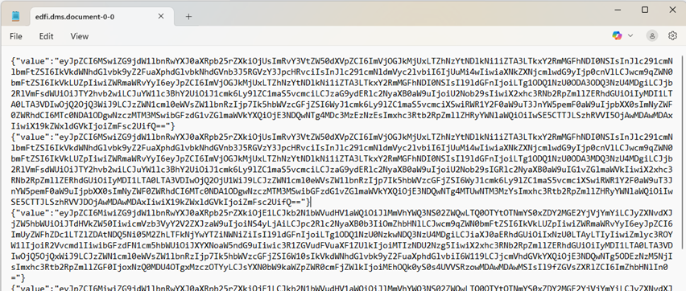
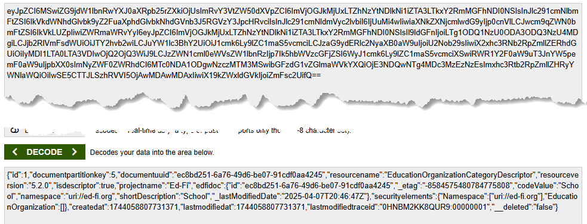

# Streaming to S3 Object Storage

## Objective

Read from the `document` stream in Kafka and write out to S3, e.g. for data lake creation.

Reference material:

* [Create an Amazon S3 sink connector by Aiven from Apache Kafka®](https://aiven.io/docs/products/kafka/kafka-connect/howto/s3-sink-connector-aiven)
  * [Detailed S3 Connector Settings](https://github.com/Aiven-Open/cloud-storage-connectors-for-apache-kafka/blob/main/s3-sink-connector/README.md#configuration)

## Technical Requirements

Use [MinIO](https://min.io/) as a compatible replacement for S3, so that the
demonstration does not require interacting with AWS. Do not try to fine tune for
data lake storage; do just enough to help jumpstart others.

## Architecture



## Proof-of-Concept

> [!TIP]
> For more information on the sample Docker startup, see
> [docker-compose/README.md](https://github.com/Ed-Fi-Alliance-OSS/Data-Management-Service/blob/main/eng/docker-compose/README.md)

1. Startup the DMS Platform from the [DMS source code
   repository](https://github.com/Ed-Fi-Alliance-OSS/Data-Management-Service):

   ```powershell
   cd Data-Management-Service
   git checkout 0.4.0
   eng/docker-compose
   cp .env.example .env
   ./start-local-dms.ps1 -EnableConfig -EnableSearchEngineUI -r

   # One time Keycloak setup
   ./setup-keycloak.ps1
   ```

2. Star MinIO using the docker compose file in this directory. `docker compose up -d`.
3. Once started, open the [MinIO Console](http://localhost:9090/) in your
   browser and sign in with user `root` and password `p@ssw0rd!`.
4. Create a Bucket called `dms-document`.
5. Install and configure the Aiven S3 sink connector into the Sink
   connector container by running `setup-connector.ps1`.
6. Add some data to the DMS, for example by using the
   [OpenSearch-Dashboard-POC.http](../../search/simple-dashboards/OpenSearch-Dashboard-POC.http)
   file.
7. Return to the MinIO console. On the page for the `dms-document` bucket, click
   the refresh button if you do not see anything. If everything worked without
   error, then you should see a single file.

   

   * The file is gzipped. If you download, you may want to rename to add `.gz`
     to the end of the file name, then extract the JSON file inside of it.

     

   * The JSON file contains one JSON object per line ("JSONL" format). The raw document is Base64 encoded.

     

A more complete solution probably needs to take several steps.

1. Is it possible to create separate files for each resource type?
2. Furthermore, is it possible to create a folder per resource type, and put
   separate files for each document into those folders? Is that even the right
   structure? Probably depends on how you are approaching your data lake
   architecture.
3. Evaluate how PUT and DELETE requests are being handled.
