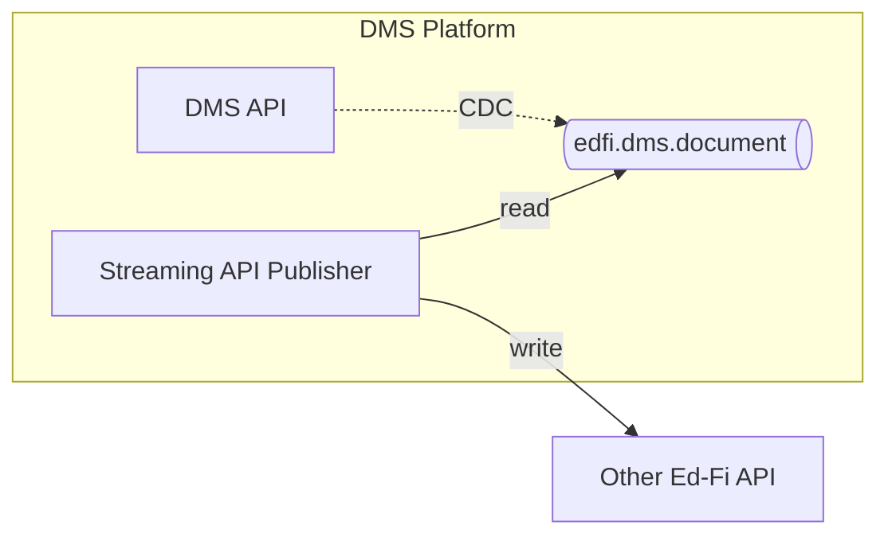

# Streaming API Publisher

## Objective

Perform realtime synchronization with a destination Ed-Fi API

## Technical Requirements

Build a custom .NET application that reads from the Kafka stream and writes data
to an ODS/API. Assume the downstream Ed-Fi API is running the same data
standard, so that there are no mismatches in the shape of the payload. Assume
that the client credentials for the custom application have sufficient
authorization to write any of the data received.

> [!NOTE]
> This POC lacks the following features that would be needed in a production-ready system:
>
> - Retries and rate limit handling
> - Support for updates
> - Support for deletes
> - Parseable log format (e.g. using Serilog or log4net)
> - Interesting pluralizations such as "agency" --> "agencies" and "person" --> "people"
> - Token refresh logic
> - Assumes messages arrive in dependency order, which is not actually guaranteed.

## Architecture



This application uses Confluent.Kafka for consuming messages from Kafka topics.

## Proof-of-Concept

### Prerequisites

- .NET 8.0 SDK
- Access to a Kafka cluster with the `edfi.dms.document` topic
- Access to an Ed-Fi API with valid OAuth credentials

### Configuration

Edit the `ApiPublisher/appsettings.json` file with your environment-specific values:

```json
{
  "DiscoveryApiUrl": "https://api.ed-fi.org/v7.3.1/api",
  "OAuth": {
    "ClientId": "your-client-id",
    "ClientSecret": "your-client-secret"
  },
  "Kafka": {
    "BootstrapServers": "localhost:9092",
    "GroupId": "api-publisher-group",
    "Topic": "edfi.dms.document",
    "AutoOffsetReset": "earliest"
  }
}
```

- **DiscoveryApiUrl**: The URL to the Ed-Fi Discovery API endpoint
- **OAuth.ClientId**: OAuth client ID for the destination Ed-Fi API
- **OAuth.ClientSecret**: OAuth client secret for the destination Ed-Fi API
- **Kafka.BootstrapServers**: Kafka broker address(es)
- **Kafka.GroupId**: Consumer group ID for Kafka
- **Kafka.Topic**: Kafka topic to consume from (default: `edfi.dms.document`)
- **Kafka.AutoOffsetReset**: Where to start reading messages (`earliest` or `latest`)

### Building the Application

Navigate to the ApiPublisher directory and build the project:

```bash
cd ApiPublisher
dotnet build
```

### Running the Application

Run the application using:

```bash
dotnet run
```

The application will:

1. Load configuration from `appsettings.json`
2. Connect to the Discovery API to retrieve OAuth and Data Management API URLs
3. Authenticate using the OAuth `client_credentials` flow
4. Connect to Kafka and subscribe to the configured topic
5. Process messages by:
   - Reading the `projectname`, `resourcename`, and `edfidoc` fields
   - Removing the `id` field from `edfidoc`
   - Posting the transformed document to the appropriate Data Management API endpoint
6. Continue processing messages until stopped with Ctrl+C

### Message Processing

The application reads messages from the `edfi.dms.document` Kafka topic. Each message contains:

- **projectname**: The Ed-Fi project (e.g., "Ed-Fi")
- **resourcename**: The resource type (e.g., "GradeLevelDescriptor")
- **edfidoc**: The Ed-Fi document JSON
- **__deleted**: Flag indicating if the document was deleted

The application transforms each message and posts it to:

```
{DataManagementApiUrl}/{projectname}/{resourcename}s
```

For example: `https://api.ed-fi.org/v7.3.1/data/ed-fi/GradeLevelDescriptors`

Messages marked as deleted (`__deleted: "true"`) are skipped.

### Environment Variable Overrides

Configuration values can be overridden using environment variables. Use double underscores (`__`) to represent nested configuration keys:

- `DiscoveryApiUrl` - Discovery API URL
- `OAuth__ClientId` - OAuth client ID
- `OAuth__ClientSecret` - OAuth client secret
- `Kafka__BootstrapServers` - Kafka broker address(es)
- `Kafka__GroupId` - Consumer group ID
- `Kafka__Topic` - Kafka topic name
- `Kafka__AutoOffsetReset` - Offset reset strategy

Example:

```bash
export DiscoveryApiUrl="https://api.ed-fi.org/v7.3.1/api"
export OAuth__ClientId="my-client-id"
export OAuth__ClientSecret="my-client-secret"
export Kafka__BootstrapServers="dms-kafka1:9092"
dotnet run
```

### Running with Docker

Build and run the application using Docker Compose:

```bash
# Copy the example environment file
cp .env.example .env

# Edit .env with your configuration values
nano .env

# Build and run
docker compose up --build
```

The Docker Compose configuration connects to the external `dms` network.

### Example Output

```
Starting API Publisher...
Connecting to Discovery API: https://api.ed-fi.org/v7.3.1/api
OAuth URL: https://api.ed-fi.org/v7.3.1/oauth/token
Data Management API URL: https://api.ed-fi.org/v7.3.1/data
Authenticating with OAuth...
Successfully authenticated
Connecting to Kafka: localhost:9092
Subscribing to topic: edfi.dms.document
Listening for messages... Press Ctrl+C to exit

Received message at offset 0
Resource: Ed-Fi/GradeLevelDescriptor
Publishing GradeLevelDescriptor to https://api.ed-fi.org/v7.3.1/data/ed-fi/GradeLevelDescriptors
Successfully published GradeLevelDescriptor
```

## DMS Kafka Connection

> [!NOTE]
> The DMS Kafka setup uses host name `dms-kafka1`. To connect to this Kafka instance _outside_ of Docker, you will need to add a hosts file mapping from server `dms-kafka1` to IP address `127.0.0.1`.
