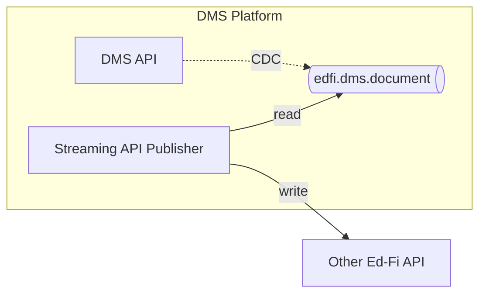

# Streaming API Publisher

## Objective

Perform realtime synchronization with a destination Ed-Fi API

## Technical Requirements

Build a custom .NET application that reads from the Kafka stream and writes data
to an ODS/API. Assume the downstream Ed-Fi API is running the same data
standard, so that there are no mismatches in the shape of the payload. Assume
that the client credentials for the custom application have sufficient
authorization to write any of the data received.

> [!WARNING]
> A production system will need to handle retries and possibly rate limit
> throttling. This POC will not code for that.

## Architecture

This application will use [Quix
Streams](https://github.com/quixio/quix-streams-dotnet).

## Proof-of-Concept

TBD
