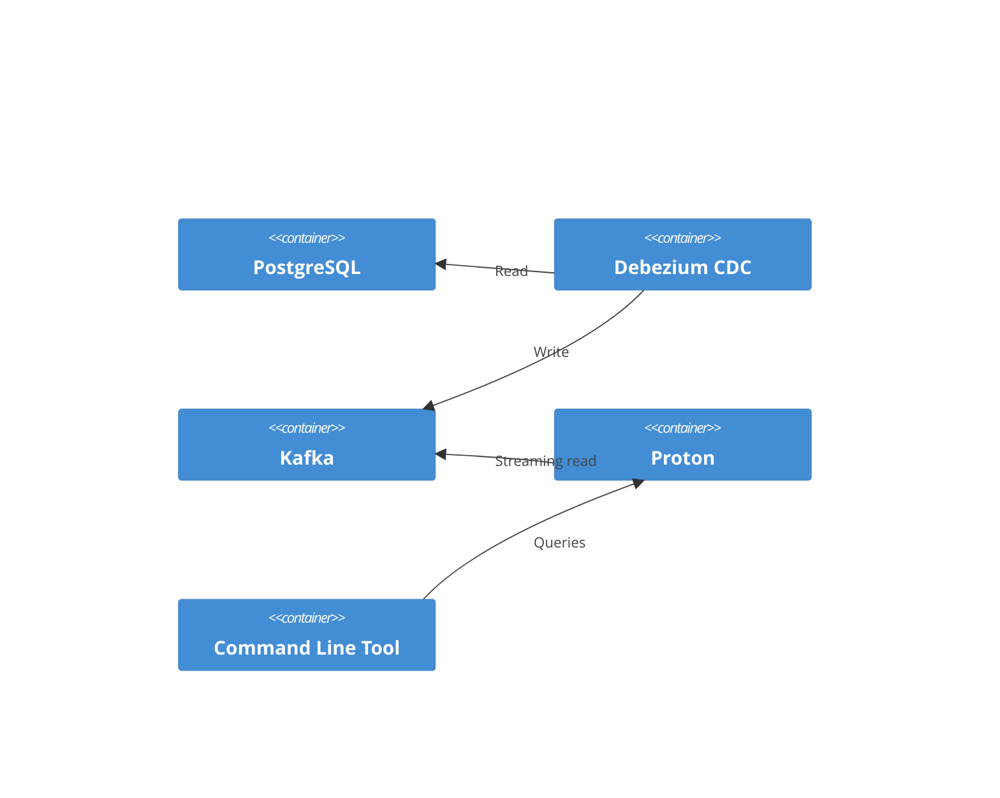

# Realtime Command Line Interface with Proton

## Objective

This showcase is primarily a starting-point for other showcases, demonstrating
Kafka interactivity using [Timeplus
Proton](https://github.com/timeplus-io/proton) as the stream processor.

Reference material:

* [Kafka External Stream](https://docs.timeplus.com/proton-kafka) documents
  using SQL statements for streaming queries against a Kakfa topic.
* [Query Syntax](https://docs.timeplus.com/query-syntax) describes the SQL
  language implemented by Proton.
* [Proton Python Driver](https://github.com/timeplus-io/proton-python-driver)
* [Proton Java Driver](https://github.com/timeplus-io/proton-java-driver)
* [Proton Go Driver](https://github.com/timeplus-io/proton-go-driver)
* [Proton ODBC](https://github.com/timeplus-io/proton-odbc) - experimental;
  should be able to use in a .NET or JavaScript application, for example.

This simple showcase use the Python driver.

## Technical Requirements

Use Proton to connect to the running Kafka instance and display new documents as
they are received.

## Architecture



The Proton stream processor runs as a stand-alone service on the same network as
the Kafka cluster. The POC command line tool will issue queries to the Proton
server using the Python driver.

## Proof-of-Concept

This POC uses [Poetry](https://python-poetry.org/) as the Python package
manager. The requirements have also been exported to a PIP requirements.txt
file. Tested with the source code from milestone `0.4.0`.

1. Startup the DMS Platform from the DMS source code repository:

   ```powershell
   cd Data-Management-Service
   git checkout 0.4.0
   eng/docker-compose
   ./start-local-dms.ps1 -EnableConfig -EnableSearchEngineUI -r

   # One time Keycloak setup
   ./setup-keycloak.ps1
   ```

2. In this repository, start proton. Advisable to use a separate terminal
   window:

   ```powershell
   cd Project-Tanager
   cd showcase/streaming/proton-realtime-cli
   docker compose up -d
   ```

3. Install Python dependencies

   ```powershell
   poetry install
   ```

4. Run the script

   ```powershell
   poetry run python __main__.py
   ```

5. Begin interacting with the running DMS, creating new descriptors and/or
   resources. Watch the Proton-cli tool's window to see new records come in. The
   file [DMS-demonstration.http](./DMS-demonstration.http) includes HTTP
   requests for setting up a DMS client, authenticating, and then posting a few
   new resources.
