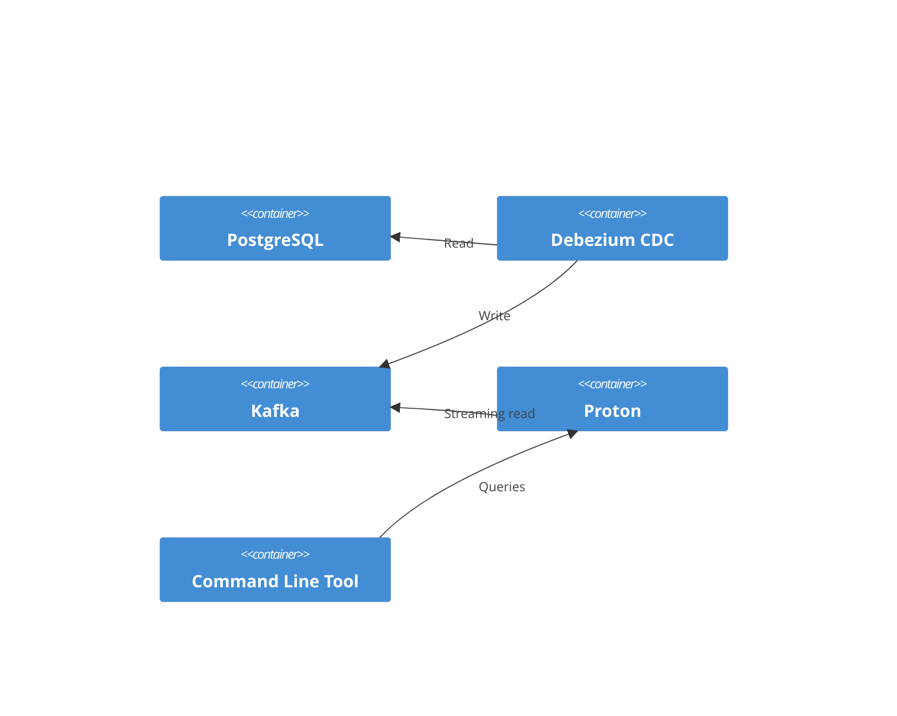

# Proton Streaming Database for Analytics

## Objective

This showcase provides lightweight demonstrations of use of the streaming
database [Timeplus Proton](https://github.com/timeplus-io/proton). Proton is a
column-oriented analytics database that can update itself in realtime from a
Kafka feed. As an analytics database, it is primarily used for aggregate
calculations rather than row lookups. [Rising Wave](https://risingwave.com/) is
an alternative to explore for row-oriented procedures. Both are available under
the Apache License, Version 2.0.

Reference material:

* [Kafka External Stream](https://docs.timeplus.com/proton-kafka) documents
  using SQL statements for streaming queries against a Kakfa topic.
* [Query Syntax](https://docs.timeplus.com/query-syntax) describes the SQL
  language implemented by Proton.
* [Tutorial: Query Kafka with SQL](https://docs.timeplus.com/tutorial-sql-kafka)

Integration tools:

* [Proton Python Driver](https://github.com/timeplus-io/proton-python-driver)
* [Proton Java Driver](https://github.com/timeplus-io/proton-java-driver)
* [Proton Go Driver](https://github.com/timeplus-io/proton-go-driver)
* [Proton ODBC](https://github.com/timeplus-io/proton-odbc) - experimental;
  should be able to use in a .NET or JavaScript application, for example.

This simple showcase use the Python driver.

## Technical Requirements

Use Proton to connect to the running Kafka instance and demonstrate a few
trivial queries.

> [!WARNING]
> Proton is a columnar database meant for realtime analytics. For example,
> aggregations. It is not as well-suited for looks like an OLTP database. For
> that, use a row-oriented streaming database, such as Materialize or Rising
> Wave.
>
> As described in _Streaming Databases_ (Dulay and Debusmann, O'Reilly, 2024),
> it has an "interesting" eventual consistency challenge. The issue is described
> in detail in [Internal consistency in streaming
> systems](https://www.scattered-thoughts.net/writing/internal-consistency-in-streaming-systems/),
> though Proton is not specifically named as it is in the book. Something to
> watch out for.

## Architecture



The Proton stream processor runs as a stand-alone service on the same network as
the Kafka cluster. The POC command line tool will issue queries to the Proton
server using the Python driver.

## Proof-of-Concept

This POC uses [Poetry](https://python-poetry.org/) as the Python package
manager. The requirements have also been exported to a PIP requirements.txt
file. Tested with the source code from milestone `0.4.0`.

1. Startup the DMS Platform from the [DMS source code
   repository](https://github.com/Ed-Fi-Alliance-OSS/Data-Management-Service):

   ```powershell
   cd Data-Management-Service
   git checkout 0.4.0
   eng/docker-compose
   cp .env.example .env
   ./start-local-dms.ps1 -EnableConfig -EnableSearchEngineUI -r

   # One time Keycloak setup
   ./setup-keycloak.ps1
   ```

   > [!TIP]
   > For more information on the sample Docker startup, see
   > [docker-compose/README.md](https://github.com/Ed-Fi-Alliance-OSS/Data-Management-Service/blob/main/eng/docker-compose/README.md)

2. In this repository, start proton. Advisable to use a separate terminal
   window:

   ```powershell
   cd Project-Tanager
   cd showcase/streaming/proton-realtime-cli
   docker compose up -d
   ```

3. Install Python dependencies

   ```powershell
   poetry install
   ```

4. Run any of the three scripts: `echo_count_of_schools.py`,
   `echo_new_documents.py`, or `validate_school_edOrgCategory.py`:

   ```powershell
   poetry run python echo_count_of_schools.py
   ```

   * `echo_count_of_schools.py`: list a running count of the number of schools
     _as new ones are added_. It does not list the number of existing schools.
     At this time, it does not distinguish an update an insert, and it ignores
     deletions.
   * `echo_new_documents.py`: list all new documents as they arrive.
   * `validate_school_edOrgCategory.py`: parses incoming School documents.
     Reports an error any time one of these Schools has an
     `educationCategoryDescriptor` that is _not_ "School". This could easily be
     modified to post a message into a Validation API service. Demonstrates the
     ability to perform a snapshot query of everything _previously_ created and
     a query of everything as it comes in.
     * But how would one use this in practice for validation? If the script
       stops running, and then is restarted, then in the current simplistic
       setup, either (a) keep the `table()` query for a snapshot - but you end
       up reprocessing records that were already handled or (b) remove that and
       only process new records - which skips anything that was inserted between
       when the script stopped and started again.
     * This is not a good use of an columnar database. The quandary above might
       be better handled in a row-oriented database.

5. Begin interacting with the running DMS, creating new descriptors and/or
   resources. Watch the Proton-cli tool's window to see new records come in. The
   file [DMS-demonstration.http](./DMS-demonstration.http) includes HTTP
   requests for setting up a DMS client, authenticating, and then posting a few
   new resources.
