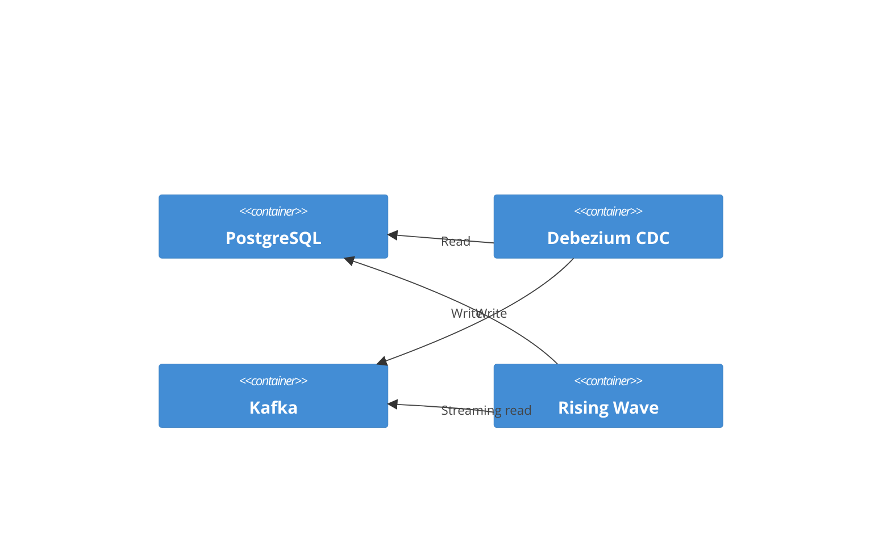

# Realtime ETL with Rising Wave

## Objective

Demonstrate one or more realtime ETL use cases using Rising Wave, a row-oriented
streaming database. These would push data back to operational systems, for
example as materialized views that support a readonly backend-for-frontend (BFF)
application.

Reference Material

* [RisingWave: Real-time ETL](https://risingwave.com/use-cases/use-case-real-time-etl/)
* [Sink data from RisingWave to PostgreSQL](https://docs.risingwave.com/integrations/destinations/postgresql#sink-data-from-risingwave-to-postgresql)
* [Rising Wave and Docker Compose](https://docs.risingwave.com/deploy/risingwave-docker-compose)

[Materialize](https://materialize.com/) is another good streaming database with
similar use cases. Rising Wave is available for use under the Apache License
2.0, whereas Materialize is available under the [Business Source
License](https://github.com/MaterializeInc/materialize/blob/main/LICENSE). An
Ed-Fi system host who sells Ed-Fi as a service might not be able to use
Materialize under this license.

## Technical Requirements

* Read from the Kafka stream.
* Perform some sort of calculation using one or more materialized views.
* Save data into a PostgreSQL table.

Suggested use case: Suppose you have a dashboard that needs attendance rate
information. The raw data for the calculations are provided in the the Ed-Fi
API. The calculation can be updated in realtime as attendance records are
received, instead of writing a batch ETL process.

## Architecture

## Proof-of-Concept

> [!NOTE]
> Pending
